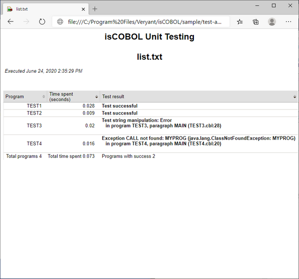
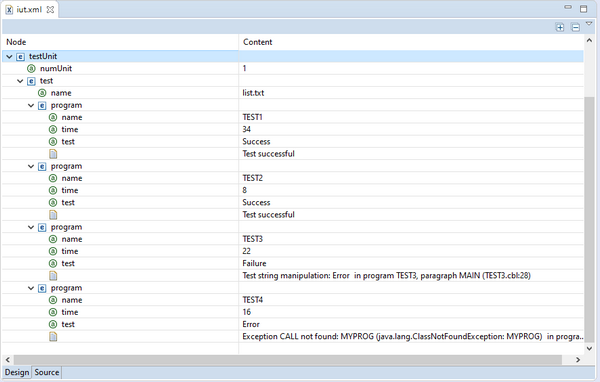

### Running an Unit Test from the command-line

In order to create an Unit Test, you need to list which programs must be included in the test. The list is provided as a text file set by the configuration property [iscobol.unit_test.list_file](../../Compiler-and-Runtime/Configuration/Configuration-Properties#unit-test-configuration). For example, the below setting specifies that the list of programs is stored in the file list.txt placed the runtime working directory:

```cobol
iscobol.unit_test.list_file=./list.txt
```

The list file must specify each program on a separate line. For example, the below file content causes TEST1, TEST2, TEST3 and TEST4 to be included in the Unit Test:

```cobol
TEST1
TEST2
TEST3
TEST4
```

It is also possible to specify more than one list file, separating them with the system path separator (semicolon on Windows, colon on Linux/Unix) or by the \\n character sequence, e.g.

```cobol
iscobol.unit_test.list_file=./list.txt\n./list2.txt
```

You may also consider creating a folder to hold the HTML report generated by the Unit Test, and set [iscobol.unit_test.html](../../Compiler-and-Runtime/Configuration/Configuration-Properties#unit-test-configuration) to point to this folder. By default, the Unit Test engine looks for a folder named "htmlReport" in the current directory. If the folder doesn’t exist, it is automatically created.

In order to run the Unit Test, start the runtime with the [-iut](../../Compiler-and-Runtime/Runtime-Framework/Runtime-Options#-iut) option, e.g.

```cobol
iscrun -c iut.cfg -iut
```

In the above sample command, iut.cfg is a configuration properties file that must include at least the [iscobol.unit_test.list_file](../../Compiler-and-Runtime/Configuration/Configuration-Properties#unit-test-configuration) setting.

The isCOBOL Runtime will execute all the programs in the list files, one by one. When execution is finished, a file named the same as the list file plus the html extension (e.g. list.txt.html) will be written to the folder set by [iscobol.unit_test.html](../../Compiler-and-Runtime/Configuration/Configuration-Properties#unit-test-configuration). Open this with your favorite web browser to see the Unit Test report.

#### Using Assertions

An assertion is a predicate connected to a point in the program that should always evaluate to true at that point in code execution. Assertions can help a programmer read the code, help a compiler compile it, or help the program detect its own defects.

You can add assertions to the source code of your program using the [ASSERT](../../../Language%20Reference/Procedure-Division-Statements/ASSERT) statement, for example:

```cobol
     assert string1 = "my string"
            otherwise "Test string manipulation: Error"
```

In order to evaluate assertions during the Unit test, add the -ea Java option to the command line, e.g.

```cobol
iscrun -c iut.cfg -iut -J-ea
```

Considering for example that all tests were successful except for TEST3 that failed due to a failed assertion and TEST4 that failed due to a missing subprogram, the HTML report will look like this:



In the page, the following information is provided:

| Column Name | Column Content |
| --- | --- |
| Program | Name of the COBOL program as it appears in the file set by [iscobol.unit_test.list_file](../../Compiler-and-Runtime/Configuration/Configuration-Properties#unit-test-configuration). |
| Time spent (seconds) | Number of seconds that the program spent to complete. |
| Test result | "Test successful" if the program completed without errors or the exception stack of the error otherwise. |

The report can also be generated in XML format.

Set [iscobol.unit_test.xml](../../Compiler-and-Runtime/Configuration/Configuration-Properties#unit-test-configuration) to the name of the XML file that you want to create.

The XML file contains only the list of failed tests, so the XML for the Unit Test described above would look like this:

If you set only one of the properties [iscobol.unit_test.xml](../../Compiler-and-Runtime/Configuration/Configuration-Properties#unit-test-configuration ) and [iscobol.unit_test.html](../../Compiler-and-Runtime/Configuration/Configuration-Properties#unit-test-configuration), then only the report related to the property that you set is generated.

If you set both properties, then both reports are generated.

If you don't set any of these properties, then an HTML report is generated in the "./htmlReport" directory.

#### Unit Test console output and exit codes

When iscrun is launched with the -iut option, it prints a summary of the outcome upon exit.

A successful test will generate the following message:

```cobol
All <testsCount> tests "ok", for details see <reportName>
```

In this case, the exit code of the iscrun process is 0.

A test with errors will generate the following message:

```cobol
<failuresCount> of <testsCount> tests "failed", for details see <reportName>

```

In this case the exit code of the iscrun process is failuresCount.
