## Debugger Functions

The following is a list of available debugger functions, how they are accessed, and their descriptions:

| Command | Shortest Form | Key | Menu | ToolbarButton | Description |
| :--- | :--- | :--- | :--- | :--- | :--- |
| n/a | n/a | n/a | Help / About |  | Displays information about the current version of isCOBOL. |
| n/a | n/a | n/a | Look and Feel |  | Allows you to choose the desired UI theme between:<br>• Flatlaf Dark<br>• Flatlaf Light (default)<br>• System<br>• Metal<br>• Nimbus |
| n/a | n/a | n/a | Run / Set command line parameters |  | Displays a window that allows the user to alter the parameters that were specified on the command line. <br>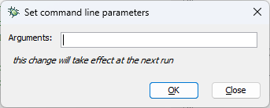 |
| n/a | n/a | n/a | Settings / Data |  | Displays a window that allows you to configure settings for data-items management.<br>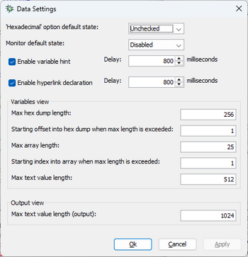<br>*‘Hexadecimal’ option default* state sets the default value for the *‘Hexadecimal’* flag in the following dialogs:<br>- Data / Display<br>- Data / Set Monitor<br>- Quickwatch <br>*Monitor default enabled state* specifies if new monitors will be enabled or not by default. <br>*Enable variable hint* enables tool-tips shown when you move the mouse pointer over a data item name. The next *Delay* field sets the delay in milliseconds for the tool-tips. *Enable hyperlink declaration* enables an hyperlink effect activated when you move the mouse pointer over a data item or paragraph name. The next *Delay* field sets the delay in milliseconds for the hyperlink. <br>The *Variables view* area and the *Output view* areas allow you to limit the buffers used to host and display item values.<br>• *Max hex dump length* specifies the maximum number of characters shown when the Debugger displays the hex content of a data item. |
|  |  |  |  |  | • *Starting offset into hex dump when max length is exceeded* allows you to specify which portion of the content must be shown. For example, assuming that the hex content is 1000 characters long and the max length is 256, with the default value 1 you will see bytes from 1 to 256, with value 101 you will see bytes from 101 to 356.<br>• *Max array length* specifies how many items of an OCCURS data item can be displayed and monitored.<br>• *Starting offset into array when max length is exceeded* allows you to specify which portion of the array must be shown. For example, assuming that the OCCURS contains 100 items and the max length is 25, with the default value 1 you will see items from 1 to 25, while with value 11 you will see bytes from 11 to 35.<br>• *Max text value length* specifies how many characters of an alphanumeric data item can be displayed in the [Variables Area](../Debugger-Window/Variables-Area).<br>• *Max text value length (output)* specifies how many characters of an alphanumeric data item can be displayed in the [Output Window](../Debugger-Window/Output-Window). <br>Increasing these buffers too much gives you more monitoring capabilities but might slow down performance, making the Debugger UI less responsive. |
| n/a | n/a | n/a | Settings / Breakpoint |  | Displays a window that allows you to configure the default state of breakpoints. <br>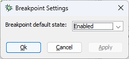|
| n/a | n/a | n/a | Settings / Source / Format |  | Tells the Debugger which source format is used by the current program. This setting is useful only when the Debugger doesn’t automatically recognize the source format and fails to color keywords and comments. |
| n/a | n/a | n/a | Settings / Source / Expand copy books when loading source |  | Tells the Debugger to automatically expand the copy books included in the program source code. |
| n/a | n/a | [Ctrl++]<br>[Ctrl+-] | Settings / Font size |  | Sets the size of the font used to display the source code. |
| n/a | n/a | n/a | Settings / Customize / Commands |  | Displays a window that allows the user to create an alias for every Debugger command. <br>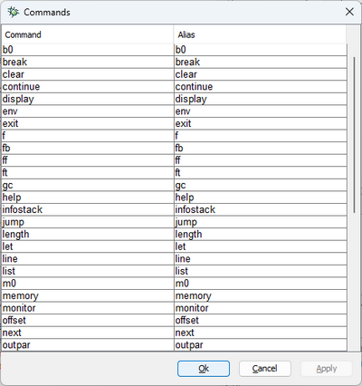 |
| n/a | n/a | n/a | Settings / Customize / Shortcuts |  | Displays a window that allows the user to customize the keyboard shortuct for every Debugger command. <br>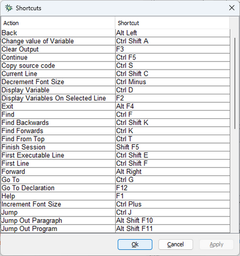|
| n/a | n/a | n/a | Settings / Customize / Fonts And Colors |  | Displays a window that allows the user to customize the appearance of the various elements of the debugger window. <br>There are two sets of colors: dark and light. The dark set of colors is configurable only when *Flatlaf Dark* is the current [Look and Feel](./Debugger-Functions). The light set of colors is configurable when any of the other LAFs is in use. |
| 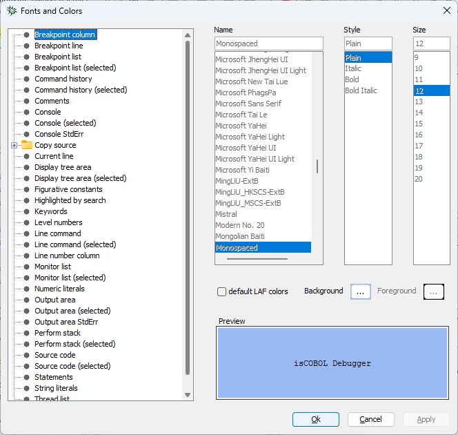 | | | | | |
| n/a | n/a | n/a | Settings / Session |  | Displays a window that allows the user to customize the debugger session. <br>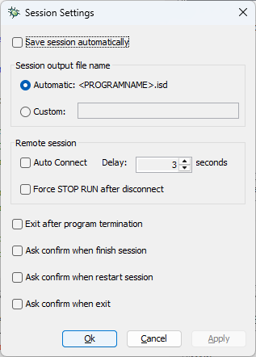<br>*Save session automatically* enables the automatic save of Debugger sessions on exit. <br>*Session output file name* allows you to specify a custom name for the file where the Debugger session is saved. <br>*Auto Connect* allows you to specify how many seconds the Debugger should wait before connecting to a remote runtime. <br>*When Force STOP RUN after disconnect* is checked, the debugged program will perform a STOP RUN after the remote debugger is either disconnected or closed. If the program is accepting user input, the STOP RUN will occur as soon as the ACCEPT is interrupted. <br>*Exit after program termination* causes the debugger to close automatically when the runtime session terminates. <br>*Ask confirm...* options allows you to enable a prompt message to be shown when the user chooses to terminate the session or exit from Debugger. |
| n/a | n/a | n/a | Settings / Console |  | Displays a window that allows the user to customize the [Console](../Debugger-Window/Informatiom-Window) tab.<br>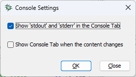<br>The choices made here are reflected in the tool-bar buttons of the [Console](../Debugger-Window/Informatiom-Window) tab. |
| n/a | n/a | [F1] | Help / Commands |  | Displays a window containing a list of debugger commands and their use. |
| 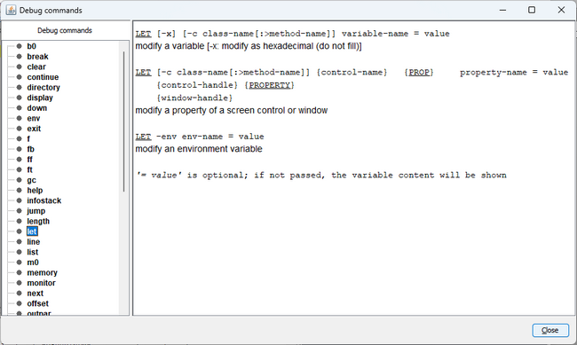 | | | | | |
| n/a | n/a | [F2] | Data / Display variables on selected line |  | Displays all variables that appear in the selected source line along with their current value. |
| n/a | n/a | [Alt+F3] | Edit / Clear output |  | Clears the [Output Window](../Debugger-Window/Output-Window). |
| n/a | n/a | [F4] | Breakpoints / Toggle at current line |  | Toggles a breakpoint at the current line of the current source code. |
| n/a | n/a | [F9] | Run / Run to selected line |  | Starts or continues the program execution until the line where the cursor is located is reached. |
| n/a | n/a | [Ctrl+F8] | Edit / Last command |  | Repeats the last command entered in the [Command Area](../Debugger-Window/Command-Area). The command is not immediately executed, so the user can change it before executing. |
| n/a | n/a | [Ctrl+F] | Edit / Find |  | Displays a window that searches text in the current source code. <br>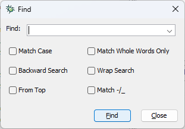|
| n/a | n/a | n/a | Edit / Expand all copy books |  | Expands all the copybooks in the current source file |
| n/a | n/a | n/a | Edit / Collapse all copy books |  | Collapses all the copybooks in the current source file |
| n/a | n/a | [Ctrl+G] | Edit / Go to... |  | Displays a window that jumps to a specific part of one of the currently loaded programs. <br>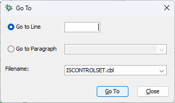|
| n/a | n/a | [F12] | Edit / Go to declaration |  | Having a variable selected in any part of the source, moves the cursor to the variable declaration in Data Division. |
| n/a | n/a | [Alt+Left] | Edit / Back |  | Moves the cursor to the previous occurrence of the selected variable in the source. |
| n/a | n/a | [Alt+Right] | Edit / Forward |  | Moves the cursor to the next occurrence of the selected variable in the source. |
| n/a | n/a | [Ctrl+L] | File / Load file... |  | Loads a source file. The purpose of loading a source file is to set breakpoints in that file before executing it. |
| n/a | n/a | [Ctrl+U] | File / Unload current file |  | Releases a previously loaded source file. |
| b0 | n/a | n/a | n/a |  | Usage: *b0 [ { -d \| -e } ] ProgramName* <br>Sets a breakpoint at the beginning of the program *ProgramName*. <br>If the-d option is used, the breakpoint is disabled. <br>If the-e option is used, the breakpoint is enabled. |
| break | br | [Ctrl+B] | Breakpoints / Set |  | Usage: *break* <br>Displays a window that allows the user to set breakpoints. <br>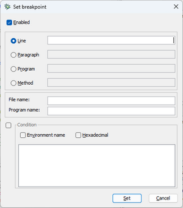 |

| clear | cl | n/a | n/a |  | Usage: clear { LineNumber \| ParagraphName } [SourceCode] Clears a breakpoint. LineNumber is the line number where the breakpoint is set. ParagraphName is the name of the paragraph where a breakpoint is set. SourceCode is the optional name of the source code that LineNumber and ParagraphName refer to. If SourceCode is not specified, the current source code is implied. |
| n/a | Breakpoints / Clear all |  | Usage: clear -l Clears all breakpoints. |
| continue | co | [Ctrl+F5] | Run / Continue |  | Usage: continue Starts or continues program execution. |
| directory | dir | n/a | n/a |  | This is a deprecated command. It’s useful only if you’re debugging programs compiled by isCOBOL 2020 R1 or previous. Usage: directory [DirectoryName] If DirectoryName is omitted, then the value of iscobol.debug.code_prefix is shown. Otherwise, the directory specified by DirectoryName is appended to the value of iscobol.debug.code_prefix. |
| display | dis | [Ctrl+D] | Data / Display |  | Usage: display Opens a window that displays the value of a variable. Refer to the usages below for details. |
| n/a | n/a |  | Usage: display [-x] [-c class-name[:>method-name]] [-tree] [-full] VariableName Displays the value of a data item. When "-x" is specified, the hexadecimal value is shown. When "-c" is specified, the runtime searches for the data item in the class specified by this option. The class must exist in the call stack. When "-tree" is specified, a new tab is added to the information window. It will show the data item and all its sub-levels in a hierarchical structure. It can be updated or removed by right-clicking in the tab to display a contextual menu. When "-full" is specified, the whole data item value is displayed. By default, data item values are truncated to the size specified in Settings / Data. When "-x" and "-tree" are specified in the same command, their effects are combined. VariableName is the data item whose value will be displayed. |
| n/a | n/a |  | Usage: display [-x] [-c class-name[:>method-name]] ControlHandle [ property | prop ] PropertyName Displays the current value of a control property. When "-x" is specified, the hexadecimal value is shown. When "-c" is specified, the control handle is searched in the class specified by this option. The class must exist in the call stack. ControlHandle must refer to a valid handle. PropertyName is a the name of a property of ControlHandle. |
| display-classinfo | dis -classinfo | n/a | Run / Display class info |  | Usage: display -classinfo Prints information about the current class. The information includes the compiler version, the compiler options, the list of embedded resources and the date and time the program was compiled on. |
| display -env | dis -env | n/a | Data / Display Environment variable |  | Usage: display [-x] -env VariableName Displays the value of an environment variable. When "-x" is specified, the hexadecimal value is shown. VariableName is the name of the environment variable to be displayed. When activated by menu, the following dialog is shown: |
| down | do | n/a | n/a |  | Usage: down Shows the next lower stack frame. |
| env | en | n/a | Data / Display environment variable |  | Usage: env Opens a window that allows the user to enter the name of the environment variable to be displayed. |
| n/a | n/a |  | Usage: env VariableName Displays the value of an environment variable. VariableName is the name of the environment variable to be displayed. |
| exit | ex | [Alt+F4] | File / Exit |  | Usage: exit Terminates the debugging session and exits. |
| f | n/a | F3 | Edit / Repeat find |  | Usage: f Repeats the last search, with the same options |
| fb | n/a | [Ctrl+Shift+K] | Edit / Find backwards... |  | Usage: fb SearchText Searches backwards for specific text. SearchText is the text to be searched for. |
| ff | n/a | [Ctrl+K] | Edit / Find forwards... |  | Usage: ff SearchText Searches forward for specific text. SearchText is the text to be searched for. |
| ft | n/a | [Ctrl+T] | Edit / Find from top... |  | Usage: ft SearchText Searches for specific text from the beginning of the source. SearchText is the text to be searched for. |
| gc | g | n/a | n/a |  | Usage: gc Forces the garbage collector to release unreferenced resources and compact the memory heap. |
| help | h | n/a | n/a |  | Usage: help Lists all the available debugger commands. |
| n/a | n/a |  | Usage: help DebuggerCommand Displays the usage of a specific debugger command. DebuggerCommand is the command to be searched for. |
| infostack | i | n/a | View / Perform stack |  | Activates the "Perform stack" tab in the Information window. |
| jump            Note - this is supported only in programs compiled with -dx option | [Ctrl+J] | Run / Jump to |  | Usage: jump Opens a window that allows the user to jump to a specific line by skipping the code between the current line and the destination line. |
| [Shift+F11] | Run / Jump to selected line |  | Usage: jump line-number [filename] Jump to a specific line by skipping the code between the current line and the destination line. Note: Jumping to lines that are inside blocks is not allowed. In this case the Debugger jumps to the beginning of the block. |
| n/a | n/a |  | Usage: jump paragraph-name Jump to a specific paragraph by skipping the code between the current line and the destination line. |
| [Alt+Shift+F10] | Run / Jump out paragraph |  | Usage: jump -outpar Jump out of the current paragraph skipping all the remaining statements in the paragraph. |
| [Alt+Shift+F11] | Run / Jump out program |  | Usage: jump -outprog Jump out of the current program skipping all the remaining statements in the program. |
| [Shift+F10] | Run / Jump next statement |  | Usage: jump -next Jump to the next statement skipping the current one. |
| length | len | n/a | Data / Length... |  | Usage: length Opens a window that displays the length of a variable. Refer to the usages below for details. |
| n/a | n/a |  | Usage: length [-c class-name[:>method-name]] variable-name Displays the lenght in bytes of a data item. When "-c" is specified, the data item is searched in the class specified by this option. The class must exist in the call stack. |
| let | le | [Ctrl+Shift+A] | Data / Accept |  | Usage: let Opens a window that allows the user to change the value of a variable. Refer to the usages below for details. |
| n/a | n/a |  | Usage: let [-x] [-c class-name[:>method-name]] VariableName [=VariableValue] Changes the value of a data item. When "-x" is specified, a hexadecimal value must be entered. When "-c" is specified, the data item is searched in the class specified by this option. The class must exist in the call stack. VariableName is the data item whose value will be changed. VariableValue is the value that will be set to VariableName. If omitted, the current variable content is shown and you’re allowed to change it. |
| n/a | n/a |  | Usage: let [-c class-name[:>method-name]] ControlHandle { property | prop } PropertyName [=PropertyValue] Changes the current value of a control property. When "-c" is specified, the control handle is searched in the class specified by this option. The class must exist in the call stack. ControlHandle must refer to a valid handle. PropertyName is a the name of a property of ControlHandle. PropertyValue is the value that will be set to PropertyName. If omitted, the current property value is shown and you’re allowed to change it. |
| n/a | Data / Change environment variable... |  | Usage: let -env VariableName [=VariableValue] Changes the value of a configuration property. VariableName is the data item whose value will be changed. VariableValue is the value that will be set to VariableName. If omitted, the current property value is shown and you’re allowed to change it. |
| line | lin | n/a | n/a |  | Shows information about the current line. |
| list | lis | n/a | n/a |  | Shows some lines of code, starting at the current line. |
| m0 | n/a | n/a | n/a |  | Usage: m0 [ { -d | -e } ][ classname { . | :> | :: } ][ methodname ]( [ signature ] ) Sets a breakpoint at the first executable line of classename.methodname.If classname is not specified, the breakpoint is set on the current debugged class. If signature is not specified and there is only a method named methodname, the breakpoint is set on that method. signature is a comma separated list of class names or primitive types names,e.g. (java.lang.String,int,java.awt.Rectangle,boolean) If the -d option is used, the breakpoint is disabled.If the -e option is used, the breakpoint is enabled. |
| memory | me | n/a | n/a |  | Shows information about memory usage. |
| monitor | mo | [Ctrl+M] | Data / Set monitor... |  | Usage: monitor Opens a window that allows the user to enter the parameters needed to set a new monitor Note - the content of the Value field is trimmed, unless you delimit it by quotes. |
| n/a | n/a |  | Usage: monitor [-d] [-e] [-x] [-c class-name[:>method-name]] VariableName [ when Operator Value | always | never ] Monitors a data item. When its value changes or matches a condition, the execution of the program is suspended and the debugger is activated. VariableName is the data item to monitor. Operator can be =, !=, <, >, <=, >=. Value is the value to be tested. If you need to include leading or trailing spaces in the value, delimit it by quotes.  When "-d" is specified, the monitor is disabled and its value in the Information Window is not updated.When "-e" is specified, the monitor is enabled and its value in the Information Window is updated. When "-x" is specified, the value is hexadecimal. When "-c" is specified, the data item is searched in the class specified by this option. The class must exist in the call stack. When the "always" phrase is specified, the debugger is activated each time the value changes. When the "never" phrase is specified, the debugger is never activated, but the value in the Information Window is always updated. |
|  |  |  |  |  | Usage: monitor [-d][-e] [-c class-name[:>method-name]] ControlHandle [ property | prop ] PropertyName [ when Operator PropertyValue | always | never ] Monitors a property of a control. When its value changes or matches a condition, the execution of the program is suspended and the debugger is activated. ControlHandle must refer to a valid handle. PropertyName is a the name of the property of ControlHandle to monitor. Operator can be =, !=, <, >, <=, >=. PropertyValue is the value to be tested.  When "-d" is specified, the monitor is disabled and its value in the Information Window is not updated.When "-e" is specified, the monitor is enabled and its value in the Information Window is updated.When "-c" is specified, the control handle is searched in the class specified by this option. The class must exist in the call stack. When the "always" phrase is specified, the debugger is activated each time the value changes. When the "never" phrase is specified, the debugger is never activated, but the value in the Information Window is always updated. |
| n/a | n/a |  | Usage: monitor [-d][-e] -env VariableName Monitors an environment variable. When "-d" is specified, the monitor is disabled and its value in the Information Window is not updated.When "-e" is specified, the monitor is enabled and its value in the Information Window is updated. VariableName is the name of the environment variable to monitor. |
| n/a | View / Monitors |  | Usage: monitor -l Activates the Monitors view in the Information Window. All monitors currently set are listed. |
| next | n | [Shift+F7] | Run / Step over |  | Usage: next Executes the current statement. If it is a PERFORM statement, it is entirely executed. |
| offset | of | n/a | Data / Offset... |  | Usage: offset Opens a window that displays the length of a variable. Refer to the usages below for details. |
| n/a | n/a |  | Usage: offset [-c class-name[:>method-name]] variable-name Displays the offset of a data item. When "-c" is specified, the data item is searched in the class specified by this option. The class must exist in the call stack. |
| outpar | outpa | [Alt+Shift+F7] | Run / Step out paragraph |  | Usage: outpar Continues execution until current paragraph exits. |
| outprog | outpr | [Alt+Shift+F8] | Run / Step out program |  | Usage: outprog Continues execution until current program exits. |
| pause | p | n/a | Run / Pause |  | Usage: pause Suspends the program execution and highlights the current statement, whether it has already returned or is still in progress. |
| prog | prog | [Alt+F9] | Run / Run to next program |  | Usage: prog Continues execution until the runtime enters in the next program compiled in debug mode. |
| quit | q | [Shift+F5] | Run / Finish session |  | Usage: quit Stops the execution of the program. The debugging session is still valid and the program can be restarted with the run command. |
| quit | q | [Shift+F5] | Run / Disconnect |  | Usage: quit Only when remote debugging, attached the remote runtime session.In a remote debug environment, this function replaces Run / Finish Session. |
| readsession | rea | n/a | File / Load debugger session |  | Usage: readsession [FileName] Loads monitors and breakpoints from a previously saved debugging session. FileName is the name of the file that contains the debugger configuration. If it is not specified, "null.isd" is implied. |
| restart | res | [Ctrl+Shift+F6] | Run / Restart session |  | Usage: restart This command has the same effect as issuing the quit command followed by the run command. |
| run | ru | [Ctrl+F6] | Run / Start session |  | Usage: run Starts the execution of the program. No COBOL statements are executed. |
| run | ru | [Ctrl+F6] | Run / Connect |  | Usage: run Only when remote debugging, attached the remote runtime session.In a remote debug environment, this function replaces Run / Start session. |
| step | s | [F7] | Run / Step into |  | Usage: step [n]Executes the current statement. If it is a PERFORM statement, the first statement of the paragraph or session that it refers to becomes current. If n is specified and it’s greater than 1, the step command is automatically repeated n times. |
| stoff | n/a | [Ctrl+F4] | Run / Stop autostep |  | Usage: stoff Deactivates the autostep function. |
| ston | n/a | [Ctrl+F3] | Run / Start autostep |  | Activates the autostep function. Statements are automatically executed at regular intervals. The function can be changed with the selector on right side of the toolbar. |
| thread | th | n/a | Run / ThreadName |  | Usage: thread ThreadName Activates a specific thread. ThreadName is the name of the thread to activate. |
| n/a | View / Threads |  | Usage: thread -l Activates the Threads view in the Information Window. All monitors currently set are listed. |
| to | to | [Ctrl+F9] | Run / Continue to line number |  | Usage: to LineNumber [SourceCode] Starts or continues the program execution until a certain line is reached. LineNumber is the line to reach. SourceCode is the optional name of the source code to which LineNumber refers. If it is not specified, the current source code is implied. |
| troff | trof | [Shift+F4] | File / Trace Off |  | Usage: troff Tracing is suspended. |
| tron | n/a | [Shift+F3] | File / Trace On... |  | Usage: tron Tracing is activated. A trace line is appended each time a paragraph starts or ends and each time a program starts or ends. Information is stored in a file called debugger.log, created in the current directory. |
| unmonitor | u | n/a | n/a |  | Usage: unmonitor VariableName Removes the monitor on a data item. VariableName is a monitored data item. |
| n/a | n/a |  | Usage: unmonitor [-env] VariableName Removes a monitor on an environment variable. VariableName is a monitored environment variable . |
| n/a | Data / Clear all monitors |  | Usage: unmonitor -a Clears all monitors. |
| up | up | n/a | n/a |  | Usage: up Shows the higher stack frame. |
| w0 | n/a | n/a | Edit / First executable line |  | Usage: w0 Moves the cursor to the first executable line. |
| w@ | n/a | n/a | Edit / Current line |  | Usage: w@ Moves the cursor to the current line. |
| wb | n/a | [Ctrl+Home] | Edit / Last line |  | Usage: wb Moves the cursor to the last line of the current source. |
| wt | n/a | [Ctrl+End] | Edit / First line |  | Usage: wt Moves the cursor to the first line of the current source. |
| writesession | w | n/a | File / Save debugger session |  | Usage: writesession [FileName] Saves monitors and breakpoints to a file. FileName is the name of the file that contains the debugger configuration. If it is not specified, "null.isd" is implied. Note - The session can be saved automatically by going to Settings -> Session, and checking the "Save session automatically" option. |

### Enter Debugger

If a program compiled in debug mode is performing ACCEPT of user input on a graphical window, if you press Pause/Break on the keyboard, you will enter Debugger at the next ACCEPT interruption. For example, if you want to debug what happens when you click on a specific push-button of your window,

1. start the Debugger
2. issue the run command
3. issue the continue command
4. wait for the window with the push-button to appear
5. press Pause/Break on the keyboard
6. click on the push-button

On some keyboards the Pause/Break key is not available. In order to have the same feature associated to another key, set the exception value of that key to 65535. For example, if you want to enter debugger using F6, start the Debugger as follows:

```cobol
iscrun -d -Discobol.key.f6=exception=65535 MYPROGRAM
```

### Null, empty and dyndata values

The [display](./Debugger-Functions), [length](./Debugger-Functions), [monitor](./Debugger-Functions) and [offset](./Debugger-Functions) commands can return one of the following special values:

| Value | Meaning |
| :--- | :--- |
| <dyndata\> | This value is returned for structures that contain a dynamic length item (PIC X ANY LENGTH) or a dynamic capacity table (OCCURS DYNAMIC) with some memory allocated. To check the content of these dynamic length items you need to point to the specific data item, not to his parent. |
| <empty\> | This value can be returned either for a dynamic length item with no memory allocated (i.e initialized PIC X ANY LENGTH and OCCURS DYNAMIC items) or for Linkage parameters that were not passed by the caller program. |
| <null\> | This value is returned for OBJECT REFERENCE data items that point to no object. |
