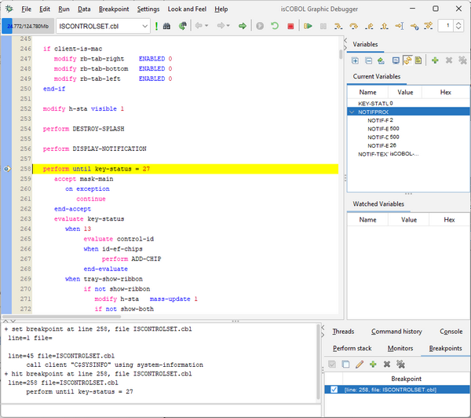

## The Debugger Window

The visual debugger is displayed in a dedicated window, which is divided into several areas described below:

By default the source code is shown on a white background while copybooks and nested copybooks are shown on different shades of gray. Color can be configured in [Settings / Customize / Fonts And Colors](../Debugger-Functions/Debugger-Functions).

Copybooks can be expanded and collapsed for easier reading.

Debugger command aliases and shortcuts can be configured in [Settings / Customize / Commands](../Debugger-Functions/Debugger-Functions) and [Settings / Customize / Shortcuts](../Debugger-Functions/Debugger-Functions).

Settings are saved in a file named *isdebugger2.properties* under the user home directory. This file is read every time the Debugger starts.

### Differences between Local Debugger and Remote Debugger

The graphical Debugger can be used to debug both local programs or remote programs.

When debugging a local runtime session, you have to issue a [run](../Debugger-Functions/Debugger-Functions) command to start debugging and you can issue a [quit](../Debugger-Functions/Debugger-Functions) command to forcibly terminate the runtime session.

When debugging a remote runtime session, you attach the remote runtime and start debugging from the statement the runtime was performing when it was attached. By issuing the [quit](../Debugger-Functions/Debugger-Functions) command, the Debugger disconnects and the runtime session continues to the end, unless you enable the *Force STOP RUN after disconnect* option in [Settings / Session](../Debugger-Functions/Debugger-Functions), in such case the runtime session is forcibly terminated as the Debugger disconnects.
