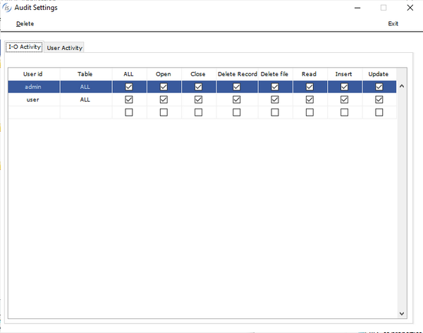

### Audit configuration

isCOBOL provides a graphical configurator for the audit feature. The program is named AUDITSETTINGS and can be launched from the Isapplication menu.

Using this tool you can easily activate or deactivate the logging of specific I/O operations and also choose which users will have their activity logged.

In the "I-O Activity" tab you can choose which file operation(s) to trace. Specify the name of the user as well as the name of the file. To trace all operation of a specific file click on "ALL" checkbox. If you want trace the operation on all file type "ALL" into the column "table"

The operations you can trace are:

| Operation | Value stored into the auditlog file |
| --- | --- |
| Open | fo |
| Close | fc |
| Delete record | fd |
| Delete file | ff |
| Read (sequential and random) | fr |
| Write | fw |
| Rewrite | fx |

In the "User Activity" tab you can choose to trace user access and program execution information. You will specify the name of the user.

The operations you can trace are:

| Operation | Value stored into the auditlog file |
| --- | --- |
| Login | pi |
| Logout | po |
| Program start | ps |
| Program end | pe |
