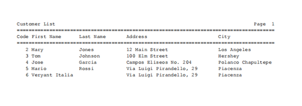
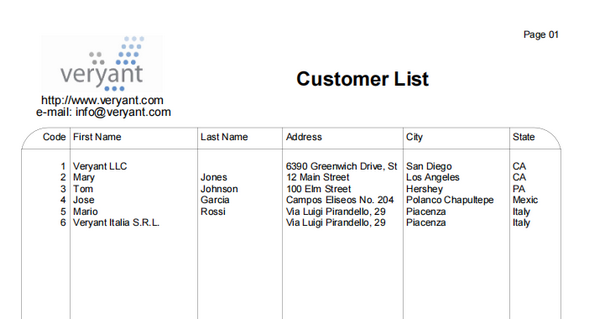

### Printing modernization (from text-only to graphical, from paper to PDF)

Most legacy COBOL programs wrote text-only printouts using a monospaced font so that the text can be aligned and distributed into columns by inserting space characters among words. Basic graphics like bars and boxes are obtained by printing pipes, dashes or underscores.

isCOBOL allows you to modernize these printouts through the WIN$PRINTER library routine. With this routine you can

- use different true type fonts, with different styles and colors,
- distribute text into columns even if the font is not monospaced,
- draw graphic boxes with square or round corners,
- print image pictures.

In addition, the isCOBOL runtime allows you to redirect the print job to three possible destinations:

- The system spooler

When the print job is sent to the system spooler, it causes the active printer to manage it. The active printer can be changed through the WIN$PRINTER routine.

- The print preview

When the print job is sent to the print previewer, the runtime shows a print preview dialog for the user to review the printout. From this dialog the user can either print to a phyisical printer or save to a PDF file.

- PDF file

When the print job is sent to a PDF file, the runtime takes care of generating a PDF file on disc.

The destination is controlled by the physical name of the print file, and no specific coding is required in the print procedure logic.

The modernization sample installed along with isCOBOL under *sample/modernization* includes a print program named *PRINTCUSTOMER.cbl* that evolves along with the UI, from a text-only printout

to a better graphical printout

Review the code of *PRINTCUSTOMER.cbl* in its various versions to understand the changes that are necessary for this kind of evolution.
