## Modernization Guides

### UI Modernization (from character based to graphical and web)

This guide explains the modernization process of a legacy COBOL application with character based user interface. It discusses the necessary steps to transform the character based user interface into a graphical user interface and eventually to a web user interface.

The code snippets used by this guide are taken from the modernization example installed with isCOBOL in the folder *sample/modernization*.

For an easy conversion of the user interface it’s good practice to have the user interface management separated from the backend processing. The installed example is an application of this kind.

The starting point is a character based screen whose Screen Section definition is as follows:

```cobol
       01  s1.
           03 "Customer code:"        line 3 col 2.
           03 using cust-code         col + 2 high prompt.
           03 "First name: "          line 4 col 2.
           03 using Cust-First-Name   col + 2 high prompt.
           03 "Last name:"            line 5 col 2.
           03 using Cust-Last-Name    col + 2 high prompt.
           03 "Address:"              line 7 col 2.
           03 "Street:"               line 8 col 2.
           03 using Cust-Street       col + 2 high prompt.
           03 "City:"                 col 50.
           03 using Cust-City         col + 2 high prompt.
           03 " State:"               line 9 col 2.
           03 using Cust-State        col + 2 high prompt
                                      after CHECK-STATE.
           03 from State-Description  col + 2.
           03 "Zip code:"             col 50.
           03 using Cust-Zip          col + 2 high prompt.
           03 "Gender:"               line 11 col 2.
           03 using Cust-Gender       col + 2 high prompt.
           03 "Phone number:     "    line 13 col 2.
           03 using Cust-Phone        col + 2 high prompt.
           03 "Cell Phone number:"    line 14 col 2.
           03 using Cust-CellPhone    col + 2 high prompt.
 
       01  s-func.
           03 "F1=Lookup"             line 21 col 2 reverse.
           03 "F2=Lookup State"       col + 2 reverse.
           03 "F3=Del"                col + 2 reverse.
           03 "F5=First"              col + 2 reverse.
           03 "F6=Prev"               col + 2 reverse.
           03 "F7=Next"               col + 2 reverse.
           03 "F8=Last"               col + 2 reverse.
           03 "F9=Save"               col + 2 reverse.
           03 "F10=Print"             Line 23 col 2 reverse.
           03 "ESC=Exit"              col + 2 reverse.
```

At runtime, the screen appears as follows:

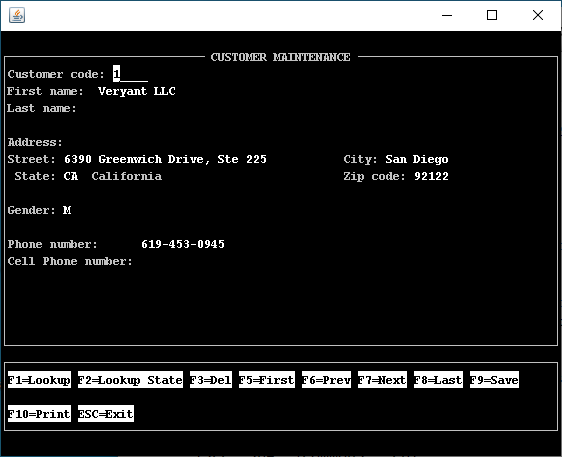

The minimal modification that can be done to the Screen Section in order to obtain a graphical screen is to change text labels and FROM fields to LABEL controls and USING fields to ENTRY-FIELD controls as follows:

```cobol
       01  s1.
           03 label "Customer code:"             line 3 col 2.
           03 entry-field using cust-code        col + 2 high prompt.
           03 label "First name: "               line 4 col 2.
           03 entry-field using Cust-First-Name  col + 2 high prompt.
           03 label "Last name:"                 line 5 col 2.
           03 entry-field using Cust-last-Name   col + 2 high prompt.
           03 label "Address:"                   line 7 col 2.
           03 label "Street:"                    line 8 col 2.
           03 entry-field using Cust-Street      col + 2 high prompt.
           03 label "City:"                      col 50.
           03 entry-field using Cust-City        col + 2 high prompt.
           03 label " State:"                    line 9 col 2.
           03 entry-field using Cust-State       col + 2
                                                 after CHECK-STATE.
           03 label State-Description            col + 2.
           03 label "Zip code:"                  col 50.
           03 entry-field using Cust-Zip         col + 2 high prompt.
           03 label "Gender:"                    line 11 col 2.
           03 entry-field using Cust-Gender      col + 2 high prompt.
           03 label "Phone number:"              line 13 col 2.
           03 entry-field using Cust-Phone       col + 2 high prompt.
           03 label "Cell Phone number:"         line 14 col 2.
           03 entry-field using Cust-CellPhone   col + 2 high prompt.
 
       01  s-func.
           03 label "F1=Lookup"             line 16 col 2 reverse.
           03 label "F2=Lookup State"       col + 2  reverse.
           03 label "F3=Delete"             col + 2  reverse.
           03 label "F5=First"              col + 2 reverse.
           03 label "F6=Prev"               col + 2 reverse.
           03 label "F7=Next"               col + 2 reverse.
           03 label "F8=Last"               col + 2 reverse.
           03 label "F9=Save"               col + 2 reverse.
           03 label "F10=Print"             line 17 col 2 reverse.
           03 label "ESC=Exit"              col + 2 reverse.
```

After this modification, the screen appears as follows: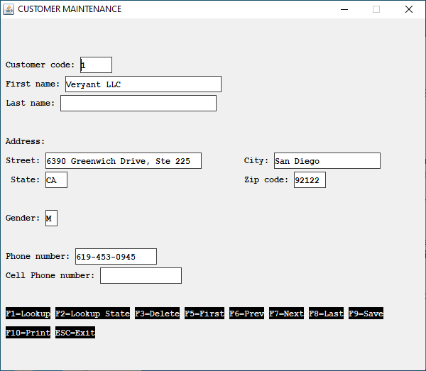

A little more complex modification is to add some properties and styles to LABEL and ENTRY-FIELD controls and replace text labels that describe an action with graphical PUSH-BUTTON controls as follows:

```cobol
       01  s1.
           03 label
              title    "Customer code:"
              line     3 
              col      2
              .
           03 entry-field
              value    cust-code
              numeric
              col      + 2
              id       78-id-cust-code
              .
           03 label
              title    "First name: "
              line     4 
              col      2
              .
           03 entry-field
              value    Cust-First-Name
              col      + 2
              id       78-id-first-name
              .
           03 label
              title    "Last name:"
              line     5 
              col      2
              .
           03 entry-field
              value    Cust-last-Name
              col      + 2
              .
           03 label
              title    "Address:"
              line     7 
              col      2
              .
           03 label
              title    "Street:"
              line     8
              col      2
              .
           03 entry-field
              value    Cust-Street
              col      + 2
              .
           03 label
              title    "City:"
              col      50
              .
           03 entry-field
              value    Cust-City
              col      + 2
              .
           03 label
              title    " State:"
              line     9 
              col      2
              .
           03 entry-field
              value    Cust-State
              col      + 2
              after    CHECK-STATE
              id       78-id-cust-state
              .
           03 label 
              title    State-Description
              col      + 2
              .
           03 label
              title    "Zip code:"
              col      50
              .
           03 entry-field
              value    Cust-Zip
              col      + 2
              .
           03 label
              title    "Gender:"
              line     11
              col      2
              .
           03 entry-field
              value    Cust-Gender
              col      + 2
              .
           03 label
              title    "Phone number:"
              line     13 
              col      2
              .
           03 entry-field
              value    Cust-Phone
              col      + 2
              .
           03 label
              title    "Cell Phone number:"
              line     14 
              col      2
              .
           03 entry-field
              value    Cust-CellPhone
              col      + 2
              .
 
       01  s-func.
           03 push-button
              exception-value   1
              self-act
              title             "F1=Lookup"
              line              17 
              col               2 
              size              14
              .
           03 push-button
              exception-value   2
              self-act
              title             "F2=Lookup State"
              col               + 2 
              size              14
              .
           03 push-button
              exception-value   3
              self-act
              title             "F3=Delete"
              col               + 2
              size              14
              .
           03 push-button
              exception-value   5
              self-act
              title             "F5=First"
              col               + 2
              size              14
              .
           03 push-button
              exception-value   6
              self-act
              title             "F6=Prev"
              col               + 2
              size              14
              .
           03 push-button
              exception-value   7
              self-act
              title             "F7=Next"
              line              18 
              col               2
              size              14
              .
           03 push-button
              exception-value   8
              self-act
              title             "F8=Last"
              col               + 2
              size              14
              .
           03 push-button
              exception-value   9
              self-act
              title             "F9=Save"
              col               + 2
              size              14
              .
           03 push-button
              exception-value   10
              self-act
              title             "F10=Print"
              col               + 2
              size              14
              .
           03 push-button
              exception-value   27
              self-act
              title             "ESC=Exit"
              col               + 2
              size              14
              .
```

After this modification, the screen appears as follows:

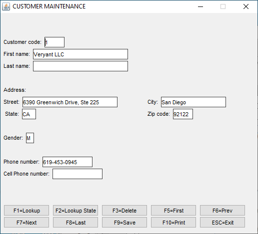

**Note** - if you wish to assign a special attribute to all the fields, for example if you want all the push-buttons to have the SELF-ACT style, you can use the compiler configuration property [iscobol.compiler.gui.<control-type\>.defaults](../../Compiler-and-Runtime/Configuration/Configuration-Properties#compiler-configuration) instead of writing "SELF-ACT" in every push-button description in the Screen Section.

Though the screen is graphical it’s still not perfect; it doesn’t look like a modern and appealing screen. A further effort is required in order to obtain a good screen. The following changes are suggested:

- Reorder the graphical control and put frames around them to better describe the information that they host,
- Add icons to the buttons and move them to a tool-bar on top of the screen
- Use different controls where applicable. For example the Gender can be accepted using two radio-buttons instead of an entry-field. This will save you for checking if the user input a valid value.
- Add a status-bar

Refer to CUSTOMER.cbl in *sample/modernization/graphical/3-full-gui* for the necessary code.

After these changes, the screen will look like this:

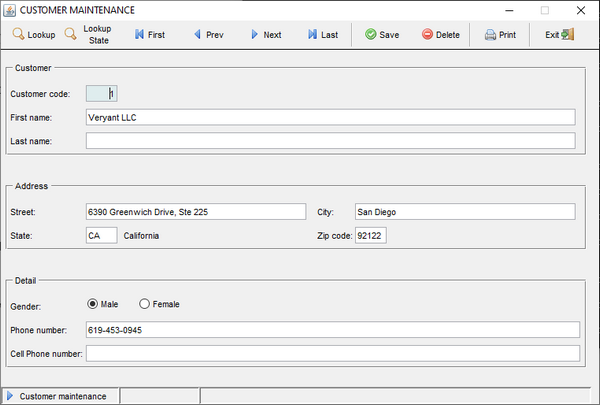

Button icons could be replaced with glyphs retrieved from a symbol font, like [Font Awesome](https://fontawesome.com/).

Refer to CUSTOMER.cbl in *sample/modernization/graphical/4-advanced-gui* for the necessary code.

After this change, the screen will look like this:

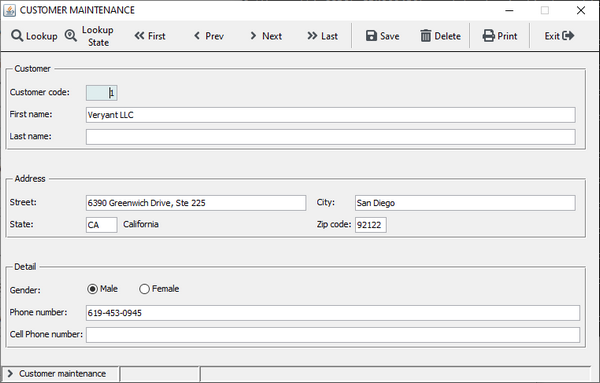

An additional cosmetic improvement can be introduced at compile time by setting [iscobol.compiler.gui.<control-type\>.defaults](../../Compiler-and-Runtime/Configuration/Configuration-Properties#compiler-configuration) to apply properties and styles to all the controls without code changes. Let’s consider, for example, the following Compiler configuration:

```cobol
# Compiler.regexp to remove the 3D and "ERASE" styles when displaying the window
iscobol.compiler.regexp="(?i)( 3-D,)" "" \
                        "(?i)( 3-D)" "" \
                        "(?i)( ERASE,)" "" \
                        "(?i)( ERASE)" ""
 
#### code injection for controls ####
# add the gradient color on all windows
iscobol.compiler.gui.window.defaults= \
    gradient-color-1 rgb x#FFFFFF \
    gradient-color-2 rgb x#F2F5F9  \ 
    gradient-orientation gradient-northeast-to-southwest 
 
# add the transparent style to all labels, check-boxes and radio-buttons
iscobol.compiler.gui.label.defaults= transparent
iscobol.compiler.gui.check_box.defaults= transparent
iscobol.compiler.gui.radio_button.defaults= transparent
iscobol.compiler.gui.frame.defaults= transparent
 
# set the white color for all toolbars
iscobol.compiler.gui.tool_bar.defaults= background-Color rgb x#FFFFFF \
                                        foreground-Color rgb x#000000
 
# add the flat style to all push buttons
iscobol.compiler.gui.push_button.defaults=flat 
 
# add the underline style to all entry-fields
iscobol.compiler.gui.entry_field.defaults = border-width (0, 0, 2, 0) \
                                            border-color rgb x#DAE1E5 \
                                            margin-width (3, 3, 3, 3)
             
# add the rollover effect on the grid control
iscobol.compiler.gui.grid.defaults= \
    cursor-frame-width 1 \
    cursor-frame-color rgb x#264188 \
    row-rollover-background-color rgb x#8BA2DE \
    row-rollover-foreground-color rgb x#264188 \
    heading-rollover-background-color rgb x#8BA2DE \
    heading-rollover-foreground-color rgb x#264188
 
# add the grip style to the status-bar
iscobol.compiler.gui.status_bar.defaults= grip
```

After recompiling the program with the above settings, the screen will look like this:

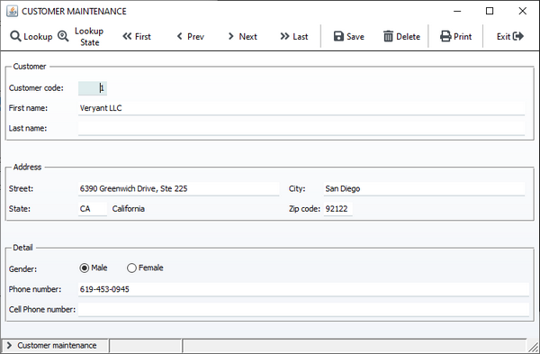

The last step in the modernization process is to bring our user interface to the web.

It can be done in three ways, discussed below:

#### WebClient

WebClient allows you to display your screen in a web browser. The screen that the user sees in the browser is identical to the screen he would see by running the desktop application.

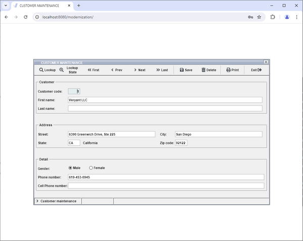

With this solution no change is required to the user interface management code.

However, by default the program doesn’t look like a web application, it looks more like a remote desktop implemented in the browser.

In order to make the program more similar to a web application, you should undecorate and maximize the window as follows:

| Before | After |
| --- | --- |
| display independent graphical window        <br>background-low           <br>system menu         <br>title  "CUSTOMER MAINTENANCE"         <br>size 125         <br>lines 30         <br>control font window-font         <br>handle h-main         <br>event  WIN-EVT | display independent graphical window         <br>background-low           <br>system menu         <br>title  "CUSTOMER MAINTENANCE"         <br>size 125         <br>lines 30         <br>control font window-font         <br>handle h-main         <br>event  WIN-EVT         <br>resizable         <br>undecorated         <br>action  action-maximize |

After this small change, the screen will look like this:

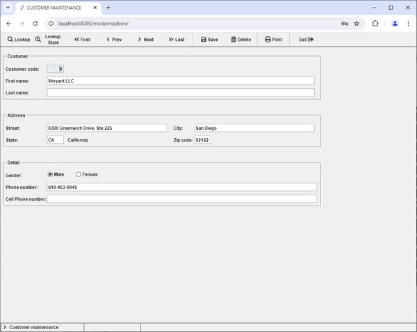

It looks more similar to a web page.

However, to improve the web-like layout even more, you might consider building an HTML container around your application. This is demonstrated by the example provided in the folder *sample/modernization/webclient/encapsulated*. The final result is: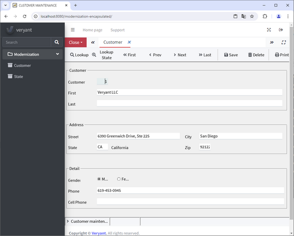

For more information about WebClient, see [isCOBOL Evolve: WebClient](../../../../is-cobol-web-client/iscobol-webclient).

#### WebDirect

The WebDirect option allows you to display your screen in a web browser. The screen is rendered using the ZK Framework so the layout is a little different than the one you would see by running the desktop application.

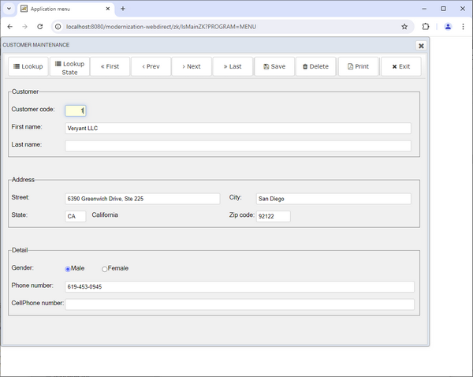

Unlike WebClient, WebDirect doesn’t provide a full compatibility with the Swing components used by the desktop application. In particular:

- some control properties and styles are not supported,
- java-beans based on Swing and JavaFX components must be replaced with the proper ZK component.

For more information about the Web Direct 2.0 option, see [WebDirect option](../../../../is-cobol-EIS/WebDirect-option/Introduction).

A complete and working example is provided in the folder sample/modernization/eis/wd2.

#### Servlet option

This kind of option allows you to obtain a real web application. The user interface management must be rewritten in HTML5, CSS and JavaScript. The COBOL code is maintained only for the backend processing.

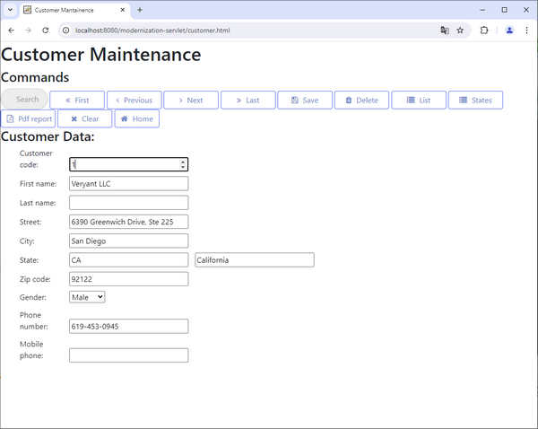

For more information about servlets written in COBOL, see [COBOL Servlet option (OOP)](../../../../is-cobol-EIS/COBOL-Servlet-option-OOP/Introduction).

A complete and working example is provided in the folder sample/modernization/eis/servlet.
