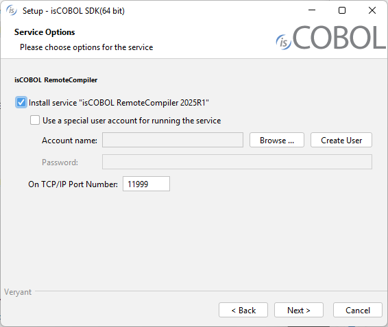

## Windows service and Unix daemon

### Windows service

On Windows it's possible to install isCOBOL RemoteCompiler as a Windows Service.

The isCOBOL RemoteCompiler service can be installed during the setup process:

When isCOBOL has been installed, the service can be installed, removed and managed through the isremotecc.exe command line utility.
