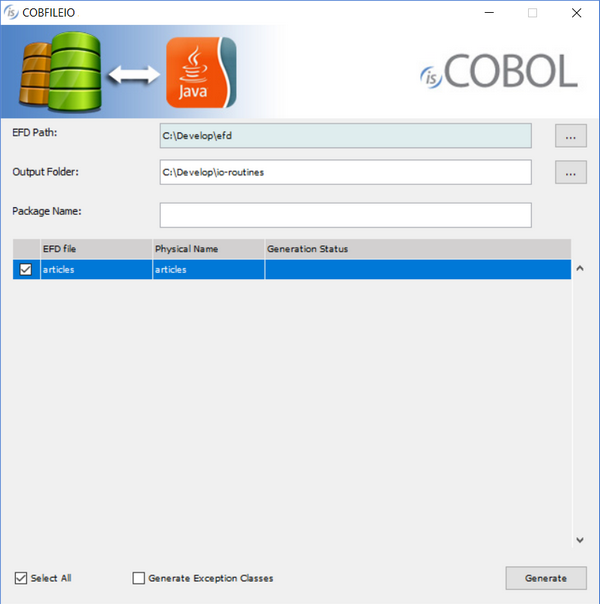

## COBFILEIO

The COBFILEIO utility works together with the isCOBOL Compiler to read COBOL source code and generate Java classes that can be used to access COBOL files and records.

COBFILEIO reads External File Description (EFD) XML files that are produced by the isCOBOL Compiler when it has been executed with the -efd compiler option. An EFD is a data dictionary that contains the mapping to use when COBOL files and records are accessed externally. COBFILEIO reads two files, an EFD file and an FD file containing the standard COBOL file descriptor, and generates a Java class for the COBOL file and a Java class for the COBOL record.

The Java programmer does not need any knowledge of COBOL data types or their underlying storage format, and COBFILEIO automatically generates Javadocs for the file and record classes.

The resulting classes can be brought into any Java development environment and Java developers can take advantage of rapid development features such as Eclipse's "code assist" to pop-up documentation and provide single key or click code completion.

A data record is managed as an object with set and get accessor methods for each elementary field. The individual record fields are accessed using Java data types. The set methods automatically perform data validation and throw customizable exceptions.

COBFILEIO generates Object-Oriented COBOL source code for the classes. This source code can be customized and maintained in either COBOL or Java language.

### Usage 1:

```cobol
cobfileio
```

or

```cobol
iscrun -utility cobfileio
```

If the utility is launched without parameters, a graphical wizard procedure will start.



### Usage 2:

```cobol
cobfileio -help
```

or

```cobol
iscrun -utility cobfileio -help
```

The *-help* option displays the usage on the system output.

### Usage 3:

```cobol
cobfileio fileName [-p=fileName] [-e]
```

or

```cobol
iscrun -utility cobfileio fileName [-p=fileName] [-e]
```

#### Where:

- *fileName* is the external file name in all lowercase letters. For example, if in the file's SELECT statement there is ASSIGN TO DISK "/mydir/MYFILE", then the COBFILEIO command line would be "java COBFILEIO myfile".
- The -p option allows you to assign a custom physical file name, otherwise the same name as the EFD dictionary is used.
- The –e option causes COBFILEIO to generate the exception classes. This needs to be done only for the first file because the same exception classes are reused for every file.

### Usage Steps

1. Create the EFD file by compiling the COBOL program with the -efd compile option. If desired, add the -efo=DirName compiler option to specify the directory where the EFD file will be output.
2. Execute the COBFILEIO utility with java COBFILEIO fileName -e. Include the -e option only the first time you run COBFILEIO.
3. Compile the exceptions classes. For example, javac \*.java.
4. Compile the generated COBOL object classes. First compile the record class, FileNameRec.cbl. Then compile the file class, FileNameFile.cbl. If desired, add the -jj and -jc compiler options to generate Java source code.
5. If desired, use the javadoc utility that comes with the JDK to create Javadocs.

**NOTE** - By default, COBFILEIO attempts to read an EFD named fileName.xml from the current working directory. If your EFD file is in another directory then specify this directory as the value of the cobfileio.efd_path property. For example,

```cobol
iscrun -c cobfileio.properties -utility cobfileio fileName
```

Where cobfileio.properties contains

```cobol
iscobol.cobfileio.efd_path=../efd
```

### Thin Client and headless systems

COBFILEIO can be used in thin client environment as well. Use this command to start it:

```cobol
iscclient -hostname <server-ip> -port <server-port> -utility cobfileio <arguments>
```

Server side paths must be provided in the arguments.

The thin client technology allows you to run the utility on a headless server. Start the isCOBOL Server on the headless server and launch the utility with the thin client from your PC; in this way the utility operates on the headless server while the utility GUI is shown on your PC.
