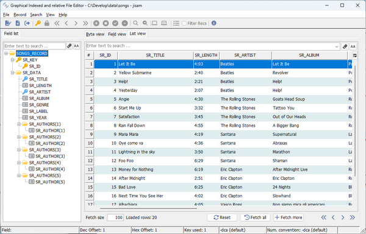
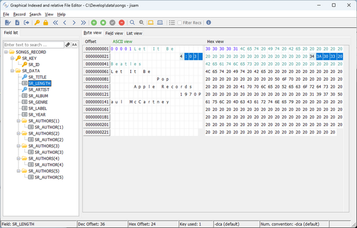

## GIFE (Index and Relative File Editor)

The Graphical Indexed File Editor (GIFE) utility allows you to read and modify the content of indexed and relative files.

## Usage 1:

```cobol
gife
```

or

```cobol
iscrun -utility gife
```

If the utility is launched without parameters, an empty dialog is shown.

To open a file click on the File menu and select Open. You will be prompted for the file name, file type and open mode (input / I-O). If [iscobol.file.prefix](../Compiler-and-Runtime/Configuration/Configuration-Properties#file-handling-configuration) is set in the configuration, the first path of the file prefix is proposed. If [iscobol.file.index](../Compiler-and-Runtime/Configuration/Configuration-Properties#file-handling-configuration) is set in the configuration, its value is proposed as file type. If you plan to open a relative file rather than an indexed file, set the file type field to "relative".

You can optionally specify an External File Description (EFD) XML file. This kind of file is produced by the isCOBOL Compiler when it has been executed with the -efd compiler option. An EFD is a data dictionary that contains the mapping to use when COBOL files and records are accessed externally. When provided with an EFD, GIFE shows the list of fields and allows you to work on each single field through three different views:

- List view (default), showing multiple records at once.
- Byte view, showing one record at once, displayed byte by byte.
- Field view, showing one record at once, displayed field by field.

The program shows the first record as soon as the file is open. ASCII view of the record content is shown on the left; this view is useful to handle USAGE DISPLAY items. Hex view is shown on the right; this view is useful to handle USAGE COMP and other kind of items that can’t be correctly represented in ASCII.

Primary key digits are shown in blue. Alternate keys digits are shown in green. The rest of the record is shown in black.

The *Record menu* contains features that allow you to navigate through records and update the record content.

From the *Search* menu you can perform a search for a specific word in the current record.

The *View* menu allows you to switch between ASCII view and HEX view.

The *Lock* button on the toolbar is used to lock and unlock the current record.

The *Filter Recs* option and the menu before it are enabled when opening a file with a dictionary that describes more record definitions bound to different tables. It is the case where the COBOL program from which the dictionary was generated uses the EFD [WHEN Directive](\) with the TABLENAME clause:

- if the *Filter Recs* option is unchecked, then GIFE allows you to browse all the records in the file;
- if the *Filter Recs* option is checked, then GIFE allows you to browse only the records of a specific table name. The table name can be selected from the menu before the *Filter Recs* option.

### Usage 2

```cobol
gife filename [ EFDfile ]
```

or

```cobol

```

Refer to the [GIFE](../Compiler-and-Runtime/Configuration/Configuration-Properties#gife) section in [Utilities Configuration](../Compiler-and-Runtime/Configuration/Configuration-Properties#utilities-configuration) for the list of configuration properties that can be included in *gife.properties* to configure GIFE.

If you pass the name of a file as parameter on the command-line, GIFE opens the file automatically by using the handler set by the [iscobol.file.index](../Compiler-and-Runtime/Configuration/Configuration-Properties#file-handling-configuration) configuration property. Relative file names are resolved using the first path in the [iscobol.file.prefix](../Compiler-and-Runtime/Configuration/Configuration-Properties#file-handling-configuration) setting and the current working directory.

### Thin Client and headless systems

GIFE can be used in thin client environment as well. Use this command to start it:

```cobol
iscclient -hostname <server-ip> -port <server-port> -utility gife <arguments>
```

Usage 1: server side paths must be provided in the arguments.

Usage 2: GIFE looks for files on the server machine. Browse features are disabled, you need to type the files path by hand.

The thin client technology allows you to run the utility on a headless server. Start the isCOBOL Server on the headless server and launch the utility with the thin client from your PC; in this way the utility operates on the headless server while the utility GUI is shown on your PC.
