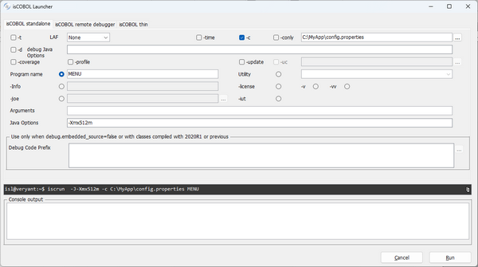
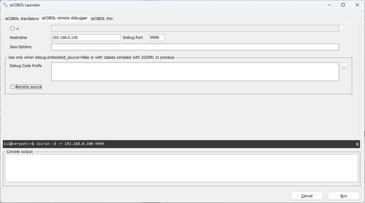
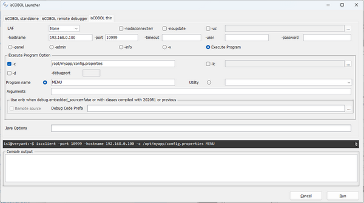
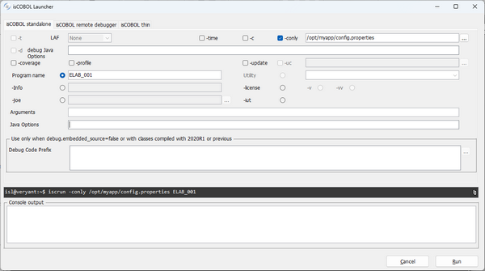

## ISL (isCOBOL Launcher)

The ISL utility helps setting up startup commands for your COBOL application.

Usage:

```cobol
isl
```

or

```cobol
iscrun -utility isl
```

### Configuring isCOBOL standalone

In this screen you can set up the command to run a COBOL program in stand alone mode, with or without debug.



| Available options | Description |
| --- | --- |
| -t | Run in terminal mode on Linux/Unix terminals |
| laf | Select the Look and Feel |
| -time | Measure the time spent by the runtime session |
| -c | Use an additional runtime configuration file |
| -conly | Use only one runtime configuration file |
| -d | Run in debug mode |
| Debug Java Options | Options to be passed to the JVM that runs the Debugger |
| -coverage | Generate code coverage report of the runtime session |
| -profile | Profile runtime execution |
| -update | Look for updates before starting the runtime |
| -uc | Specifies a configuration file for the isUpdater utility, that is invoked by the -update option |
| Program name | Name of the COBOL program to run |
| Utility | Run an utility instead of a COBOL program. Choose the desired utility from the list |
| -info | Instead of running the program, print information about the program class |
| -license | Instead of running the program, print information about the license |
| -v | Instead of running the program, print the runtime version |
| -joe | Run a joe script instead of a COBOL program |
| -iut | Run a unit test instead of a COBOL program |
| Arguments | Arguments to the COBOL program |
| Java options | Options to be passed to the Java Runtime |
| Debug Code Prefix | Path list to locate the source files when running in debug mode. This is useful only for debugging programs that were compiled with isCOBOL 2020 R1 or previous |

While you fill the fields and check the options, the resulting command is shown in the dark entry-field on the bottom of the screen; you can copy it to the clipboard and paste it in a batch file using a text editor. Click the Run button to start the COBOL program.

### Configuring isCOBOL remote debugger

In this screen you can set up the command to remotely debug a COBOL program, assuming that you know the IP address and port of a Debugger listener.



| Available options | Description |
| --- | --- |
| -c | Use an additional runtime configuration file |
| Hostname | IP address or hostname that runs the program to remote debug |
| Debug Port | Port used by the remote host for debugging communication |
| Java Options | Options to be passed to the Java Runtime |
| Debug Code Prefix | Path list to locate the source files when running in debug mode |
| Remote source | The source files are located on the remote host |

While you fill the fields and check the options, the resulting command is shown in the dark entry-field on the bottom of the screen; you can copy it to the clipboard and paste it in a batch file using a text editor. Click the Run button to start the COBOL program.

### Configuring isCOBOL thin

In this screen you can set up the command to run or debug a COBOL program in thin client mode, assuming that you know the IP address and port of a listening Application Server. You can also run server administration utilities from here.



| Available options | Description |
| --- | --- |
| laf | Select the Look and Feel |
| -nodisconnecterr | Avoid message box notification on connection lost |
| -noupdate | Don’t check for updates before starting the isCOBOL Client |
| -hostname | IP address or hostname where the isCOBOL Application Server is running |
| -port | Port used by the isCOBOL Application Server running on the host |
| -timeout | Specifies the connection timeout in seconds |
| -user | Specifies the user for the connection to the isCOBOL Server |
| -password | Specifies the password for the connection to the isCOBOL Server |
| -panel | Run the isCOBOL Server’s Administration Panel. |
| -admin | Run the isCOBOL Server’s Administration Panel. The panel starts with the "Users View" tab active |
| -info | Print the list of connected clients on the console |
| -v | Print the isCOBOL Client version on the console |
| Execute program | Run a program in thin-client mode. It enables [Execute program options](./ISL#execute-program-options) |
| Java Options | Options to be passed to the Java Runtime |

### Execute program options

| Available options | Description |
| --- | --- |
| -c | Use an additional runtime configuration file, server side |
| -lc | Use an additional runtime configuration file, client side |
| -d | Run in debug mode |
| -debugport | Port used by the remote host for debugging communication |
| Program Name | Name of the COBOL program to run |
| Utility | Run an utility instead of a COBOL program. Choose the desired utility from the list |
| Arguments | Arguments to the COBOL program |
| Remote source | The source files are located on the remote host. This is useful only for debugging programs that were compiled with isCOBOL 2020 R1 or previous |
| Debug Code Prefix | Path list to locate the source files when running in debug mode. This is useful only for debugging programs that were compiled with isCOBOL 2020 R1 or previous |

While you fill the fields and check the options, the resulting command is shown in the dark entry-field on the bottom of the screen; you can copy it to the clipboard and paste it in a batch file using a text editor. Click the Run button to start the COBOL program.

### Presets

ISL inherits most of the settings from the environment in which it’s launched. For settings that cannot be inherited, some configuration properties are provided. Refer to the [ISL](../Compiler-and-Runtime/Configuration/Configuration-Properties#isl) section in [Utilities Configuration](../Compiler-and-Runtime/Configuration/Configuration-Properties#utilities-configuration) for the list and description of these properties.

In order to run ISL with a configuration file (e.g. *isl.properties*), use the command:

```cobol
iscrun -c isl.properties -utility isl
```

### Thin Client and headless systems

ISL can be used in thin client environment as well. Use this command to start it:

```cobol
iscclient -hostname <server-ip> -port <server-port> -utility isl <arguments>
```

When launched in thin client environment, the utility allows you to configure only the launch of a backend elaboration that will run server side. This means that only the ‘isCOBOL standalone’ tab is active and within that tab all the options related to the UI are disabled.



The thin client technology allows you to run the utility on a headless server. Start the isCOBOL Server on the headless server and launch the utility with the thin client from your PC; in this way the utility operates on the headless server while the utility GUI is shown on your PC.
