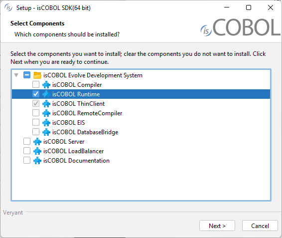

#### Distribution of a standalone application

To deploy the application through the Update Facility of isCOBOL Server, the isCOBOL Runtime Framework must be installed on the client machines.

Downlad and launch isCOBOL_*yyyy_R_n*_Windows_*arc*.msi where *yyyy* is the year, *R* is the release number, *n* is the build number and *arc* is the system architecture. Choose "isCOBOL Runtime" from the list of products:

When prompted, choose to associate the isws extension to the SDK that you’re installing:

The isws files are property files that include the isUpdater configuration. See [Client Configuration (isupdater.properties)](../../Compiler-and-Runtime/Configuration/Configuration-Properties#client-configuration-isupdaterproperties) for the list of properties that you could include in this kind of file. The isws files could be passed to isUpdater via the -c option. The installer creates an association between the isws extension and the command:

```cobol
isupdater -c %1
```

Below we describe how to set up the deployment of a COBOL application through the Update Facility and isws files, using the isCOBOL Server as HTTP server for the download of the application.

##### What to do server side

The user should gather the platform-dependent components from the corresponding isCOBOL setups and place them in specific folders on the server machine. Also the COBOL application items (classes, configuration and icons) should be gathered in a dedicated folder.

Here is a suggestion: create the following subfolders in the isCOBOL installation directory (that we assume as */home/veryant/isCOBOL2026R1*):

| Directory | What to copy inside |
| --- | --- |
| jars | Content of the lib folder of isCOBOL (may be empty) |
| libWin32 | Content of the lib folder of isCOBOL for Windows 32 bit |
| libWin64 | Content of the lib folder of isCOBOL for Windows 64 bit |
| binWin32 | Content of the bin folder of isCOBOL for Windows 32 bit |
| binWin64 | Content of the bin folder of isCOBOL for Windows 64 bit |
| myApp | Items of the COBOL application, described later |

The isCOBOL Server must be started with the option –hs in order to activate the HTTP Server feature, e.g.

```cobol
iscserver –hs
```

Create a file named *swupdater.properties* in the isCOBOL Server’s working directory and put the following entries into it:

```cobol
swupdater.version.iscobol=###
swupdater.lib.win.32.iscobol=/home/veryant/isCOBOL2026R1/libWin32
swupdater.lib.win.64.iscobol=/home/veryant/isCOBOL2026R1/libWin64
swupdater.version.iscobolJars=###
swupdater.lib.iscobolJars=/home/veryant/isCOBOL2026R1/jars
swupdater.version.iscobolNative=###
swupdater.lib.win.32.iscobolNative=/home/veryant/isCOBOL2026R1/binWin32
swupdater.lib.win.64.iscobolNative=/home/veryant/isCOBOL2026R1/binWin64
swupdater.version.myApp=1
swupdater.lib.myApp=/home/veryant/isCOBOL2026R1/myApp
```

Where ### is the build number of the isCOBOL Server. For example, for "release 2026 R1 build#1173.1_20260122_41329" you would use "1173.1".

If you use third party jar libraries that need to be installed along with your COBOL application, copy them to the isCOBOL *lib* folder.

Put the following items in the *myApp* subfolder:

- The class files of your COBOL programs,
- The icons (bmp, jpeg, gif and png) used by your programs,
- A file named *myApp.properties* that contains
  - a valid runtime license,
  - a code-prefix setting that points the folder C:\myApp (e.g. iscobol.code_prefix=C:\\\myApp),
  - the configuration of your COBOL application (e.g. keystrokes and file-prefix).

If you have custom native libraries that should be installed along with your application, copy them to the proper “bin” folder (e.g. if you have a library named mylib.dll for both Windows 32 bit and Windows 64 bit, copy the 32 bit version to binWin32 and copy the 64 bit version to binWin64).

##### What to do client side

Create a file with isws extension, e.g. *myapp.isws*, and put the following entries into it:

```cobol
swupdater.site=http://serverNameOrIp:10996
swupdater.version.iscobol=###
swupdater.directory.iscobol=C:/Veryant/isCOBOL_SDK2026R1/lib
swupdater.directory.clean.iscobol=true
swupdater.version.iscobolJars=###
swupdater.directory.iscobolJars=C:/Veryant/isCOBOL_SDK2026R1/jars
swupdater.directory.clean.iscobolJars=true
swupdater.version.iscobolNative=###
swupdater.directory.iscobolNative=C:/Veryant/isCOBOL_SDK2026R1/bin
swupdater.directory.clean.iscobolNative=true
swupdater.version.myApp=0
swupdater.directory.myApp=C:/myApp
swupdater.directory.clean.myApp=true
swupdater.mainclass=com.iscobol.invoke.Isrun –c C:/myApp/myApp.properties MYPROG
```

Where ### is the build number of the runtime installed on the client machine. For example, for "release 2026 R1 build#1173.1_20260122_41329" you would use "1073.1".

MYPROG is the name of the program that you wish to execute. The class of this program must be found in the myApp folder discussed above.

The above snippet assumes that the isCOBOL SDK was installed in the default location proposed by the setup wizard.

Note that *swupdater.version.myApp* in this file has a lower value of the corresponding property in the *swupdater.properties* file on the server. This is necessary to trigger the download of the COBOL Application (*myApp*) from the server machine to the local machine. After the first launch, *swupdater.version.myApp* is updated and its value matches the value server side. If you change the content of the *myApp* folder on the server, increase the value of *swupdater.version.myApp* in *swupdater.properties* on the server machine to trigger a new download of the *myApp* folder.

Double clicking on *myapp.isws* will trigger the program execution. It also will update the local copy of the isCOBOL runtime if necessary.

The file *myapp.isws* could be distributed via internet in the form of a file to be downloaded and executed.
