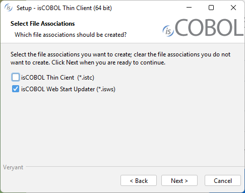

#### Distributon of the thin client

To deploy the thin client through the Update Facility of isCOBOL Server, the isCOBOL Thin Client must be installed on the client machines.

Install either isCOBOL_*yyyy_R_n*_Windows_*arc*.msi (it requires Java installed on the machine) or isCOBOL_*yyyy_R_n*_THIN_Windows_*arc*.msi (it doesn’t require Java on the machine as it installs its own JVM) where *yyyy* is the year, *R* is the release number, *n* is the build number and *arc* is the system architecture.

When prompted, choose to associate the isws extension:



The isws files are property files that include the isUpdater configuration. See [Client Configuration (isupdater.properties)](../../Compiler-and-Runtime/Configuration/Configuration-Properties#client-configuration-isupdaterproperties) for the list of properties that you could include in this kind of file. The isws files could be passed to isUpdater via the -c option. The installer creates an association between the isws extension and the command:

```cobol
isupdater -c %1
```

Below we describe how to set up the deployment of a COBOL application through the Update Facility and isws files, using the isCOBOL Server as HTTP server for the download of the application.

##### What to do server side

The user should gather the platform-dependent components from the corresponding isCOBOL setups and place them in specific folders on the server machine.

Here is a suggestion: create the following subfolders in the isCOBOL installation directory (that we assume as */home/veryant/isCOBOL2026R1*):

| Directory | What to copy inside |
| --- | --- |
| jars | Content of the lib folder of isCOBOL (may be empty) |
| libWin32 | Content of the lib folder of isCOBOL for Windows 32 bit |
| libWin64 | Content of the lib folder of isCOBOL for Windows 64 bit |
| binWin32 | Content of the bin folder of isCOBOL for Windows 32 bit |
| binWin64 | Content of the bin folder of isCOBOL for Windows 64 bit |

The isCOBOL Server must be started with the option –hs in order to activate the HTTP Server feature, e.g.

```cobol
iscserver –hs
```

Create a file named *swupdater.properties* in the isCOBOL Server’s working directory and put the following entries into it:

```cobol
swupdater.version.iscobol=###
swupdater.lib.win.32.iscobol=/home/veryant/isCOBOL2026R1/libWin32
swupdater.lib.win.64.iscobol=/home/veryant/isCOBOL2026R1/libWin64
swupdater.version.iscobolJars=###
swupdater.lib.iscobolJars=/home/veryant/isCOBOL2026R1/jars
swupdater.version.iscobolNative=###
swupdater.lib.win.32.iscobolNative=/home/veryant/isCOBOL2026R1/binWin32
swupdater.lib.win.64.iscobolNative=/home/veryant/isCOBOL2026R1/binWin64
```

Where ### is the build number of the isCOBOL Server. For example, for "release 2026 R1 build#1173.1_20260122_41329" you would use "1173.1".

If you use third party jar libraries that need to be installed along with the thin client, copy them to the isCOBOL *lib* folder. Also, if you have programs that are called via CALL CLIENT and run on the client side, put the classes of these programs in a jar library and copy the jar library to the *lib* folder.

If you have custom native libraries that should be installed along with your application, copy them to the proper “bin<Platform\>” folder (e.g. if you have a library named *mylib.dll* for both Windows 32 bit and Windows 64 bit, copy the 32 bit version to *binWin32* and copy the 64 bit version to *binWin64*).

##### What to do client side

Create a file with isws extension, e.g. *mythin.isws*, and put the following entries into it:

```cobol
swupdater.site=http://serverNameOrIp:10996
swupdater.version.iscobol=###
swupdater.directory.iscobol=C:/Program Files/Veryant/isCOBOL THIN2026R1/lib
swupdater.directory.clean.iscobol=true
swupdater.version.iscobolJars=###
swupdater.directory.iscobolJars=C:/Program Files/Veryant/isCOBOL THIN2026R1/jars
swupdater.directory.clean.iscobolJars=true
swupdater.version.iscobolNative=###
swupdater.directory.iscobolNative=C:/Program Files/Veryant/isCOBOL THIN2026R1/bin
swupdater.directory.clean.iscobolNative=true
swupdater.mainclass=com.iscobol.gui.client.Client –hostname serverNameOrIp MYPROG
```

Where ### is the build number of the runtime installed by isCOBOL THIN. For example, for "release 2026 R1 build#1173.1_20260122_41329" you would use "1173.1".

*MYPROG* is the name of the program that you wish to execute. The class of this program must be found in the server-side Classpath or code-prefix.

The above snippet assumes that isCOBOL THIN was installed in the default location proposed by the setup wizard.

Double clicking on *mythin.isws* will trigger the program execution. It also will update the local copy of the isCOBOL thin client if necessary.

The file *mythin.isws* could be distributed via internet in the form of a file to be downloaded and executed.
