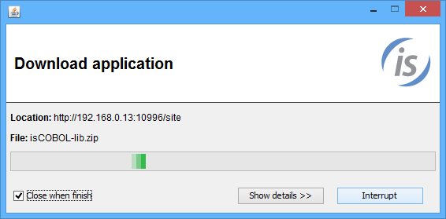
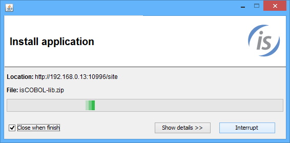

### Usage and configuration of isCOBOL Updater

Once the HTTP server has been properly configured, it’s possible to run the isupdater tool from the client machines.

#### Usage

```cobol
iscupdater -c configuration_file [-stop] [-icon image_file]
```

Where:

- *configuration_file* is the properties file used to pass the server location and current version to the isupdater tool.
- *-stop*, if used, the isupdater tool just checks for the availability of updates and, if one is available, it informs the user with a message box, but nothing is downloaded.
- *image_file* is a picture suitable for Java (e.g. a GIF or PNG file) that will be shown as custom icon instead of the Java logo.

#### Client configuration

See [Client Configuration (isupdater.properties)](../../Compiler-and-Runtime/Configuration/Configuration-Properties#client-configuration-isupdaterproperties) for the list of the properties that can be used to configure the isupdater tool.

The following sample configuration sets the HTTP server address for updates to 192.168.0.13, listening on the port 10996. The swupdater.properties file is expected in the sub directory "site". It also sets the current version of isCOBOL’s bin and lib folders to 90 and the folder where downloaded files should be saved to C:\Veryant:

```cobol
swupdater.site=http://192.168.0.13:10996/site
swupdater.version.isc_lib=90
swupdater.version.isc_bin=90
swupdater.directory.isc_lib=C:/Veryant/lib
swupdater.directory.isc_bin=C:/Veryant/bin
swupdater.mainclass=com.iscobol.invoke.Isrun -v
```

Since the client side version (90) is less that the version available on the server (100, as referenced in the server configuration file explained on the previous page), the download process starts.



At the end of the download process, the isupdater tool rewrites the configuration file putting the new version in it:

```cobol
#Automatically updated
swupdater.site=http://192.168.0.13:10996/site
swupdater.version.isc_lib=100
swupdater.version.isc_bin=100
swupdater.directory.isc_lib=C:/Veryant/lib
swupdater.directory.isc_bin=C:/Veryant/bin
swupdater.mainclass=com.iscobol.invoke.Isrun -v
```

#### Post update

Once the download process has been completed, the folders isCOBOL-lib and isCOBOL-bin will be available in C:\\Temp. If they contain a class named POSTUPDATE.class, then isupdater will automatically run it passing the destination folder as a parameter. You can use this feature to code post update operations such as copying downloaded files to a different folder.

During the execution of this class, the isupdater dialog changes as follows:



If the property [swupdater.mainclass](../../Compiler-and-Runtime/Configuration/Configuration-Properties#client-configuration-isupdaterproperties) was set, then isupdater automatically runs the specified class along with the arguments. In the above example the command Isrun -v is executed in order to show a message box with the current version of the runtime.

The following alternate example shows how to call a server program named MENU using the thin client technology after the update:

```cobol
swupdater.mainclass=com.iscobol.gui.client.Client MENU
```
