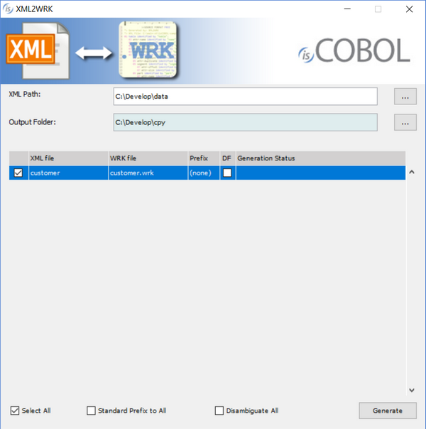

## XML2WRK

This utility is deprecated and supported only for backward compatibility. [STREAM2WRK](./STREAM2WRK) should be used instead.

The XML2WRK utility opens an XML file and creates the corresponding record definition to be used with the [XMLStream Class (com.iscobol.rts.XMLStream)](\) object.

### Usage 1:

```cobol
iscrun -utility xml2wrk
```

If the utility is launched without parameters, a graphical wizard procedure will start.



### Usage 2:

```cobol
iscrun -utility xml2wrk xmlFile [outputFile] [prefix] [disambiguate_flag]
```

#### Where:

- *xmlFile* is the name of the XML file to parse. It can be either a disk file or a URL. Note that the utility is not able to read a file over the HTTPS protocol. In such case, the file should be downloaded to disc using third party utilities (e.g. a web browser) and then processed as a disc file.
- *outputFile* is the name of the file that will contain the record definition corresponding to *xmlFile*. If omitted, a file named *xmlFile*.wrk is created.
- *prefix* defines a string to be put in front of every data name in the record definition.
  - When set to "0" or omitted, data-names are generated with no prefix.
  - When set to "1", the prefix will be the name of the XML file.
  - Any other value represents the prefix to be used, without any conversion.
- *disambiguate_flag* activates or deactivates names ambiguity check
  - When set to "0" or omitted, field names are generated without control
  - When set to "1", field names are adapted if necessary in order to avoid ambiguous identifiers

XML2WRK uses the following criteria while parsing the XML file:

- Only the first occurrence of each element is parsed to retrieve child items.
- If an element appears more than once in the XML file, then it’s generated as an OCCURS item in the COBOL record definition, otherwise it is generated as standard item.
- If the element contains text or attributes, data-items are generated in the COBOL record definition to store text and attribute values, otherwise the element is generated as a container item without picture.
- Every data-item is generated as PIC X ANY LENGTH into the COBOL record definition.

Consider the following sample xml:

```cobol
<content>
 <parent>
   <child>
     <item>text</item>
   </child>
   <child>
     <lost></lost>
   </child>
 </parent>
 <parent>
   <child></child>
 </parent>
</content>
```

The underlined text highlights elements that are processed by XML2WRK according to the above rules.

- <parent\> and  will be generated as OCCURS items because they appear twice
- <item\> will not be generated as OCCURS item because it appears once
- <lost\> will not be generated because it’s included into an item that is not parsed by XML2WRK
- a data-item will be generated for <item\> because it contains text

The resulting record definition is:

```cobol
01 content identified by "content".
   03 parent identified by "parent" occurs dynamic capacity parent-count.
      05 child identified by "child" occurs dynamic capacity child-count.
         07 item identified by "item".
            09 item-data pic x any length.
```

### Thin Client and headless systems

XML2WRK can be used in thin client environment as well. Use this command to start it:

```cobol
iscclient -hostname <server-ip> -port <server-port> -utility xml2wrk <arguments>
```

Server side paths must be provided in the arguments.

The thin client technology allows you to run the utility on a headless server. Start the isCOBOL Server on the headless server and launch the utility with the thin client from your PC; in this way the utility operates on the headless server while the utility GUI is shown on your PC.
