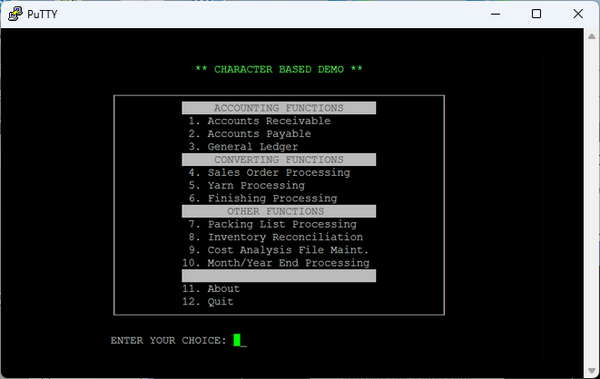

# Character Based Screens

isCOBOL can run applications with character based screens (green screens, text mode screens) on hardware terminals and terminal emulators.



By default, isCOBOL emulates character based screens using graphical resources. This behavior produces an error if working on terminals that don’t include a graphical interface (dumb terminals and terminal emulators). The error returned is:

```cobol
No X11 DISPLAY variable was set, but this program performed an operation which requires it.
```

To avoid this error and enable an application to use the terminal as the screen, isCOBOL takes advantage of CHARVA, a Java Windowing Toolkit for Text Terminals. See [Using CHARVA](./Using-CHARVA) for more information.

Note that the CHARVA solution is suitable only for those COBOL application whose UI is fully character-based. Graphical UI is not supported by CHARVA.

CHARVA is not supported on the Windows 64 bit platform.
