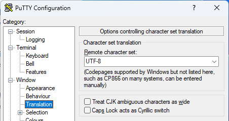

## Using CHARVA

isCOBOL supports any terminal that has a description in the terminfo database on the system; in other words, all popular terminals such as VT100, VT220, Wyse and ANSI terminals and the "xterm" and "PuTTY" terminal emulators are supported. Support for UTF-8 character sets is also included (e.g. for Hungarian, Czech, Cyrillic, Korean etc). This feature is implemented using the CHARVA Toolkit.

CHARVA was designed to bring the power and flexibility of Java to applications on Linux/Unix systems (and has also been ported to MS Windows).

Terminal-based applications can now benefit from Java features such as object orientation, multithreading, automatic garbage-collection, and a vast range of libraries.

### How to run the program

CHARVA has been embedded in the isCOBOL Framework. In order to enable its use, the following entry must be set in the configuration:

```cobol
iscobol.guifactory.class=com.iscobol.gui.client.charva.GuiFactoryImpl
```

The above setting is automatically activated by the -t option provided by iscrun, so in order to run a program with CHARVA, it’s enough to issue the command:

```cobol
iscrun -t PROGRAM_NAME
```

In order to make isCOBOL work correctly with CHARVA, the terminal library (Terminal.dll on Windows and libTerminal.so on Unix) must be available in the Java library path while charva.jar, commons-logging.jar and commons-logging-api.jar must be listed in the CLASSPATH.

CHARVA is for purely character-based applications and should not be used with graphical controls. Displaying graphical controls does not usually have any adverse effects, but it can cause unpredictable behavior.

Colors are not enabled by default. In order to activate support for colors, the *charva.color* Java property must be set to True. For example:

```cobol
iscrun -t -J-Dcharva.color=1 PROGRAM_NAME
```

**Note**: In isCOBOL, the background and foreground colors are mapped in the RGB color model, but the CHARVA toolkit does not recognize the attribute highlight in the RGB color value so, when either blue or green or red is greater than 192, the bold attribute is set for the control.

### How to debug

Programs that run with CHARVA cannot be debugged directly since the Debugger traps the display that should be redirected to the console, causing Exception errors.

In order to debug a program that runs with CHARVA, the Remote Debugger must be used. For example, assuming that you wish to debug a program running on a headless Linux whose IP is 192.168.0.149, you can start the program as follows on the Linux machine:

```cobol
iscrun -t -J-Dcharva.color=1 -J-Discobol.rundebug=2 PROGRAM_NAME
```

Then, using a PC with graphical interface (i.e. a Windows PC) in the same network, you can start the debugger as follows:

```cobol
iscrun -d -r 192.168.0.149
```

### Known limitations and differences between Charva and emulated character mode

DISPLAY MESSAGE BOX is not supported. Message box text can be printed on the console if [iscobol.display_message](../../SDK-Users-Guide/Compiler-and-Runtime/Configuration/Configuration-Properties#general-runtime-configuration) configuration property is set to 1 or 2.

When using CHARVA, [iscobol.terminal.cursor_type](../../SDK-Users-Guide/Compiler-and-Runtime/Configuration/Configuration-Properties#character-based-interface) is ignored: the cursor has the default shape provided by the current terminal. In addition, [iscobol.terminal.autowrap (boolean)](../../SDK-Users-Guide/Compiler-and-Runtime/Configuration/Configuration-Properties#character-based-interface) is ignored: the display always wraps.

isCOBOL maps the background and foreground colors to the RGB color model, but CHARVA does not recognize the highlight attribute in the RGB color value, therefore isCOBOL applies the highlight attribute to the control when either the blue or green or red value is greater than 128.

The [WFONT-GET-FONT](../../Appendices/Library-Routines/W$FONT/WFONT-GET-FONT) function works only if WFDEVICE-WIN-PRINTER is set to TRUE, otherwise WFONTERR-FONT-NOT-FOUND is returned.

If the program performs only DISPLAY statements without accepting user input with a ACCEPT statement, you need to call the [WFLUSH-REFRESH](../../Appendices/Library-Routines/W$FLUSH/WFLUSH-REFRESH) at the end in order to make the displayed text appear on video.

When working on Linux/Unix you can have different terminal implementations.Depending on the tool you use to connect (PuTTY, ssh command, direct access to the server console...) you might have a different $TERM setting. If the corresponding terminfo doesn't map all the necessary keys, you might need to rebuild the terminfo to add the missing keys, or the keyboard input in Charva will be incomplete (i.e pressing the key doesn't have effect or inputs a different value).

### PuTTY configuration

When PuTTY is used to connect to a Unix server and run a COBOL program through CHARVA, you should set the Character set translation to match the locale of the server. The locale of the server can be retrieved by checking the LANG environment variable:

```cobol
echo $LANG
```

For example, if the locale of the server is "UTF-8", configure PuTTY as follows:



When working with UTF-8, the following setting should also be set:

```cobol
export NCURSES_NO_UTF8_ACS=1
```

The nonobservance of the above suggestions may lead to bad display of grave letters and drawings.

### Keyboard shortcuts

To force a refresh of the screen, press CTRL-L.

During the Accept, not all the keyboard shortcuts are supported. The following table lists the available shortcuts in both emulated character mode and CHARVA.

| shortcut | action | supported by the emulated character mode | supported by CHARVA |
| --- | --- | --- | --- |
| CTRL+Z | Undo | Yes | Yes |
| ATL+Backspace | Undo | Yes | No |
| CTRL+X | Cut | Yes | Yes |
| SHIFT+Delete | Cut | Yes | No |
| CTRL+V | Paste | Yes | No |
| SHIFT+INS | Paste | Yes | No |
| CTRL+C | Copy | Yes | No |
| CTRL+INS | Copy | Yes | No |

### More information

For more information about CHARVA, please visit: [http://www.pitman.co.za/projects/charva/](http://www.pitman.co.za/projects/charva/)
