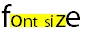

## HTML and Controls

Unless explicitly excluded, display-only texts can be HTML source. This makes it easy to create fancy interfaces.

The HTML text must be enclosed between the <HTML\> </HTML\> and  tags. Fonts and colors can be mixed. The following label

```cobol
LABEL TITLE '<html><font size=6>f</font><font style="background-color:#FFFF00"><font size=5>o</font><font size=4>n</font><font size=3>t s</font><font size=4>i</font><font size=5>z</font></font><font size=6>e</font></html>'
```

is rendered as follows: 

Images, tables and borders are supported, too.

Within HTML titles the "&" character is interpreted as the beginning of an HTML entity (e.g. &*nbsp*) while the first letter underlined by the <U\> tag becomes the access key.
