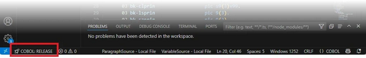

# Compiling

Before compiling, be sure to save the last modification by pressing Ctrl-S.

To compile the current source file, select "isCOBOL: Compile current source file" from the command palette or press Ctrl-Shift-F9.

To compile all the source files in the project, select "isCOBOL: Compile source code" from the command palette or press Ctrl-F9. You can also use the dedicated button on the [Editor tool-bar]().

## Debug and Release modes

There are two compile modes: Debug and Release.

Each mode can be configured to use a specific set of compiler options. For example, you might want using [\-d]() and [\-lf]() only when compiling in Debug mode and [\-ostrip]() only when compiling in Release mode.

The current mode is shown on the bottom left corner of the window and clicking on it allows you to switch between Debug mode and Release mode.

• When COBOL:DEBUG is selected, the compiler uses the options specified by [Veryant > Compiler: Options]() plus the options specified by [Veryant > Debug > Compiler: Options]().

• When COBOL:RELEASE is selected, the compiler uses the options specified by [Veryant > Compiler: Options]() plus the options specified by [Veryant > Release > Compiler: Options]().
