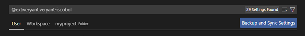

# Configuration

After a successful installation, the following item appears in the “extensions” sidebar:

Click on the gear icon (or right click) and choose “extension Settings” to configure the Veryant isCOBOL extension.

Settings can be made at User level, Workspace level and Folder level:

Settings made at User level are used for every Workspace.

Settings made at Workspace level are used for the current Workspace and override settings at User level.

Settings made at Folder level are used for the selected Folder (project) and override settings at Workspace level.

An empty setting causes the setting at higher level to be used; for example, if *Veryant > Compiler: Options* is blank in Folder settings, *Veryant > Compiler: Options* in Workspace setting will be considered. If also *Veryant > Compiler: Options* in Workspace settings is blank, *Veryant > Compiler: Options* in User settings will be considered.

The following settings are available:

| Setting | Description |
| --- | --- |
| Setting | Description |
| Veryant > Classpath | Additional classpath entries to compile, run and debug |
| Veryant > Compiler: Options | List of compiler options to be used.Multiple options are separated by space. |
| Veryant > Debug > Compiler: Options | Compiler flags for debug mode that will be appended to common compiler options.See [Debug and Release modes]() for more information. |
| Veryant > Debugger: Array Start[A] | First index of occurs elements to display. |
| Veryant > Debugger: External Debug Configs[A] | Path to external configuration file, which provides specific command names and regular expressions to parse and interact with external debug process. |
| Veryant > Debugger: Max Array Length[A] | Maximum number of occurs elements to display. |
| Veryant > Debugger: Params[A] | Parameters that will be accepted before running the debugger. |
| Veryant > Debugger: Trace File[A] | Path to the file where trace will be stored. When specified, every interaction with the external command-line debugger will be logged on this file. |
| Veryant > Diagnose Copy[A] | Controls whether Visual Studio Code should diagnose copy files. |
| Veryant > Folding[A] | Controls whether folding is allowed. |
| Veryant > Formatter: Location[A] | COBOL external formatter location. |
| Veryant > Invert Special Colors in Light Theme[A] | Controls whether special colors should be reversed when using a light theme |
| Veryant > Jdk: Root | Root folder of the Java JDK. |
| Veryant > Jre: Root | Root folder of the Java JRE. |
| Veryant > Log[A] | Controls whether Veryant isCOBOL extension logging is active. |
| Veryant > Main: Program | Program to start. |
| Veryant > Main: Program-path | Startup folder for program |
| Veryant > Max Cache Time For Expanded Source[A] | Maximum time to keep expanded source cache in milliseconds. |
| Veryant > Program: Arguments | Arguments to pass to the isCOBOL program. |
| Veryant > Release > Compiler: Options | Compiler flags for Release mode that will be appended to common compiler options.See [Debug and Release modes]() for more information. |
| Veryant > Returns Last Cache From Expanded Source[A] | Indicates whether to return the last cache when reaching the maximum cache time. |
| Veryant > Runtime: Options | Options passed to the iscrun command when running the isCOBOL program. |
| Veryant > Sdk: Folder | Root folder of the isCOBOL Evolve SDK. |
| Veryant > Snippets Repositories | Repositories where JSON snippets are located. |
| Veryant > Source Extensions[A] | COBOL compilable source code extensions. |
| Veryant > Special Auto Documentation[A] | Controls whether special auto documentation of some language objects is active. |
| Veryant > Special Colors[A] | Special color settings for terms interpreted by the Veryant isCOBOL extension. |
| Veryant > Tabstops[A] | COBOL tabstops. |
| Veryant > Variable Suggestion[A] | Controls whether COBOL variable suggestion is allowed. |

\[A\]Setting not available at Folder level.

The minimal configuration for a correct editing and compiling requires **Veryant** > **Jdk: Root and Veryant** > **Sdk: Folder** to be set.
