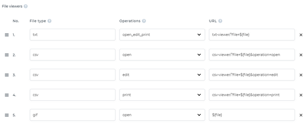

#### File viewers

In WebClient configuration you can configure a mapping of file extension to URL handler for specific file operation.



The configuration above, files with txt extension are handled with "/txt-viewer" URL handler when [CDESKTOP-OPEN](\), [CDESKTOP-EDIT](\) or [CDESKTOP-PRINT](\) is called for the file. If you want to use the browser's default action use "${file}" as URL value.

You can implement a URL handler by creating a folder (i.e. *txt-viewer*) with *index.html* inside the application [Web Folder](./Change-the-application-configuration#web-config).

This is an example code for a simple file viewer:

```cobol
<html>
    <head>
        <title>Demo text file viewer</title>
        <meta charset="utf-8">
        <script language="javascript" type="text/javascript">
            const searchParams = new URLSearchParams(window.location.search);
            const blobId = searchParams.get('file');
            console.log("blobId", blobId)
        
            document.addEventListener("DOMContentLoaded", function(event) {
                var fileContent = document.getElementById('filecontent');
                fileContent.value = 'Loading file content ...';
                
                fetch(blobId)
                  .then(response => response.blob())
                  .then(blob => {
                    const reader = new FileReader();
                    reader.readAsText(blob);
                    reader.onloadend = function() {
                      fileContent.value = reader.result;
                    };
                  })
                  .catch(error => {
                      fileContent.value = "Blob error " + error
                      console.error('blob error', error)
                  });
            });
        </script>
    </head>
    <body>
        <h1>Text file viewer</h1>
        <textarea id="filecontent" rows="20" cols="110" style="white-space: pre" readonly></textarea>
    </body>
</html>
```
