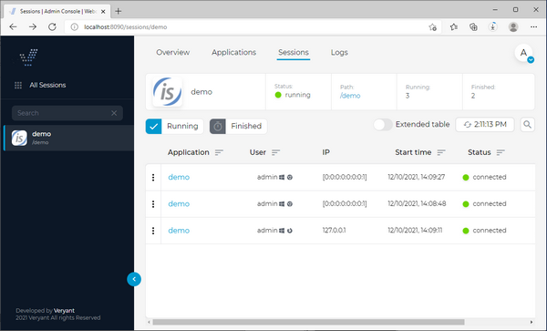
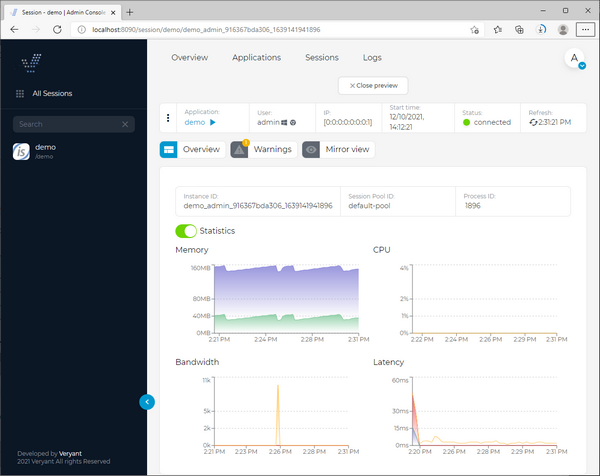
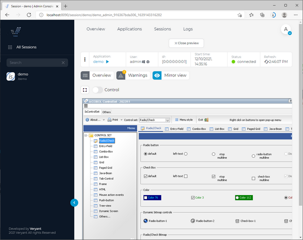

## Sessions

The Sessions section lists the sessions of each application.

Click on the *application* name in the Application column to have detailed information on a specific session.

The Session view contains all the details, metrics and options for session management and monitoring. There are also features like mirror view, recording & playback, session logs and warnings.

**Note** - the Process ID value not available when using Java 8.

The context menu provides the following actions:

| | |
| --- | --- |
| Thread Dump | Take a thread dump of the underlying JVM. The dump can be reviewed in the Warnings page |
| Record | Start recording the user actions. You can stop recording at any time by clicking the "Stop" button. The recording will automatically stop when the user session terminates. The recorded video will be playable by clicking on the "Play" button after the application name |
| Copy Inst.ID | Copies the unique session identifier to the clipboard |
| Shutdown | Kills the session. The JVM is terminated and the user is disconnected. |
| | |

Click on *Mirror View* to monitor the user activity in real time. You can also take control:

