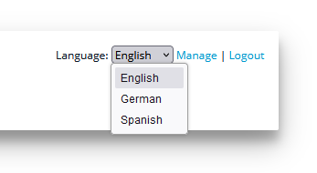

# Changing the language in WebClient’s user interface

WebClient includes a series of messages and dialogs that are shown to the user. These messages and dialogs are in English by default, however it’s possible to have them translated in multiple languages. The WebClient SDK includes two alternative language packs that are ready to use. You can customize these language packs as well as add brand new ones.

## Customizing the language packs

Language packs are installed in the *webclient/lang* directory of the WebClient SDK.

The *webclient/lang* directory includes a sub folder for every language and a select.json file where available language are listed. Inside each language folder you find a file named msg.json that includes the translation of each WebClient message label. By default, the following alternative languages are available:

- German
- Spanish

To customize a language translation, just edit the corresponding msg.json file.

To create a new language:

1. Copy an existing one, e.g. copy *webclient/lang/de* to *webclient/lang/mylang*
2. Edit the file *webclient/lang/mylang/msg.json* replacing JSON field values with your custom translations
3. Edit *webclient/lang/select.json* adding your custom language to the list

**Note** - a basic knowledge of the JSON format is required to customize WebClient’s languages.

The language can be selected in the WebClient’s home page:



However, end users do not always have access to the WebClient’s home page, as they are provided with a direct link to the web application. In this case, it is possible to force the web application to start in a specific language.

## Making an application start with a specific language

In most cases the users will go directly to the web application instead of landing on the WebClient’s home page (e.g. they browse to *http://server:port/appname*, not to *http://server:port*).

In order to make users see a specific language in the WebClient’s user interface when they browse directly to the application, proceed as follows:

1. Create a folder that will host your custom HTML files
2. Extract the *index.html* file stored in *webclient/webclient-server.war* and copy it to the folder that you’ve just created. You can use an archive manager software like [7-Zip](https://www.7-zip.org/) to perform this operation easily.
3. Edit the *index.html* file.

Find the body section where JS script are included:

```cobol
...
    <script src="javascript/webswing.js"></script>
    <script src="index.js"></script>
</body>
...
```

and add the following line:

```cobol
   <script>localStorage.setItem('webclientLang', 'es');</script>
```

obtaining:

```cobol
...
    <script>localStorage.setItem('webclientLang', 'es');</script>
    <script src="javascript/webswing.js"></script>
    <script src="index.js"></script>
</body>
...
```

**Note** - the above example forces the Spanish language. Replace "es" with another language id if you want another language. The language id must match with the name of one of the folders installed under the *lang* directory of WebClient.

4. In the app configuration, set [Web Folder](./Applications-Monitoring-and-Configuration/Applications/Change-the-application-configuration/Change-the-application-configuration#web-config) to the path of the folder you created at step 1 and [Localization Folder](./Applications-Monitoring-and-Configuration/Applications/Change-the-application-configuration/Change-the-application-configuration#web-config) to "${webclient.rootDir\}/lang".
