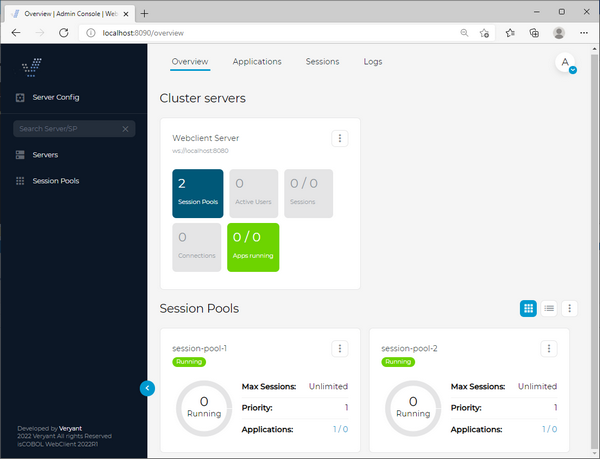
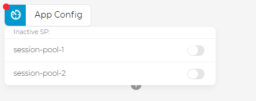

# Cluster Deployment

The main concept of clustered WebClient is to divide the former WebClient Server into separate modules which handle web requests (WebClient Cluster Server) and application processing (WebClient Session Pool).

In a minimal setup you need one Cluster Server and one Session Pool. You can use multiple Cluster Servers for redundancy, but it should not be necessary to have more than two Cluster Servers in most cases. Session Pools can be scaled dynamically, depending on your needs of resources or connected users. Note that it is not possible to connect more than one WebClient Admin in the cluster.


In this guide we’re going to setup clustered environment with three machines: a Cluster server and two Session Pool servers.

The clustered environment will be tested using the isCOBOL Demo program (Iscontrolset).

## Preliminary check (optional)

It’s good practice to ensure that the isCOBOL Thin Client can execute the program correctly. So, ensure that this command opens the isCOBOL Demo program on every server where you’re going to install a WebClient Session Pool:

```cobol
iscclient -hostname <yourAppServerNameOrIp> ISCONTROLSET
```

The above command assumes that there is an isCOBOL Server running on the machine identified by *yourAppServerNameOrIp* and the folder containing ISCONTROLSET.class is in the Server’s Classpath or code-prefix.

See [isCOBOL Evolve: Application Server](../is-cobol-AS/Key-Topics) for more information about how to start programs in a thin client environment.

## Setup of the Cluster server

In the Cluster server the following products must be installed using the appropriate setups:

- WebClient Admin
- WebClient Cluster Server

**Note** - these products can also be installed on separate machines, but in this guide we’re going to keep them on the same machine for simplicity.

Use the following command to start the WebClient Cluster service:

- Windows

```cobol
cd %ISCOBOL%\bin
webcclient-cluster.exe
```

- Linux

```cobol
cd $ISCOBOL/bin
./webcclient-cluster
```

**Note** - the above snippets assume that the ISCOBOL environment variable is set to the isCOBOL WebClient installation directory.

A correct startup shows a message like this at the bottom of the console output:

```cobol
INFO:oejs.Server:main: Started @3791ms
```

## Setup of the Session Pool servers

In a Session Pool server the following product must be installed using the appropriate setup:

- WebClient Session Pool

Edit the *webclient/cluster/session-pool/webclient-sessionpool.properties* configuration file to provide an unique ID to the current Session Pool and the web socket URL to the Cluster server. For example, assuming that the Cluster server was stared on the default port 8080 at the IP address 192.168.0.100, set these entries in *webclient-sessionpool.properties* of the first Session Pool server:

```cobol
sessionpool.id = session-pool-1
webclient.server.websocketUrl = ws://192.168.0.100:8080
```

And set these entries in *webclient-sessionpool.properties* of the second Session Pool server:

```cobol
sessionpool.id = session-pool-2
webclient.server.websocketUrl = ws://192.168.0.100:8080
```

Use the following command to start the WebClient Session Pool service:

- Windows

```cobol
cd %ISCOBOL%\bin
webcclient-session.exe
```

- Linux

```cobol
cd $ISCOBOL/bin
./webcclient-session
```

**Note** - the above snippets assume that the ISCOBOL environment variable is set to the isCOBOL WebClient installation directory.

A correct startup shows a message like this at the bottom of the console output:

```cobol
Successfully connected to server [ws://192.168.0.100:8080]!
```

## Configure the application on the Cluster server

In the Cluster Server use the following command to start the WebClient Admin:

- Windows

```cobol
cd %ISCOBOL%\bin
webcclient-admin.exe
```

- Linux

```cobol
cd $ISCOBOL/bin
./webcclient-admin
```

**Note** - the above snippets assume that the ISCOBOL environment variable is set to the isCOBOL WebClient installation directory.

A correct startup shows a message like this at the bottom of the console output:

```cobol
oejs.Server:main: Started @3792ms
```

Browse to http://localhost:8090 to reach the WebClient Admin web application. In the home page you can see an overview of active session pools.



Switch to the *Applications* tab.

The menu on the left shows the list of available applications. This list is currently empty.

Click the plus button before the search field to show the “Create new” option.


By clicking “Create new” you will be prompted for the application name:


Type "demo" in the field. This is the name that will be used in the URL in order to use the COBOL application.

Click the confirmation button to make the new application appear in the list:


Click on the *demo* button to reach the application configuration.


Click the *Enable* button in order to activate the application, then switch to the *App Config* section.

Before configuring the applicaiton, you have to associate it to the desired Session Pool servers. Click the clock icon in the *App Config* button in order to get the list of available Session Pool servers.



In order to associate the desired Session Pool servers, activate the corresponding check box.

**Note** - every time you change the Session Pool association, the app configuration is reset and you have to configure it again from scratch.

Now you can proceed in configuring the application.


Type the IP address or the name of the server where isCOBOL Server is started and listening in the *isCOBOL Server address* field.

If isCOBOL Server is not listening on the default port 10999, type the correct port number in the *isCOBOL Server port* field.

Type "ISCONTROLSET" (upper case) in the *Program name* and *arguments* field.

Scroll down to find the *Class Path* setting and add the following two values:

- "${webclient.rootDir\}/../../../lib/\*.jar"
- "${webclient.rootDir\}/../../../jars/\*.jar"

See [Change the application configuration](./Applications-Monitoring-and-Configuration/Applications/Change-the-application-configuration/Change-the-application-configuration) for more details about the configuration of a WebClient application.

Click on "Apply" when prompted.

At this point you can test your application from any web browser from any machine in the network by navigating to: http://*machine-ip:port*/demo.

Multiple sessions will be automatically redistributed on the two Session Pool servers that we configured.
