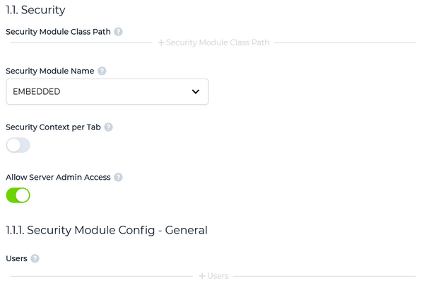
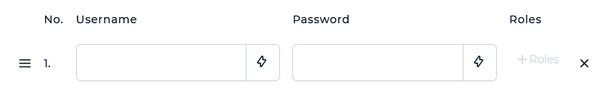

## Embedded users configuration

To configure users through the EMBEDDED module:

1. set the *Security Module Name* field to EMBEDDED to make a new section (1.1.1. Security Module Config - General) appear

2. click on "+ Users" for a new row to appear in the list

a. fill *Username* and *Password* fields with the new user credentials

b. optionally assign a role to the user (see [Roles](./Configuring-Users#roles) below for more information)

c. click on the "Apply" button
