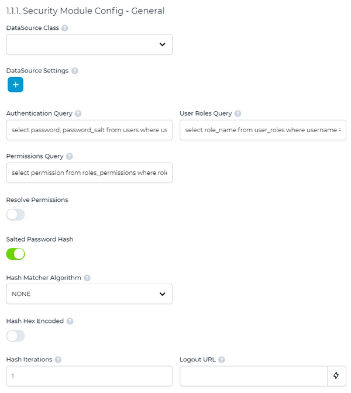

## Reading Users from a JDBC data source

Users can be registered in a database that WebClient will query via JDBC.

In order to make WebClient look for users in a JDBC data source:

1. click on the "+" below *Security Module Class* Path
2. select the value "${webclient.rootDir}/security/database+property/\*" from the list
3. click on the "Apply" button

The list of options under Security Module will change from

  - NONE
  - EMBEDDED

to

  - NONE
  - EMBEDDED
  - org.webswing.security.modules.database.DatabaseSecurityModule
  - org.webswing.security.modules.property.PropertySecurityModule

4. set the *Security Module Name* field to "org.webswing.security.modules.database.DatabaseSecurityModule".

A new section named *Security Module Config - General* appears.



Use the *Security Module Class Path* to provide the full path of the jar libraries of the JDBC drivers you wish to use. Use the "+" button to add a new driver. Use the "x" button to remove a driver.

Set the *DataSource Class* field to the name of the data source class. The class must implement the [DataSource interface](https://docs.oracle.com/javase/8/docs/api/javax/sql/DataSource.html). The field includes a list of known data source classes. If the class that you wish to use doesn’t appear in this list, type the class name in the field.

Examples:

|  | Security Module Class Path | DataSource Class |
| --- | --- | --- |
| c-treeSQL | /path/to/ctreeJDBC.jar | ctree.jdbcx.CtreeDataSource |
| Oracle | /path/to/ojdbc7.jar | oracle.jdbc.pool.OracleDataSource |
| Microsoft SQL Server | /path/to/mssql-jdbc-12.4.0.jre8.jar | com.microsoft.sqlserver.jdbc.SQLServerDriver |
| MySQL | /path/to/mysql-connector-java-bin.jar | com.mysql.jdbc.jdbc2.optional.MysqlDataSource |
| PostgreSQL | /path/to/postgresql.jdbc4.jar | org.postgresql.ds.PGSimpleDataSource |

When the *DataSource Class* has been selected, the *DataSource Settings* will provide possible parameters. Use the "+" button to add a new setting. Use the "x" button to remove a setting.

| Parameter name | Parameter value |
| --- | --- |
| serverName | IP or name of database server |
| databaseName | Name of database with user configuration tables |
| user | Username to connect to the database |
| password | Password to connect to the database |
| portNumber | TCP port number used by the database server |

The fields *Authentication Query, User Roles Query and Permissions Query* show the queries that will be performed by WebClient in order to retrieve the desired data. Ensure that your database includes the required tables and fields. Fields must be of type VARCHAR.

The minimum database schema to support the DATABASE authentication needs the following tables:

| | |
| --- | --- |
| **Table “users”** | |
| username | varchar() |
| password | varchar() |
| password_salt | varchar() |
| **Table “user_roles”** | |
| username | varchar() |
| role_name | varchar() |
| **Table “roles_permissions”** | |
| role_name | varchar() |
| permission | varchar() |
| | |

If your tables have different names, different field names or different field types, then you should adapt the queries in the *Authentication Query, User Roles Query and Permissions Query* fields. For example, if you’re using a c-treeRTG database whose tables are ISAM files that were sqlized, then the field type is CHAR instead of VARCHAR, so the queries should be changed from:

```cobol
select password, password_salt from users where username = ?
select role_name from user_roles where username = ?
select permission from roles_permissions where role_name = ?
```

to:

```cobol
select trim(password), trim(password_salt) from users where trim(username) = ?
select trim(role_name) from user_roles where trim(username) = ?
select trim(permission) from roles_permissions where trim(role_name) = ?
```

If you wish to store a password as clear text, set the *Hash Matcher Algorithm* field to NONE. If you wish to store a password encoded, select the appropriate encoding in the *Hash Matcher Algorithm* field. For example, if passwords are stored as MD5 hash, set the *Hash Matcher Algorithm* to MD5.
