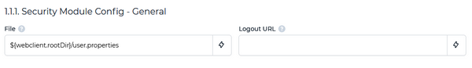

## Reading users from a property file

In order to configure users via property file:

1. click on the "+" below *Security Module Class* Path
2. select the value "${webclient.rootDir}/security/database+property/\*" from the list
3. click on the "Apply" button

The list of options under *Security Module* will change from

  - NONE
  - EMBEDDED

to

  - NONE
  - EMBEDDED
  - org.webswing.security.modules.database.DatabaseSecurityModule
  - org.webswing.security.modules.property.PropertySecurityModule

4. set the *Security Module Name* field to "org.webswing.security.modules.property.PropertySecurityModule".

A new section named *Security Module Config - General* appears. This section includes only one field named *File*. Enter the location of the property file here. By default WebClient searches in the WebClient working directory for a file named user.properties..



Each line in that file defines a user. The syntax is:

```cobol
user.<username>=<password>[,role1][,role2]
```

For example:

```cobol
user.admin=admin,admin
user.support=support,support
user.user=user
```
