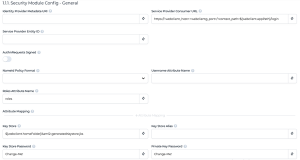
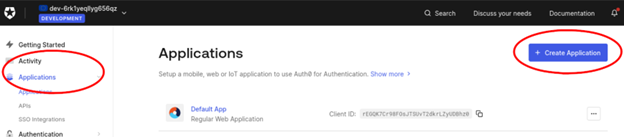
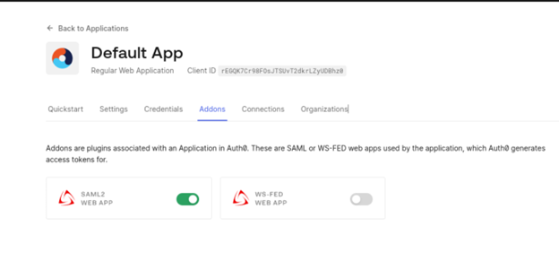
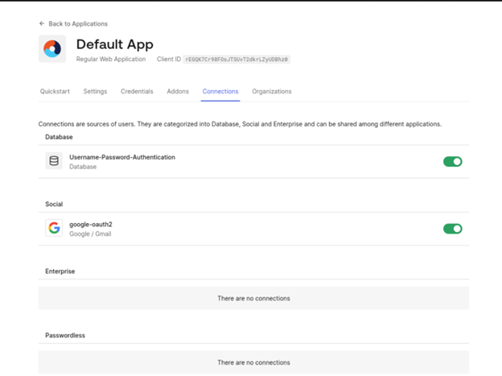
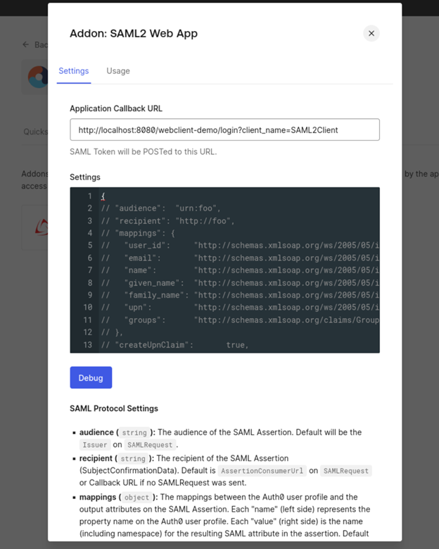
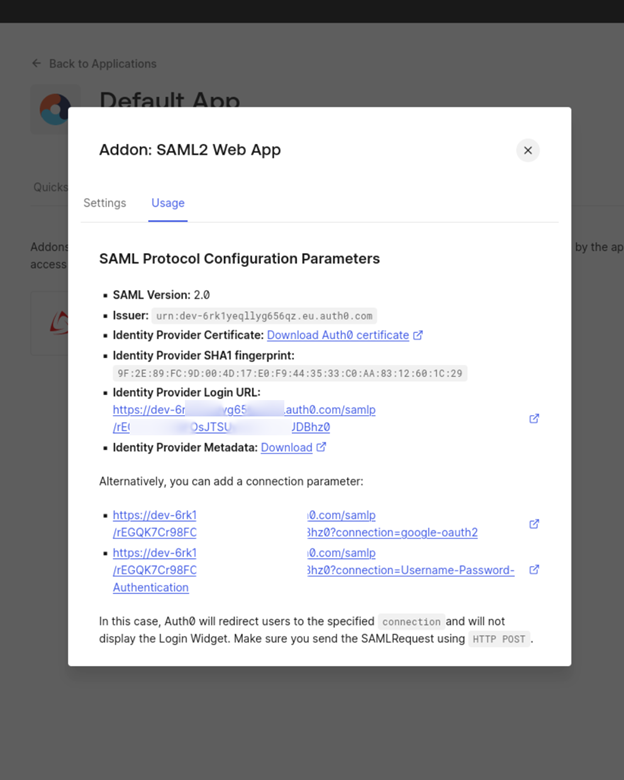

## SAML2 authentication

SAML2 is an XML-based protocol that uses security tokens containing assertions to pass information about a principal (usually an end user) between a SAML authority, named an Identity Provider, and a SAML consumer, named a Service Provider. SAML2 enables web-based, cross-domain single sign-on (SSO), which helps reduce the administrative overhead of distributing multiple authentication tokens to the user.

In order to make WebClient use SAML2:

1. click on the "+" below *Security Module Class* Path
2. select the value "${webclient.rootDir}/security/saml2/\*" from the list
3. click on the "Apply" button

The list of options under *Security Module* will change from

  - NONE
  - EMBEDDED

to

  - NONE
  - EMBEDDED
  - org.webswing.security.modules.saml2.Saml2SecurityModule

4. set the *Security Module Name* field to "org.webswing.security.modules.saml2.Saml2SecurityModule".

A new section named *Security Module Config - General* appears

Fill the fields as follows:

| | |
| --- | --- |
| Identity Provider Metadata URI | The name Id format to use for the subject |
| Service Provider Consumer URL | Name of SAML2 attribute defining the username. If empty, NameId value will be used |
| Service Provider Entity ID | Identitficator used when registering WebClient with Idp |
| AuthnRequests Signed | Indicates whether the Idp expects signed AuthnRequests. Idp needs the public key stored in Key store configured below to validate this signature |
| NameId Policy Format | The name Id format to use for the subject |
| Username Attribute Name | Name of SAML2 attribute defining the username. If empty, NameId value will be used. |
| Roles Attribute Name | Name of SAML2 attribute that contains list of roles. Leave empty if not required |
| Attribute Mapping | List of user attributes that will be stored in the session token cookie. Cookie size is limited to 4096 characters |
| Key Store | PKCS#12 or JKS Key Store file containing the private key used to decrypt the assertions returned by server. If file does not exist it will be generated |
| Key Store Alias | Key alias the private key is stored under |
| Key Store Password | Password to access the key store |
| Private Key Password | Password to access the private key |
| | |

### Example with auth0

SAML2 integration works well with auth0 provider ([https://auth0.com/](https://auth0.com/)).

To configure an auth0 application, create a new Application, as shown below.

In this document, we’re assuming WebClient is running on localhost using port 8080, and the webapp being created is called webclient-demo.

From the pop-up, choose *Regular Web Applications* and click *Create*.

Configure the application settings (in the *Settings* tab) as follows, changing settings URL, port, and WebClient app name to reflect the real application:

| | |
| --- | --- |
| Allowed Callback URLs | http://localhost:8080/webclient-demo/login?client_name=SAML2Client |
| Allowed Web Origins | http://localhost:8080/webclient-demo |
| | |

In the *Addons* enable SAML2 WebApp

In the *Connections* tab set the desired connections

Save the changes and the configuration is completed.

Clicking in the *Addon* – *Saml2* Web App button will provide the information needed to configure WebClient.

In Webclient, configure the following settings:

In the Web Config section:

| | |
| --- | --- |
| Security Module Class Path: | ${webclient.rootDir}/api/saml2/*.jar |
| Security Module Name: | org.webswing.security.modules.saml2.Saml2SecurityModule |
| Identity Provider Metadata URI: | use the link provided in the Auth0 Addon: SAML2 Web App dialog in the Usage tab, in the Identity Provider Metadata’s Download link |
| Service Provider Consumer URL: | http://localhost:8080/webclient-demo/login?client_name=SAML2Client |
| Service Provider Entity ID | copy the link in the Identity Provider Login URL setting on the Addon: SAML2 Web App Usage dialog. |
| | |

You’re now ready to test the credentials.

Our suggestion is to open the browser using a Private Window when testing, to prevent the browser from caching the authentication.
