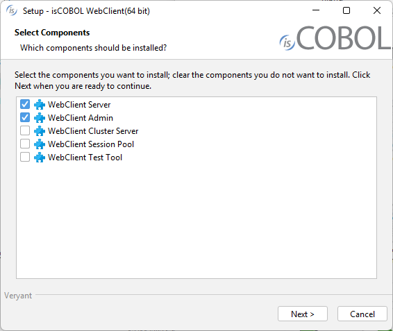
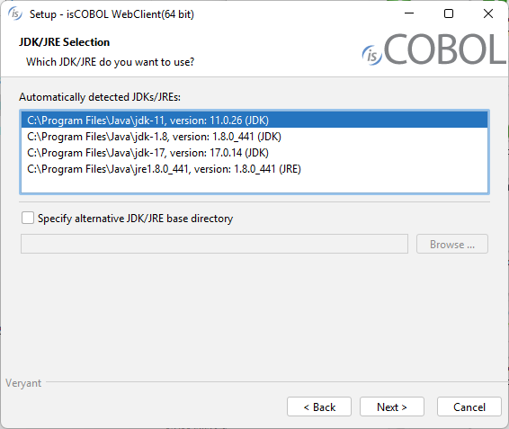

## Download and install isCOBOL WebClient 64-bit

### Windows

1. If you haven't already done so, [Download and install the Java Runtime Environment (JRE)](./Download-and-install-the-Java-Runtime-Environment).
2. Go to "[https://support.veryant.com](https://support.veryant.com)".
3. Sign in with your User ID and Password.
4. Click on the "Download Current Release" link.
5. Scroll down to the list of files for Windows x64 64-bit. Select isCOBOL_2026_R1_*n*_WEBC_Windows.64.msi, where *n* is the build number.
6. Run the downloaded installer to install the files.
7. Select the desired items from the list of products when prompted.



**Note** - By default only WebClient and WebClient Admin are installed.

8. Select your JDK/JRE when prompted



**Note** - WebClient Test Tool requires Java version 11 or higher. The other products work also with Java version 8. Select the proper Java version depending on the products that you installed and you plan to use.

9. Follow the wizard procedure to the end. In the process you will be asked to provide the installation path ("C:\\Veryant" by default) and license keys. You can skip license activation and perform it later, as explained in [Activate the License](./Activate-the-License).
10. You will also be asked if you want to install the WebClient tools as system services or not. If you don't install the services during setup, you will need to start the WebClient components in the foreground or install the services from a command prompt. You will also need to set the secret key manually in the *webclient.properties* and *webclient-admin.properties* files.


### Linux

1. If you haven't already done so, [Download and install the Java Runtime Environment (JRE)](./Download-and-install-the-Java-Runtime-Environment) .
2. Go to "[https://support.veryant.com](https://support.veryant.com)".
3. Sign in with your User ID and Password.
4. Click on the "Download Current Release" link.
5. Scroll down, and select the appropriate .tar.gz file for the Linux 64 bit platform.
6. Extract all contents of the archive:

```cobol
gunzip isCOBOL_2026_R1_*_WEBC_Linux.64.x86_64.tar.gz
tar -xvf isCOBOL_2026_R1_*_WEBC_Linux.64.x86_64.tar
```

7. Change to the "isCOBOL2026R1" folder and run "./setupwebc", you will obtain the following output:

```cobol
===============================================================================
 
                         isCOBOL WebClient Installation
                           For isCOBOL Release 2026R1
                        Copyright (c) 2005 - 2026 Veryant
 
===============================================================================
 
Install Components:
 
    [0] All products...................................... (no)
    [1] isCOBOL WebClient................................. (yes)
    [2] isCOBOL WebClient Admin........................... (yes)
    [3] isCOBOL WebClient Cluster......................... (no)
    [4] isCOBOL WebClient Session Pool.................... (no)
    [5] isCOBOL WebClient Test Tool....................... (no)
 
 
Install Path:
    [P] isCOBOL parent directory: /home/veryant/veryant
 
JDK Path:
    [J] JDK install directory: .
 
[S] Start Install        [Q] Quit
 
==============================================================================
Please press [ 0 1 2 3 4 5 P J S Q ] 
```

8. (optional) Type "3", then press Enter to select isCOBOL WebClient Cluster.
9. (optional) Type "4", then press Enter to select isCOBOL WebClient Session Pool.
10. (optional) Type "5", then press Enter to select isCOBOL WebClient Test Tool.
11. (optional) Type "P", then press Enter to provide a custom installation path, if you don’t want to keep the default one
12. Type "S", then press Enter to start the installation.

### Other Unix

The WebClient product is qualified only for the Windows and Linux platforms.

### Distribution Files

For information on a specific distribution file, please see the README file installed with the product.
