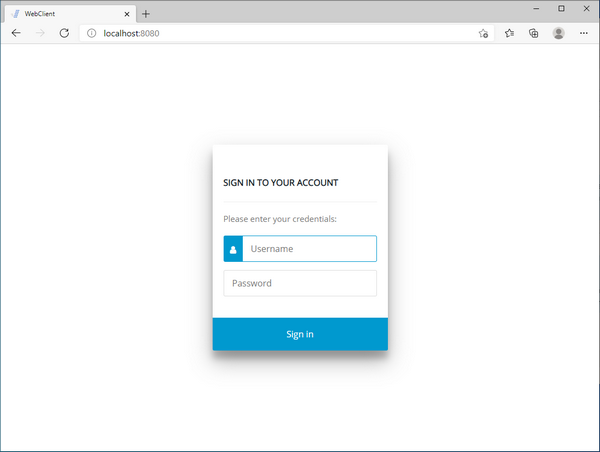
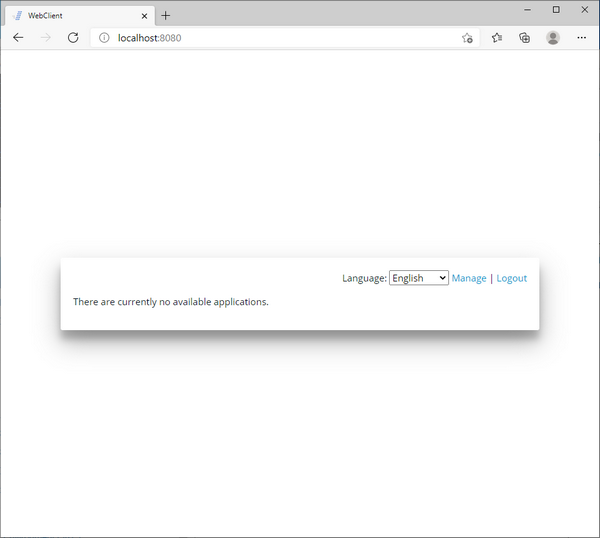
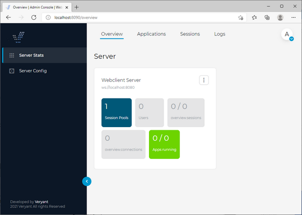
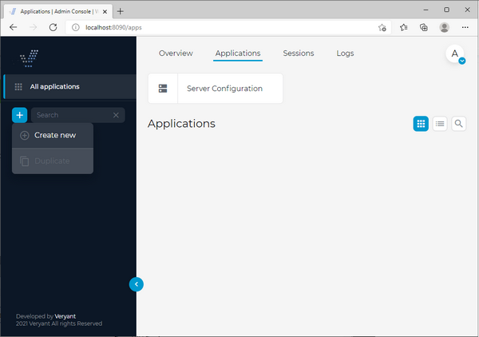
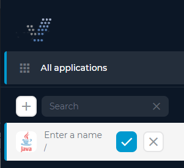
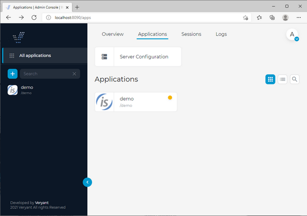
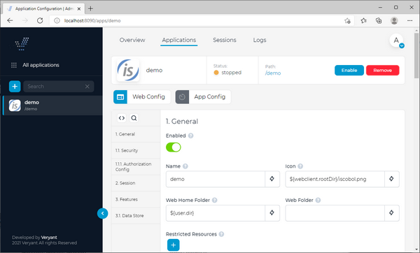
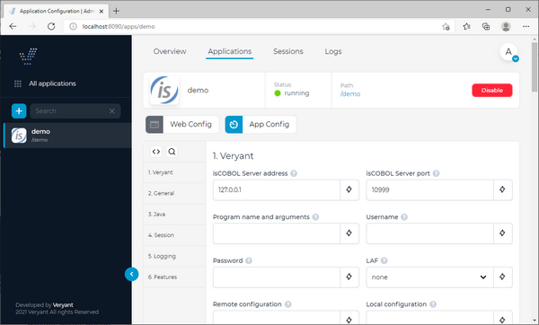
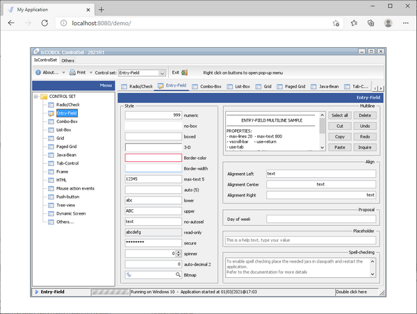

## Testing the product using the isCOBOL Demo program (Iscontrolset)

In this guide we’re going to run the isCOBOL Demo program (Iscontrolset) in a web browser through isCOBOL WebClient.

Before you start the WebClient service, it’s good practice to ensure that the isCOBOL Thin Client can execute the program correctly. So, ensure that this command opens the isCOBOL Demo program:

```cobol
iscclient -hostname <yourAppServerNameOrIp> ISCONTROLSET
```

The above command assumes that there is an isCOBOL Server running on the machine identified by *yourAppServerNameOrIp* and the folder containing ISCONTROLSET.class is in the Server’s Classpath or code-prefix.

See [isCOBOL Evolve: Application Server](../../is-cobol-AS/Key-Topics) for more information about how to start programs in a thin client environment.

Once the above command works correctly, you can start the WebClient services.

Use the following command to start the WebClient service:

- Windows

```cobol
cd %ISCOBOL%\bin
webcclient.exe
```

- Linux

```cobol
cd $ISCOBOL/bin
./webcclient
```

**Note** - the above snippets assume that the ISCOBOL environment variable is set to the isCOBOL WebClient installation directory.

A correct startup shows a message like this at the bottom of the console output:

```cobol
INFO:oejs.Server:main: Started @3791ms
```

Use the following command to start the WebClient Admin Console service:

- Windows

```cobol
cd %ISCOBOL%\bin
webcclient-admin.exe
```

- Linux

```cobol
cd $ISCOBOL/bin
./webcclient-admin
```

**Note** - the above snippets assume that the ISCOBOL environment variable is set to the isCOBOL WebClient installation directory.

A correct startup shows a message like this at the bottom of the console output:

```cobol
INFO:oejs.Server:main: Started @4082ms
```

When both the WebClient service and the WebClient Admin Console service are up and running, you can navigate to *http://machine-ip:port* with a web browser.

You will get this screen:



Log in as user "admin" with password "admin", you will get this screen:



Click on "Manage" and you will get this screen:



Switch to the *Applications* tab.

The menu on the left shows the list of available applications. This list is currently empty.

Click the plus button before the search field to show the “Create new” option.



By clicking “Create new” you will be prompted for the application name:



Type "demo" in the field. This is the name that will be used in the URL in order to use the COBOL application.

Click the confirmation button to make the new application appear in the list:



Click on the demo button to reach the application configuration.



Click the *Enable* button in order to activate the application, then switch to the App Config section:



Type "ISCONTROLSET" (upper case) in the *Program name and arguments* field.

See [Change the application configuration](../Applications-Monitoring-and-Configuration/Applications/Change-the-application-configuration/Change-the-application-configuration) for more details about the configuration of a WebClient application.

Click on "Apply" when prompted.

At this point you can test your application from any web browser from any machine in the network by navigating to: http://*machine-ip:port*/demo.

**Note** - *machine-ip* and port must match the *server*.host and *server.http.port* values set [Jetty Configuration](../JETTY-and-JMS-Configuration).


