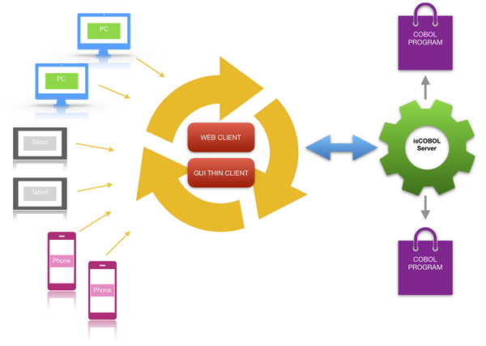

# Introduction

With isCOBOL WebClient your organization can leverage existing COBOL syntax to develop and deploy a universally accessible, zero client, rich Internet application (RIA) using standard COBOL screen sections and existing program procedure flow. No knowledge of object-oriented programming, JavaScript, HTML, or other Web languages is required.

isCOBOL WebClient is an HTTP server that reproduces the GUI of the isCOBOL Thin Client in a web browser.

The WebClient's HTTP server runs on a computer that can access the isCOBOL Application Server, just as the isCOBOL Thin Client does. This machine then becomes the 'web server' for users connecting to your COBOL application from a web browser.

Every time a new session of the COBOL application is launched from a web browser, a new isCOBOL Client (hence a new JVM) is instantiated on the web server.

**Note** - Applications running in WebClient are run by the server, and only rendered images are sent to the browser. There is no HTML involved, therefore it’s not possible to use CSS to customize the layout of the applications.

This WebClient architecture brings some notable capabilities:

- User can interact with the application as if it were a regular desktop application.
- Users can re-establish their sessions after a lost connection with session persistence.
- Administrators can monitor running applications in real time, viewing important information such as memory usage, CPU usage and response times.
- Administrators can provide assistance to end users by using the built-in remote assistance feature, which mirrors the user's screen on the WebClient administrative console, and allows administrator to take control of the session and help the user accomplish a task or troubleshoot a problem.
- The WebClient includes an administration web console you can use to configure users, isCOBOL programs, and a wide variety of customizations and settings.

## Installation Environment

isCOBOL WebClient is based on WebSwing technology.

isCOBOL WebClient works with Java 8, 11, 17 or 21.

isCOBOL WebClient is available for Windows and Linux platforms.

The product is provided and supported only for the 64 bit architecture.

### Linux requirements

In order to run on Linux, WebClient requires the X virtual framebuffer (Xvfb) or a X Window System (X11). Also, be sure that the following libraries are available (names are from Ubuntu repositories - use relevant counterparts for your distribution):

- libxext6
- libxi6
- libxtst6
- libxrender1

### Network requirements

The latency threshold of acceptable user experience is around 200ms. Beyond that threshold, the application might be usable but user experience goes down sharply.

The recommended latency is 100ms or less.

The bandwidth is required mainly for images. When [DirectDraw Rendering](./Applications-Monitoring-and-Configuration/Applications/Change-the-application-configuration/Change-the-application-configuration) is disabled, all the user interface is rendered via PNG images, so you might consider to keep [DirectDraw Rendering](./Applications-Monitoring-and-Configuration/Applications/Change-the-application-configuration/Change-the-application-configuration) enabled for networks with low responsiveness.
