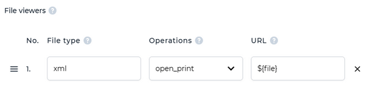

# Known limitations and differences between WebClient and Thin Client

This chapter lists the features that are currently not supported by WebClient as well as behaviors that are different between running as a standard COBOL application and running as a web application.

The list is updated to the date this document has been written.

Most of these differences and limitations are related to the more complex architecture required for the WebClient. In a Thin Client environment, there are only two machines involved: the user's PC and the application server, both using isCOBOL products. But in a WebClient environment, there are three machines involved, the web server, the web client, and the application server. The machine previously known as the user's PC becomes a web server, with no isCOBOL products installed. Instead the PC uses a web browser to interact with the web server. This means that when the COBOL application looks for client resources, it will find the web server’s resources, not the resources on the end user’s PC.

## Clipboard

Copying and pasting text among the fields of the COBOL application inside the browser is always supported.

Sharing text with external software instead is supported only when the [Allow Local Clipboard](./Applications-Monitoring-and-Configuration/Applications/Change-the-application-configuration/Change-the-application-configuration#app-config) option is enabled in the app configuration. For security reasons, the user is prompted for confirmation before accessing the system clipboard for storing or retrieving text.

The Paste option in context menus is not supported by all browsers.

## Printing

By default there is only one printer available, its name is “WebPrintService” and it’s a PDF printer. When a print operation is performed on WebPrintService, the browser automatically opens the resulting PDF in a new tab at the end of the print job. This is the suggested way of dealing with print jobs in WebClient environment. In the rare case your application needs to interact with the printers installed on the web server, enable [Allow Server Printing](./Applications-Monitoring-and-Configuration/Applications/Change-the-application-configuration/Change-the-application-configuration#app-config) in the configuration of the application.

The WebPrintService printer is not recognized as default printer by the Win$Printer functions that return printer information (e.g. WINPRINT-GET-CURRENT-INFO).

## Library Routines

Unless specified differently in the library routine documentation, every routine that access client resources in a WebClient environment works on the server where the WebClient service is running and not on the end user PC where the web browser is running. This rule applies to routines called via CALL CLIENT as well as routine functions that access the client machine (e.g. C$COPY when one of the parameters start with "@\[DISPLAY\]:").

The CDESKTOP-OPEN function of C$DESKTOP and the C$EASYOPEN routine trigger the download of the file instead of opening it with the associated application. The CDESKTOP-BROWSE function of C$DESKTOP opens the URI in a new browser tab. The CDESKTOP-PRINT function of C$DESKTOP opens PDF files in a new browser tab and triggers the download of other file types. These default behaviors can be changed through the [File viewers](./Applications-Monitoring-and-Configuration/Applications/Change-the-application-configuration/File-viewers) setting in the app configuration. For example, if you wish that XML files are shown in the browser instead of being downloaded when you open them with the CDESKTOP-OPEN function or you print them with the CDESKTOP-PRINT function, configure a File viewers entry as follows:

The J$GETFROMLAF routine is not supported. Calling it will return unpredictable results.

The W$MENU routine is not able to manage the tray icon.

The $WINHELP routine is not supported. Calling it may cause a crash of the application.

The C$OPENSAVEBOX dialogs are mapped to a box displayed in the web-browser page that allows the user to upload and download files from the server where WebClient is running. The routine behavior is affected by the following configuration entries: [Isolated Filesystem](./Applications-Monitoring-and-Configuration/Applications/Change-the-application-configuration/File-viewers), [Uploading Files](./Applications-Monitoring-and-Configuration/Applications/Change-the-application-configuration/File-viewers), [Deleting Files](./Applications-Monitoring-and-Configuration/Applications/Change-the-application-configuration/File-viewers)), [Downloading Files](./Applications-Monitoring-and-Configuration/Applications/Change-the-application-configuration/File-viewers) and [Auto-Download from Save Dialog](./Applications-Monitoring-and-Configuration/Applications/Change-the-application-configuration/File-viewers).

The W$CAPTURE routine is not supported. Calling it will return unpredictable results.

The WIN$PLAYSOUND routine plays the sound on the web server machine where WebClient is running.

## User Interface

The windows decoration is driven by an internal theme and differs from the decoration of your current Java Swing Look & Feel. Because of this, the menu bar will never be embedded in the title bar when using the FlatLaf Look & Feel in WebClient.

The default Web-Browser implementation (SWTBrowser) doesn’t work. Use the JavaFx implementation by setting *iscobol.gui.webbrowser.class=com.iscobol.browser.fx.JFXWebBrowser* in the COBOL configuration.

The copy and paste of text on character-based screens is not supported.

The MIN-LINES and MIN-SIZE window properties have no effect, the user can reduce the window dimensions to any height and width.

## Function Keys

Function keys are caught by both browser and COBOL application.

If the F5 key is caught by the COBOL program, then the browser will not refresh the page.

## Debug

In order to debug a program running under WebClient, the Remote Debugger should be used.

Set *iscobol.rundebug* to “1” or “2” in the COBOL configuration and ensure that the classes loaded by the isCOBOL Server are compiled in debug mode.

Start the application in your web browser.

Launch the Debugger on your PC, the same where you’re executing the browser and connect it to the port where the Remote Debugger is listening (usually 9999) on the machine where isCOBOL Server is running.

For more information about remote debugging, see [Remote Debugging](../is-cobol-evolve/SDK-Users-Guide/Debugger/Remote-Debugging).
