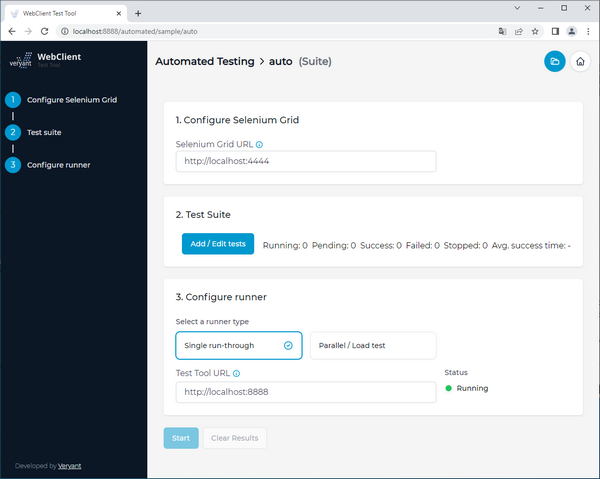
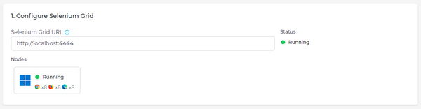
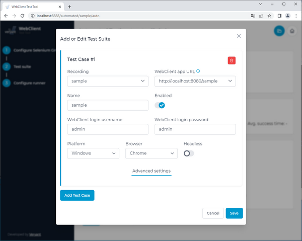
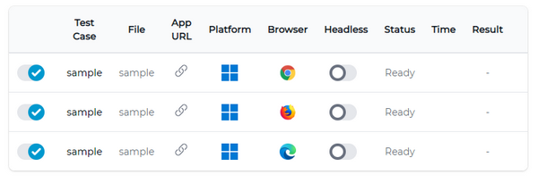
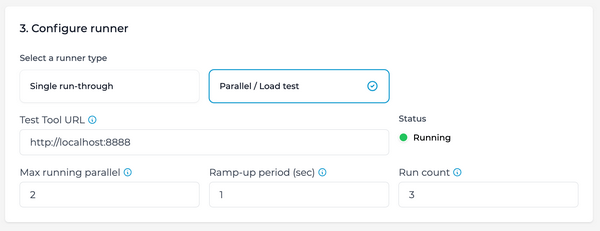
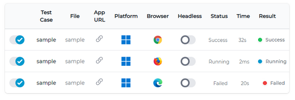

## Automating test cases

To automate the recorded test cases you have to create a Test Suite file. To create a new suite, click the *Add Suite* button, provide a name for your suite and click the *Open* button.



Automated test cases require Selenium Grid.

You can setup a Selenium Grid either in your local environment or use a 3rd party service. Please note that current Test Tool supports Selenium version 4 only.

For a 3rd party service just search for "Selenium Grid in cloud" or use one of these - https://www.gridlastic.com, https://saucelabs.com, https://testingbot.com, https://seleniumbox.com.

To setup Selenium Grid yourself please refer to the [Selenium documentation](https://www.selenium.dev/documentation/grid/getting_started/).

First configure your Selenium Grid. Enter the URL of the running Selenium Hub, e.g. http://localhost:4444. The connection will be validated, wait until you see "Status: Running". Test Tool also tries to retrieve information about running nodes.



To automate WebClient test cases you have created, you need to define test suites. A test suite is a simple configuration file where you define which test cases to run and other options.

You can add or edit the test cases using the *Add* / *Edit* tests button in the second step. Pick a recording from a list of recording files in the current project. Make sure to choose Platform and Browser based on the availability of the environment on your Selenium nodes.



After you save the edited test suite it will be stored in the file.



Finally, configure the test case runner. Enter the URL of test tool server instance (this can be the same instance, i.e. http://localhost:8888 or some other instance). This URL must be accessible from the Selenium node.

You can choose between a single run-through or a parallel run. Single run-through will simply execute test cases one-by-one, one instance at a time.

With parallel you can set how many instances you want to run at the same time (Max running parallel). Use Ramp-up period to define how long should it take to start the Max running parallel instances. For example if you want 10 instances in parallel and start them in 100 seconds, there will be 1 instance started every 10 seconds. After 100 seconds the next instances start ad-hoc after a previous test finishes. To control how many tests will run in total, set Run count. This value is per test, so if you have 3 tests in your test suite and run count set to 10, the runner will run 30 instances total, 10 per each test.



Click Start to start the runner. You can see the progress in the test suite table. If the test case is successful the row turns green, otherwise red. For a failed test case you can take a look at a screenshot from the browser from the time the assertion failed or exception occurred. You can also see an exception stack trace from the test case and optionally also from browser console logs (Chrome, Edge).



### Automated test REST API

There is a simple REST API in case you want to execute a test suite with one or more tests from an external application, e.g. for a WebClient server health check.

Send a POST request to http://localhost:8888/rest/runTest, set Content-Type header to "application/json" with following body:

```cobol
{
  "parallel": false,
  "maxRunningParallel": 1,
  "rampUpPeriod": 1,
  "runCount": 1,
  "testCaseParameters": [{
    "project": "auto",
    "file": "sample",
    "name": "sample",
    "webswingAppUrl": "http://localhost:8080/sample",
    "webswingUsername": "admin",
    "webswingPassword": "admin",
    "platform": "WINDOWS",
    "browser": "chrome",
    "headless": false,
    "enabled": true
  }]
}
```

Adjust the parameters to your needs, you can also let the tests run in parallel, similar to the automated testing web UI.

Keep in mind that you get a response after all the tests you specified finish, so make sure to watch the timeout. If all tests finish successfully you get a 200 OK response, otherwise you get 500 Internal Server Error.
