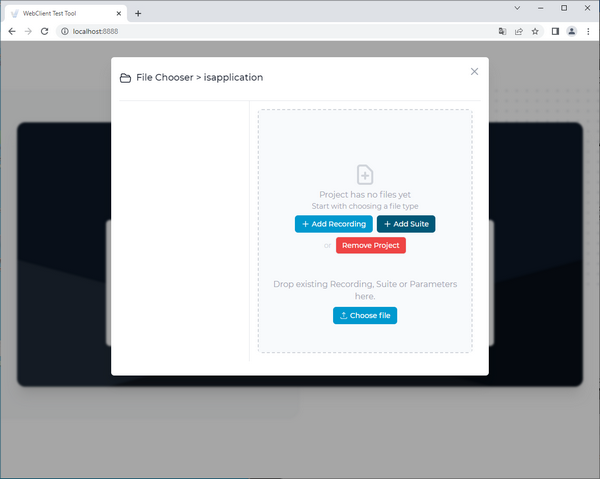
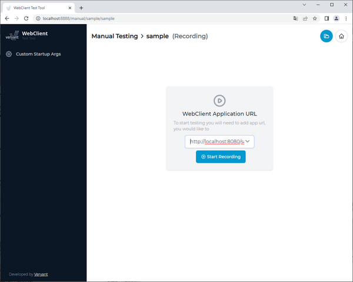
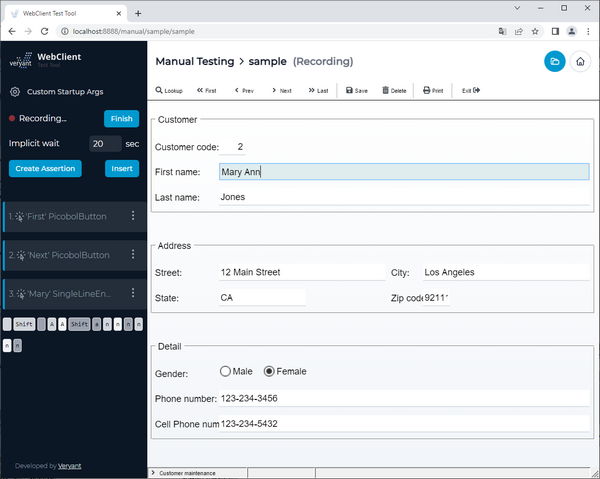
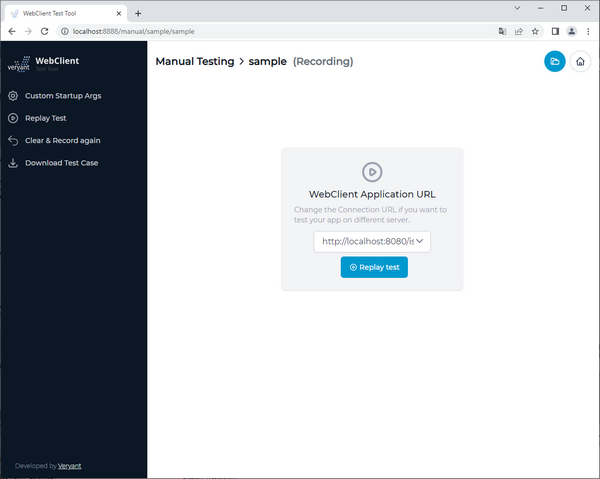

## Manual Testing

First you need to create a new project. This way you can group your recordings, test suites and parameter files. Selecting your project opens File Chooser dialog. Here you can manage your project files:

- create new,
- upload existing,
- rename,
- delete,
- download and open the file.

### Recording

To create a new recording, click the *Add Recording* button, provide a name for your recording and click the *Open* button.

**Note** - the instructions and screenshots below use the isCOBOL Modernization sample program for the demonstration. They assume that you have a WebClient application that runs the CUSTOMER program and you configured it as explained in the [Setup](./Test-Tool#setup) paragraph.

When you open a new recording file it will open in manual testing mode. To record a test case enter URL of your WebClient application (i.e. "http://localhost:8080/sample") and click *Start recording*.

Once you click the *Start recording* button the tool starts recording your actions with the WebClient application. Every time you click in the application a new assertion is created. An assertion is a set of properties that will be validated in the test case, like component type, value, path, etc. Path is especially important to be able to find and exactly identify the component when running the test later. These properties are coming from a component tree that is requested directly from the application each time. Depending on the application size and structure, connection latency, and performance of the environment setup this may take from a few milliseconds to a few seconds, so please be patient after each click you make when creating a test case.

For example, after clicking the *First* button, then the *Next* button and finally typing "Ann" after "Mary" in the First Name field, the screen will look like this:

On the left you find the list of recorded actions.

After you have done some actions and you want to create a custom assertion, use the *Create Assertion* button. Now hover over the application with your mouse to pick a component in the application view. Click the component which you want to make an assertion for. Now check component properties in the toolbox which you want to be validated by the assertion. Click *Add* to save the assertion. The recording of test case now continues.

When typing text during test creation, it is recommended to first click on the input or text area component to make sure there is an assertion created for the input component, even if the input component is already focused when it appears in UI. This way you make sure the test tool runner first waits for the input component to appear in the UI and then starts typing the text.

There is a 20 seconds implicit wait period by default. This is a time period that applies to all future created assertions and represents maximum wait time for the assertion to become valid. During this period, (while running a test case) Test Tool will try to validate the assertion multiple times until it passes. If the assertion fails to validate, the whole test case fails. You can adjust the implicit wait time at the beginning or during the test creation, or you can adjust explicit wait time for each assertion. You can also set a default implicit wait period in *webclient-testtool.properties file test.implicitWaitSec* = 20.

In addition to assertions you can also insert text, delay or a parameter using the *Insert* dialog. You can insert text and parameter only at the current position in test case. The inserted value will be immediately applied. Delays can be inserted at any position at any time.

When you are done with creating the test case click the *Finish* button. The Test Tool will save your current recording to the file. You should be able to replay the tests you just recorded, download the test case or clear and record test case again.

### Playback

Recording files are saved to the projects folder and you can open them from the file chooser.

To run a test click *Replay Test*. You will now see a playback of your recorded test case. Assertions are validated in the toolbox. There are also options to pause the playback, make a single step (disabled until there is a breakpoint) or stop playback. When you are replaying your recording and something is missing or you are not satisfied with it, you can either set a breakpoint before playback, or pause on next step. When the replay is paused you are able to

- edit assertions,
- create an assertion,
- insert (text, param, delay),
- go to next step or continue playback.

When the test finishes you can see and download the test results from the toolbox.
