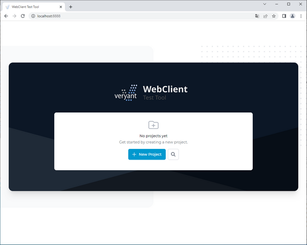

# Test Tool

WebClient Test Tool allows you to create test cases for your application running in WebClient. Test tool is a web application that lets you record a test case, playback the test case and also automate multiple test cases using Selenium Grid.

## Setup

You need a running instance of WebClient with the application you want to test to be able to run WebClient Test Tool.

Make sure your WebClient application allows connections from the test tool server setting [CORS Origins](../Applications-Monitoring-and-Configuration/Applications/Change-the-application-configuration/Change-the-application-configuration#web-config) application configuration.

Make sure you have following configuration of your WebClient application:

- [Session Mode](../Applications-Monitoring-and-Configuration/Applications/Change-the-application-configuration/Change-the-application-configuration#web-config) = ALWAYS\_NEW\_SESSION,
- [Max. Connections](../Applications-Monitoring-and-Configuration/Applications/Change-the-application-configuration/Change-the-application-configuration#web-config) = 100,
- [Auto Logout](../Applications-Monitoring-and-Configuration/Applications/Change-the-application-configuration/Change-the-application-configuration#app-config) = OFF,
- [Enable Test Mode](../Applications-Monitoring-and-Configuration/Applications/Change-the-application-configuration/Change-the-application-configuration#app-config) = ON.

Make sure that [X-Frame-Options](../Applications-Monitoring-and-Configuration/Applications/Change-the-application-configuration/Change-the-application-configuration#app-config) is set to spaces instead of SAMEORIGIN in [Server Config](../Applications-Monitoring-and-Configuration/Server-Config).

It is recommended to create and test in a maximized window with the same resolution.

It is suggested to set [Security Module Name](../Applications-Monitoring-and-Configuration/Server-Config) to NONE to speed up the recording and playback process by skipping the user authentication.

## Configuration and startup

Start the Test Tool application by running the command

```cobol
webcclient-testtool
```

You can change the default ports in the [Jetty Configuration](../JETTY-and-JMS-Configuration#jetty-configuration).

There is also *webclient-testtool.properties* configuration file where you can configure following:

| | |
| --- | --- |
| config.hubUrl | Selenium Grid URL to be used in automated testing, must be accessible by Test Tool server |
| config.testToolUrl | URL of Test Tool server that will be accessible from browser opened by Selenium node |
| testtool.projects.folder | projects folder |
| test.implicitWaitSec | implicit wait for assertion in seconds |
| test.appInitWaitSec | wait in automated test run for WebClient application to be initialized |
| test.appStartWaitSec | wait in automated test run for WebClient application to be started and ready to be tested |
| | |

Open the Test Tool on http://localhost:8888.


