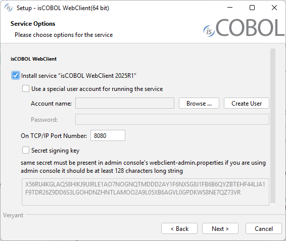

## Windows services and Unix daemons

### Windows service

On Windows it's possible to install WebClient SDK tools as Windows services.

These services can be installed during the setup process:



When WebClient has been installed, the services can be installed, removed and managed through the following commands: [webclient-admin](../webclient-admin), [webclient-and-admin](../webclient-and-admin), [webclient-cluster](../webclient-cluster), [webclient-session](../webclient-session) and [webclient](../webclient).

Each command provides the following options:

| Option | Action |
| --- | --- |
| -install | Installs the service in auto mode.<br>The service will start automatically along with the operating system. |
| -install-demand | Installs the service in demand mode.<br>The service must be started by the user. |
| -start | Starts the service. |
| -status | Returns the status of the service.<br>The possible exit codes are:<br>0 = the service is running<br>1 = the status cannot be determined<br>3 = the service is not running |
| -stop | Stops the service. |
| -uninstall | Removes the service. |

Example

To install the WebClient service, start it and check if it’s running, use these commands:

```cobol
webclient -install
webclient -start
webclient -status
```

**Note** - be sure to have administrator priviledges, or these commands will fail.

#### Non-interactive mode and custom name

In some situations, you might want to install a Windows service as a non-interactive service so that the service does not have any possibility to access the GUI subsystem. In order to do that, add the phrase non-interactive after the -install parameter. A custom service name can still be specified after the non-interactive parameter:

```cobol
webclient -install non-interactive
```

It’s also possible to specify a custom name for the service. This name should be added as last parameter of the command line for all the options. For example, the following list of commands manges an isCOBOL WebClient service named “myservice”:

```cobol
webclient -install myservice
webclient -start myservice
webclient -status myservice
webclient -stop myservice
webclient -uninstall myservice
```

#### Output redirection

The WebClient services redirect all the console output (stderr and stdout) to two files named *<command\>_err.log and <command\>_out.log*. These files are located in the bin directory, which is the default directory of the service.

#### Service configuration

Command-line Java options must be put in the *<command\>.vmoptions*  file, located in the isCOBOL bin directory, which is the default directory of the service. In this file, comments are prefixed by a hash and each option is on a separate line.

The following snippet shows how to configure memory limits, pass a custom configuration file and alter the Classpath for the WebClient service:

```cobol
#memory settings
-Xmx256m
-Xms128m
 
#configuration
-Discobol.conf=/myapp/myconf
 
#classpath
-classpath/p .
-classpath/a C:\dev\myclasses.jar
```

The WebClient service inherits the Classpath from the system and adds all jar libraries in the lib directory to it. Using the *-classpath* option you can add additional items to the active Classpath. The value of *-classpath/p* is prepended to the active Classpath. The value of *-classpath/a* is appended to the active Classpath.

**Note** - On some Windows distributions it’s necessary to reboot the system in order to make services aware of modifications to the system environment.

### Starting multiple services on the same machine (Windows)

In order to manage multiple services on the same machine, the sc command must be used instead of the webclient command.

In this example we show how to start two WebClient services listening on different ports and using different configuration files on the same machine.

1. Create the two services as follows:

```cobol
sc create "Webclient #1" start= auto binPath= "C:\Veryant\isCOBOL_WEBC2026R1\bin\webclient.exe -p 8080 -c \path\to\webclient1.config"
 
sc create "Webclient #2" start= auto binPath= "C:\Veryant\isCOBOL_WEBC2026R1\bin\webclient.exe -p 8081 -c \path\to\webclient2.config"
```

**Note** - the two commands above show the basic options; you might improve them with additional options from [Command-line startup options](../Command-line-startup-options).
