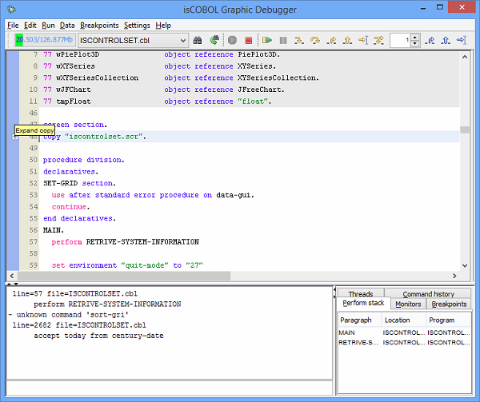
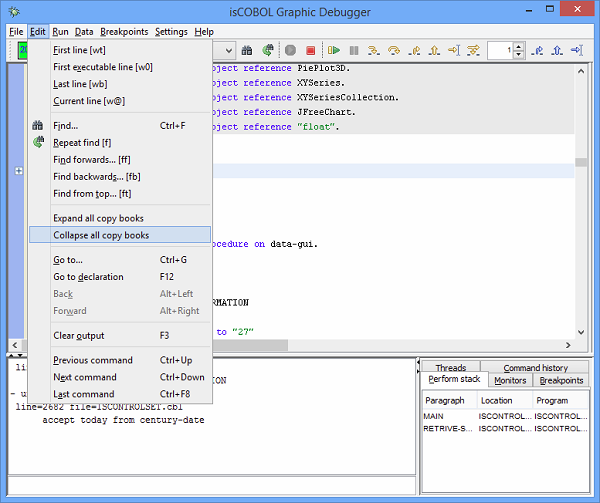
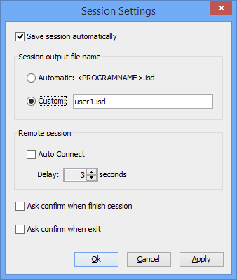
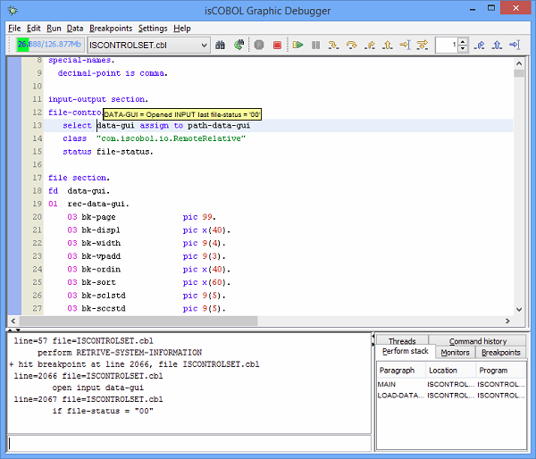
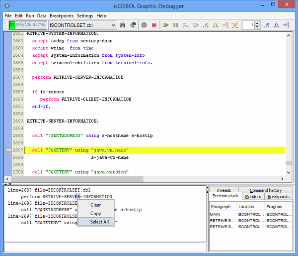

## Debugger Improvements

- Expand and Collapse copy files

Now the isCOBOL Debugger allows you to expand copy files to see all the COBOL code. As depicted in the figure below, a “plus” symbol allows you to expand or collapse related copy files.



You can also expand or collapse all copy files of the whole COBOL source that are going to be debugged.



- Ability to customize the .isd file of Debugger in Session Settings

During a debugger session all useful settings like Monitors, Breakpoints and others are saved on a debugger file session in order to be restored when the debugger is started again. By default the name of the file where a session is saved take the name of the debugged COBOL program. As shown in the picture below, a debugger user can customize the name of debugger session file.



- Other minor enhancements

On the INDEX, RELATIVE and SEQUENTIAL file is possible to inquire if a file is opened or closed and view the last file-status. This may be done with the following command:

```cobol
DISP FILE1
+ FILE1 = Opened INPUT last file-status = '00'
```

Or, iteratively:



Two additional items are available in the popup menu of the output window in the Debugger to easily maintain it clean and copy the output:


