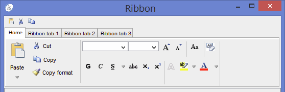

## New User Interface Features

- New GUI control RIBBON

The isCOBOL 2015 R1 introduces a new graphical control named RIBBON. The ribbon is a command bar that organizes the features of an application into a series of tabs at the top of the application window. The ribbon increases discoverability of features and functions, that enable to learn the application quicker and makes users feel more in control.

Such ribbons use tabs to expose different sets of controls, eliminating the need for many parallel toolbars and menu bars.

Code example:

```cobol
          display ribbon
                   lines 7
                   handle hRibbon
                   upon   hWin
                   HEADER-ALIGN 1
           modify hRibbon, tab-to-add ("Home"
                                       "Ribbon tab 1", 
                                       "Ribbon tab 2", 
                                       "Ribbon tab 3")
           display Ribbon-page-1 upon hRibbon(1)
           display Ribbon-page-2 upon hRibbon(2)
           display Ribbon-page-3 upon hRibbon(3)
           display Ribbon-page-3 upon hRibbon(4)
```

Every control inside the screens (Ribbon-page-1, Ribbon-page-2, …) can have the new style ON-HEADER in the first line with a small button.

The following picture shows the final result with the ON-HEADER style set on the buttons Paste, Cut and Copy.



- TAB controls can act like real TAB folder container

New properties in the TAB-CONTROL are available to allow multiple screens to be contained within a single container. With this new approach to design TAB elements, it is able to redisplay the screen for every navigational TAB. This simplifies the code to manage the TAB folding and also improves the network performances because the tab navigation is executed on client side.

The following example shows how to use the new style and properties ALLOWCONTAINER, TAB-GROUP, TAB-GROUP-VALUE:

```cobol
          01 screen1.
             03 entry-field line 2 col 20 size 10.
             03 tab1  tab-control line 3 col 2 size 70 lines 10
                      allow-container
                      value tab1-page.
             03 page1 
                  tab-group tab1
                  tab-group-value 1.
                   05 label line 5 col 6 title "pag1". 
                   05 entry-field line 8 col 6 size 5.
             03 page2
                  tab-group tab1
                  tab-group-value 2.
                   05 label line 5 col 26 title "pag2". 
                   05 entry-field line 8 col 26 size 5.
```

- Programmatically use of TCP/IP packet optimizer

The Client/Server TCP/IP communication of isCOBOL Server is automatically optimized in order to reduce the number of TCP/IP packets for each GUI statement that is shown on the screen. To provide more flexibility to the developers, some op-codes were implemented in W$FLUSH library routine to inhibit the flush and restore the flush between server and client. This allows you to improve performances in case more INQUIRE statements are executed. Using W$FLUSH can reduce the number of packets that need to be sent over the network.

Code example:

```cobol
           call "W$FLUSH" using INHIBIT-FLUSH win-handle
           inquire ef1 value in v1
           inquire ef2 value in v2
           perform varying ind from 1 by 1 until ind > 6
              inquire h-ef(ind) value in var(ind)
           end-perform 
           perform varying ind from 1 by 1 until ind > grid-last-row
              inquire grid1(ind, 1) value in gr-col1(ind)
           end-perform 
           call "W$FLUSH" using ALLOW-FLUSH win-handle
```

- Common property CUSTOM-DATA

To extend the concept of the HIDDEN-DATA property to all GUI controls, a new common property named CUSTOM-DATA has been implemented. It allows isCOBOL developers to save personal information to each GUI controls. The property can be used on DISPLAY, MODIFY and INQUIRE.

Code example:

```cobol
           display label line 2 col 2 title "Label1" custom-data 1 
                   handle in hlab1 
           inquire hlab1 custom-data in ws-custom-data
           modify  hlab1 custom-data 2
```

- Support for JavaFX WebView web-brower

A new web-browser implementation has been made for the WEB-BROWSER control to take advantage on JavaFX WebView.

JavaFX WebView, available from JSE 1.7, is the first web-browser implementation written 100% in Java. It supports Cascading Style Sheets (CSS), JavaScript, Document Object Model (DOM), and HTML5. Using this option avoids using native code and reduces the overhead to invoke the Internet Explorer ActiveX.

To enable it, it’s necessary to set the configuration setting:

```cobol
iscobol.gui.webbrowser.class=com.iscobol.fx.JFXWebBrowser
```

- Adding style READONLY for DATE-ENTRY

The style READONLY is now supported on the DATE-ENTRY control to disable manual input by keyboard on the entry-field part that composes the DATE ENTRY control. It forces users to utilize the calendar control instead of typing data on the entry-field.
