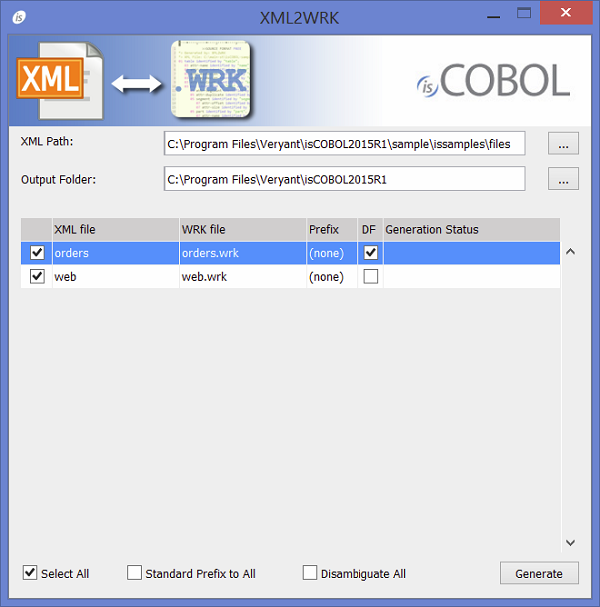
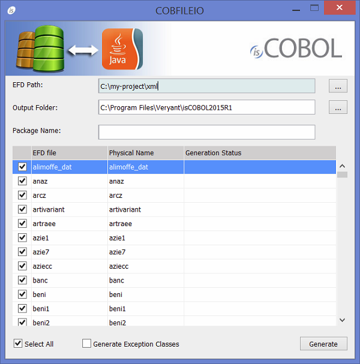
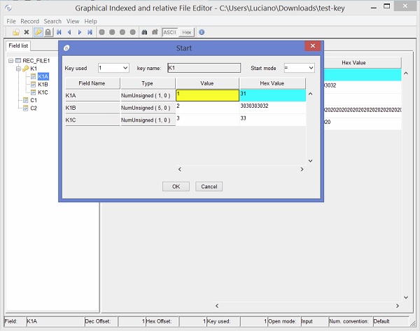
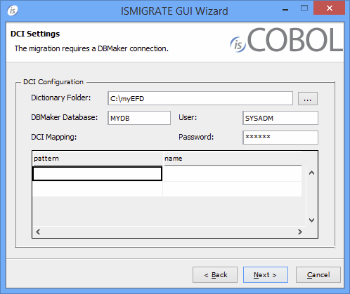

## Utility improvements

- New utility ISL "isCOBOL Launcher"

ISL provides an easy and quick way to run an isCOBOL program without knowing the options and properties that will be used. Looking at the screenshot below, it is clear that ISL could help new isCOBOL users to understand how many ways they can interact with isCOBOL objects. On the status bar of the utility, new users can start to learn the needed options.

- New GUI interface for XML2WRK utility

The XML2XRK utility that opens an XML file and creates the corresponding record definition used with the XMLStream Class (com.iscobol.rts.XMLStream) object, is now released with a graphical user interface improving its usage. As depicted in the picture below, in addition to the new GUI interface, it is also possible to parse remote xml files via URL and generates namespaces.

- New GUI interface for COBFILEIO utility

COBFILEIO, the utility that generates Java classes used to access COBOL ISAM files and records from Java programmer, is now released with a graphical user interface. As depicted in the picture below, this new GUI will make easier to be used for all users.

The Java programmer does not need any knowledge of COBOL data types or their underlying storage format, and COBFILEIO automatically generates Javadocs for the filesand record classes.

- Graphical Indexed and relative File Editor improvement

When the EFD file is provided, the field info is used during START instead of having just one entry-field that allows filling the key value. Now a grid is used in the interface where every line allows setting the field “Value” of each segment that composes the key.

- ISMIGRATE improvements

ISMIGRATE, the utility that converts ISAM files from one to another format now supports DBMaker DBMS as standard option. As depicted in the picture below, a new page was added to provide the database name, user and password. The data migration is executed using DBMaker DCI interface.

