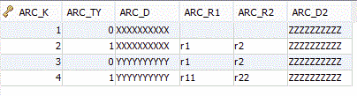
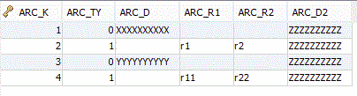

## isCOBOL Database Bridge Improvements

The isCOBOL Database Bridge tool enabling COBOL programs to use the RDBMS power without changing COBOL source code or learning ESQL was enhanced to better satisfy user’s requests.

- Improved performance

The EDBI routines now use a faster way to bind COBOL fields to DBMS fields. The performance improvement is related to the number of File Description fields. More fields are used while also increasing the performance. Up to 10% of the EDBI RDBMS subroutines will be benefit with the enhanced performance. This optimization affects only FDs with USAGE DISPLAY fields.

In EDBI routines for PostgreSQL RDBMS, NUMERIC fields are now used to bind numeric COBOL data items. NUMERIC fields perform better than INTEGER, SMALLINT and other numeric field types used by previous versions.

- Improved the support for EFD WHEN directive

In previous versions EFD WHEN without TABLENAME clauses used to manage REDEFINES fields within a record definition, caused duplicated data. Now data is stored only in the field where the WHEN directive is specified. Consider the following FD:

```cobol
       01 arc-rec.
          03 arc-k pic 999.
          03 arc-ty pic 9.
      $efd when arc-ty = 0
          03 arc-d pic x(10).
      $efd when arc-ty = 1
          03 arc-r redefines arc-d.
             05 arc-r1 pic x(5).
             05 arc-r2 pic x(5).
             03 arc-d2 pic x(10).
```

With previous versions, records were filled as follows:



Now they’re filled as follows:



In addition AND / OR clauses are now fully supported with EFD WHEN directives.

- Support for COBOL program compiler with -cp

The isCOBOL programs that need to use the C memory model to share pointers between C and COBOL, now can also take advantage of EDBI routines.

- New property iscobol.easydb.replacement_rules

The new configuration property iscobol.easydb.replacement_rules=n allows to customize how the table is named. This can be used to obtain better table names in the RDBMS when migrating from indexed files. For example having this SELECT:

```cobol
select file2 assign to "CUSTOMERS.DAT"
       organization indexed
```

By default the table name used by isCOBOL Database Bridge would be CUSTOMERS\_DAT, but setting:

```cobol
iscobol.easydb.replacement_rules=4
```

Where 4 means to remove the extension, the table name becomes CUSTOMERS.
