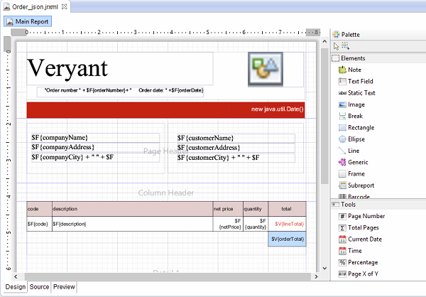
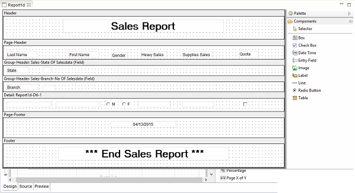
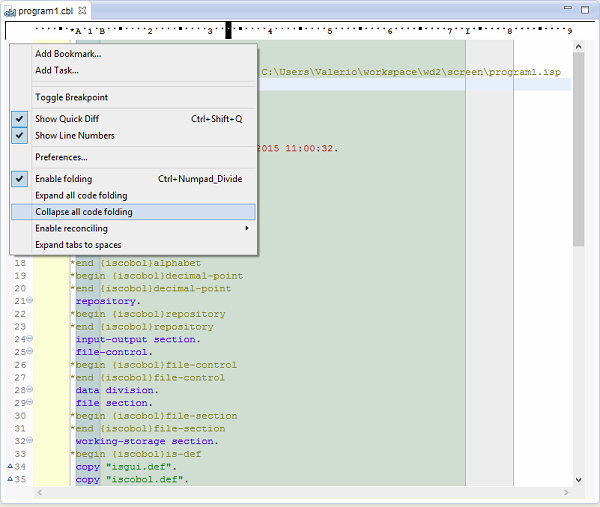
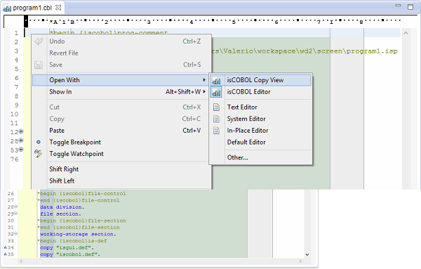

## isCOBOL IDE Enhancements

In isCOBOL Evolve 2015 R1, the isCOBOL IDE has been created with two different editions:

- Standard setup, that is based on Eclipse Kepler SR2 for Java EE with the inclusions of Jasperstudio plugins and others useful plugins

- Lite setup, that is based on Eclipse Kepler SR2 with essential plugins included.

Both editions contain all isCOBOL IDE plugins to manage isCOBOL projects, programs, screens, data files and reports.

- Jasper Report

The addition of Jasper report studio to the isCOBOL IDE, as shown in the picture below (Jasper Studio Designer), allows isCOBOL users to create sophisticated layouts containing charts, images, sub-reports, crosstabs and much more. Moreover it enables you to access your data through JDBC, TableModels, JavaBeans, XML, Hibernate, CSV, and custom sources. Then to publish your reports as PDF, RTF, XML, XLS, CSV, HTML, XHTML, text, DOCX, or OpenOffice



Using Jasper Report Studio to design report’s applications, is the first step in taking advantage of the flexible BI architecture provided by JasperSoft now TIBCO.

- Report Designer

isCOBOL IDE 2015 R1 introduces a new feature to be able to generate brand new reports. In addition, you are now able to import AcuBench reports. Once AcuBench report is imported, isCOBOL IDE users can continue maintaining the reports using a WYSIWYG graphical design window where you can drag and drop report components from a graphical palette.As shown in the picture below, once components are dragged into the report, you can use the Property window to configure the appearance and behavior of the element and the Event Editor to tie the code to the element.



While the AcuBench reports are executed as HTML files to be printed via IE Active/X using the acubenchprint.dll wrapper, the isCOBOL support for AcuBench reports, includes an HTML rendering tool that is able to print and preview generated HTML without any IE Active/X dependences. However, is also possible to continue using acubenchprint.dll if needed.

- Enhanced code folding

Figure 3, Collapse/Expand code folding, shows two new functions ‘Expand all code folding’ and ‘Collapse all code folding’, to expand or collapse all sections of a COBOL source code. This allows the user to manage large amounts of code while viewing only subsections of the code that are specifically relevant at any given time.



- isCOBOL Copy View

It is useful to have a COBOL source with the inclusion of all copy files to make a full text search that includes also all used copy files. As depicted in the picture below, is a new entry on existent “Open With” menu.



When a user decides to open a COBOL source with 'isCOBOL Copy View’ it creates a new view of the COBOL source that will be opened, where all copy files are included using a different background color as depicted in the picture below, new isCOBOL View including all copy files.


- Ability to run the import processes from the command line

Added the ability to run the PSF and DLT import process outside the isCOBOL IDE.

Example command for PSF:

```cobol
isIDE.exe -data C:\WorkspaceDST -nosplash -application com.iscobol.plugins.screenpainter.IscobolScreenPainter.importApplication project ProjectDST folder C:\ISCOBOLtests\psffolder
```

Example command for DLT:

```cobol
isIDE.exe -data C:\MyWorkspace -nosplash -application com.iscobol.plugins.screenpainter.IscobolScreenPainter.importDltApplication project Project folder C:\dltfolder
```
