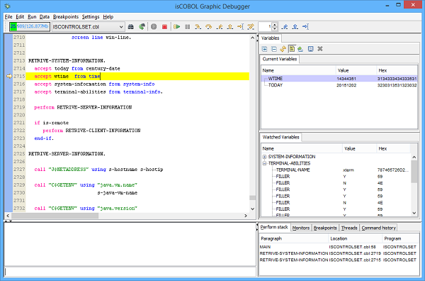
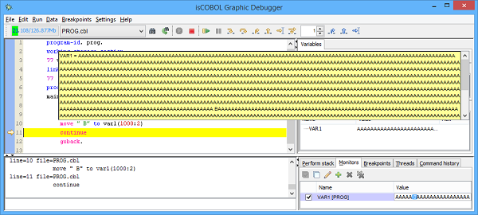

## Debugger Improvements

isCOBOL Debugger continues to be a core feature of isCOBOL Evolve so we like the idea to continue to improve it. For this reason in isCOBOL 2016 R1, the isCOBOL Debugger provides new features to continue to improve usability and easy to be used.

### New Current Variables View

isCOBOL Debugger now automatically shows the Current Variables to easily follow the program execution step by step. As depicted in the picture below, in the right part of Debugger window, an area is reserved to show the Current Variables (list of variables used in the current and previous statement) and the Watched Variables, so it is more simple to see multiple variables during the stepping process.

### Other minor enhancements

The picture below, shows the new management introduced in debugger interface to better manage long values in tool-tip and monitor.

A New button (green plus) was added in Monitor and Breakpoint Debugger views to simplify the creation of new Monitor or Breakpoint. Additionally, a new configuration property named iscobol.debug.propfile was added to set a different property file to store Debugger settings to simplify for a team of to use the same settings.
