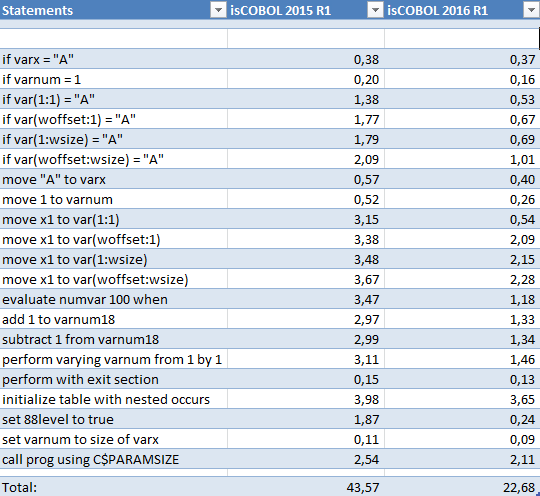
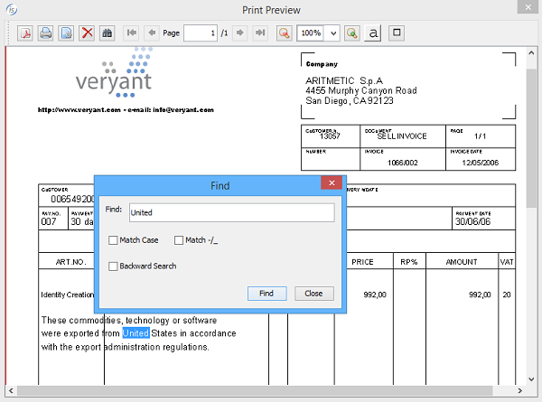

## Framework Improvements

isCOBOL framework is the heart of isCOBOL Evolve. Once again Veryant’s engineers gain performance on many common statements to perform faster the whole COBOL application. In addition of performance improvements, isCOBOL 2016R1 provides JISAM encryption, reduction of the memory footprint on numeric fields and many other improvements.

### Performance and memory improvements

Many COBOL statements have been optimized in order to increase execution of batch COBOL programs. To take advantage of most performance improvements, the COBOL source code should be recompiled with isCOBOL compiler 2016R1.

This is the list of statements that were improved in 2016R1:

- ADD,
- EVALUATE,
- EXIT SECTION,
- IF,
- MOVE,
- PERFORM,
- SET,
- SUBTRACT.

2016R1 also optimizes COBOL programs that use C memory model (-cp) on several areas. The memory consumed for numeric COBOL variables allocation has been reduced.

The image below shows a comparison between isCOBOL 2016R1 and isCOBOL 2015R1. The performance test was executed on Windows 10 64 bit (CPU: Intel Core i-5 Processor 4440+, 3.10 Ghz / RAM: 8GB / isCOBOL compiler option -dz / java used: Oracle JDK1.8.0_65 with option –server, time in seconds).



### Encryption on JISAM files

isCOBOL compiler 2016 R1 supports the WITH ENCRYPTION clause in the SELECT of indexed files. This clause was managed as a comment in previous releases to turn on a compression based on public and private keys. A new property named:

- iscobol.file.encryption.key

Allows to specify the key to be passed to file handler. This property can be set dynamically inside COBOL programs using SET ENVIRONMENT statement to maximize security.

Code example:

```cobol
           select pwd-file assign to "pwdfile"
                 organization is indexed
                 access mode is dynamic
                 record key is pwd-key
                 WITH ENCRYPTION
```

When it runs, all data stored in the “pwdfile” (both .dat and .idx) will be encrypted based on the encryption value.

In case the configuration is missing, a new file status “9X” will be returned when opening an encrypted file that means “Encryption's key missing”.

JUTIL command line utility was updated to work correctly with encrypted JISAM files. A new option -e=encryption_key needs to be passed to have JUTIL working correctly on encrypted files.

JUTIL command line examples:

```cobol
jutil -e=MyKey123 –unload pwdfile outputbinpwd
jutil -e=MyKey123 –rebuild pwdfile
```

### Find features on print preview

As depicted the picture below, the “find” feature is now supported in the isCOBOL Print Preview. User of print preview can now easily search text in forward or backward way with the option to match -/\_.



### Ability to know who is locking a record under c-tree

A new library routine named “C$LOCKPID” has been implemented to retrieve from COBOL program who is locking a record with c-tree file handler.

It returns the c-tree task number to be used in the Faircom utilities to monitor the connected clients.

Code example:

```cobol
         77  wctid  pic 9(7).
         ...
         read myfile next with lock
         if myfile-fs = "99"
            call "C$LOCKPID" giving wctid
         end-if
```

### Other enhancements

Here some minor enhancements provided in isCOBOL 2016R1 framework:

- Ability to have all ACCEPT statements to time out just as if there was a BEFORE TIME phrase present in the ACCEPT statement. A new configuration property iscobol.accept_timeout to specify the number of seconds to timeout. Configuration example:

```cobol
iscobol.accept_timeout=5
```

- Ability to set attributes for PDF generation through configuration properties. The syntax is iscobol.print.attribute.attribute-name=attribute-value.

The attribute-name and attribute-value are the same used from WINPRINT-SET-ATTRIBUTE op-code in WIN$PRINTER library routine.

Configuration examples to define jpeg compression to 95% and PDF author to “MyName”:

```cobol
iscobol.print.attribute.jpeg=95
iscobol.print.attribute.author=MyName
```

- Improved PDF compression especially when the same images are used many times in the print job.
