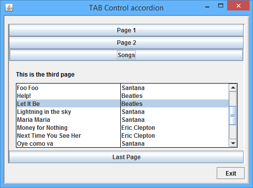
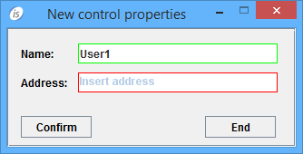

## New User Interface Features

To stay up to date with new requests to develop modern and easy to use applications, Veryant engineers continue to improve UI with new controls, style and properties. An Example? The ACCORDION new style in tab-control.

### New layout ACCORDION in TAB-CONTROL

isCOBOL 2016 R1 introduces a new layout in TAB-CONTROL. This layout can be activated with the new style named ACCORDION. As per the picture below, it is clear that ACCORDION is useful to groups some controls that will be visible only when selecting item (page) will be clicked.

Code example:

```cobol
03 Tb1-accordion
   tab-control
   line 2 col 2 lines 17 cells size 68 cells
   ACCORDION.
```



### New control properties

New property in ENTRY-FIELD control:

- PROPOSAL-MIN-TEXT to show the proposals after a number of characters typed in the field. This works in conjunction with existing PROPOSAL properties.

New property in ENTRY-FIELD and COMBO-BOX controls:

- PLACEHOLDER to show a hint inside the control when the field is empty. This assist the User to understand which type of information is required in the editing field.

New property available in all controls with borders:

- BORDER-COLOR sets the border color when BOXED style is set (in entry-field it is set by default). It supports all color values and also RGB colors.

The following example shows how to use the new properties PROPOSAL-MIN-TEXT, PLACEHOLDER and BORDER-COLOR:

```cobol
03 efname
    entry-field line 2 col 12 size 30 
    border-color 11 
    placeholder "Insert name"
    proposal-min-text 2.
03 efaddress 
   entry-field line 4 col 12 size 30 
   border-color 13
   placeholder "Insert address".
```

The image below shows the final result of BORDER-COLOR on the fields and the PLACEHOLDER see just on the second field because it is still empty.


