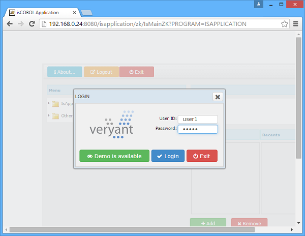
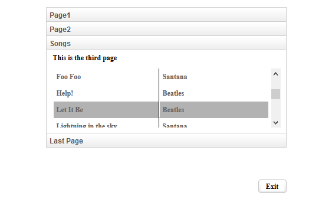

## isCOBOL EIS improvements

### Configuration to activate stateless mode

A COBOL Services can be designed to be stateless or statefull according with COBOL developers needs. In case of migration from CGI COBOL program that are stateless by design, this could be useful to force isCOBOL service to run as stateless service even if they was not designed to be stateless.

A new property iscobol.http.stateless has been added to force service to run as stateless.

Configuration examples:

```cobol
iscobol.http.stateless=true
```

### webDirect enhancements

isCOBOL webDirect now includes ZK updated to version 8. In addition to take advantage of new ZK features, there are new configuration properties:

- iscobol.wd2.additional_stylesheet=filename to load an additional CSS stylesheet
- iscobol.wd2.style=bs to use Bootstrap styling for controls

and new properties in the GUI syntax supported by isCOBOL compiler that will be used when running under webDirect:

- css-base-style-name (available for all controls) to set a css-style allowing a completely customized
- css-icon (available for push-button) to use font-awesome icons

Code example:

```cobol
03 PB-LOGIN 
   Push-Button
   title "&Login"
   ...
   css-base-style-name "btn btn-primary"
   css-icon "fa-check".
```

The result of this button is shown in the picture below:



TAB-CONTROL with ACCORDION style is supported also under webDirect. This is useful on web applications to have nice menu as alternative of tree-view control.

The image shown below depicts the final result with the ACCORDION style set on TAB-CONTROL in a browser.


