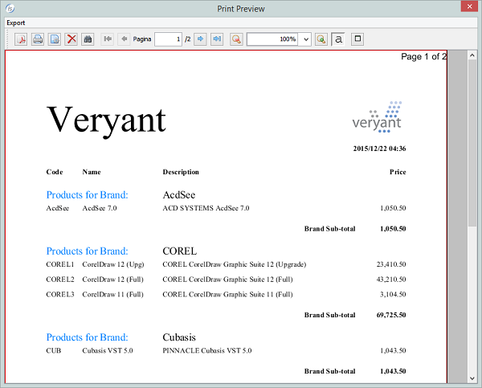
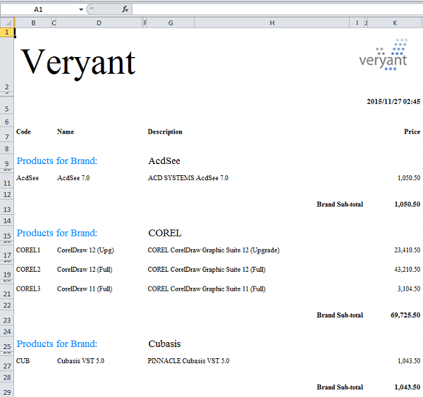
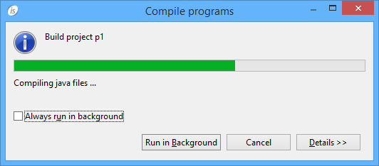
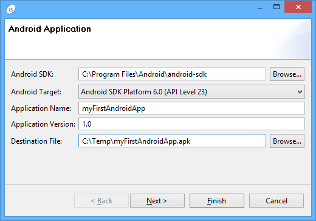

## isCOBOL IDE Enhancements

In isCOBOL Evolve 2016 R1, the isCOBOL IDE includes changes that improve the usability and productivity with additional new features like Excel file export from the Report Designer generated program.

### Report Designer

isCOBOL IDE 2016 R1 enhanced the Report Designer adding the ability for report programs to export into Excel file formats. As depicted in the picture below, during print preview, the user can decide to export the output generated from print program to XLS or XLSX file formats as well to generate a PDF or to print directly to the physical printer.

The next picture shows an Excel sheet created automatically from the new Export menu of print preview. As you can note, the export feature converts all graphical definition like fonts, formats and images into Excel equivalents features:

To better configure the output layout generations, the Export feature defaults and behaviors can be adjusting using the following properties:

- iscobol.export.excel.cell_ignore_background=(true|false)
- iscobol.export.excel.cell_ignore_borders=(true|false)
- iscobol.export.excel.cell_locked=(true|false)
- iscobol.export.excel.cell_numeric_format=(valid excel numeric format)
- iscobol.export.excel.cell_wrap_text=(true|false)
- iscobol.export.excel.collapse_row_span=(true|false)
- iscobol.export.excel.detect_cell_type=(true|false)
- iscobol.export.excel.force_page_breaks=(true|false)
- iscobol.export.excel.freeze_page_header=(true|false)
- iscobol.export.excel.ignore_images=(true|false)
- iscobol.export.excel.remove_columns_space=(true|false)
- iscobol.export.excel.remove_rows_space=(true|false)
- iscobol.export.excel.whitepage_background=(true|false)

### Ability to run the compilation in background mode

Added the ability to run the compilation on one or more programs in background mode.

This allows during long compilations to continue working on other items in the project without wasting the time spent during compilation (like shown in the picture below).

### ANDROID SDK integration

In order to simplify the mobile application generation, isCOBOL 2016R1 natively supports the generation of Android packages. As depicted in the picture below, a new Wizard named “Export to Android Application” is available in isCOBOL HTML project of isCOBOL IDE.

This new step by step wizard allows to create the APK without any external Eclipse plugin installed, just fill required fields to specify the SDK to be used, the application names, the application version etc.

