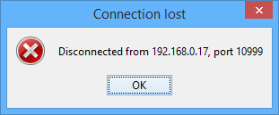
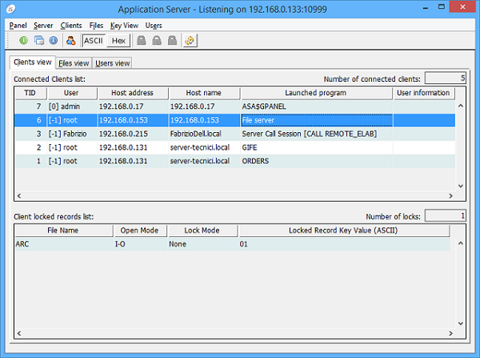

## isCOBOL Server Improvements

Starting from isCOBOL 2016R1, isCOBOL Server was improved to provide more functionality and better performance.

### Lost connection message

A message box 'Lost connection' is now automatically reported on Thin Client architecture if an abnormal session termination is detected. This assist end-users to identify a problem related to the network stability.

In case you need to avoid this message, it’s possible to pass the new Client option -nodisconnecterr. Example:

```cobol
iscclient –hostname ipserver –port 10999 –nodisconnecterr MYPROG
```

If no option is passed, by default the Connection lost error is returned as follows:



### Monitor users and locks of File Server

This new feature allows to monitor active users and locks in the File Server through the AS Panel. This allows the administrator user to have a complete list of connected users and locks in case iscobol.file.lock\_manager is set, like shown in the picture below.

This same info can be retrieved from cobol programs using the existing routines: A$LIST\_USERS and A$LIST\_LOCKS.



### Remote calls in –cp mode

The remote calls now support a new protocol named iscp, to allow COBOL programs, that use the C memory model (-cp compile option) to be called in remote way.

Example:

```cobol
iscobol.remote.code_prefix=iscp://192.168.0.101:10999
```

It’s also possible to specify multiple remote setting to define different directory or different server where call remotely COBOL program.

Example:

```cobol
iscobol.remote.code_prefix=iscp://server1:10999\niscp://server2:10999
```
