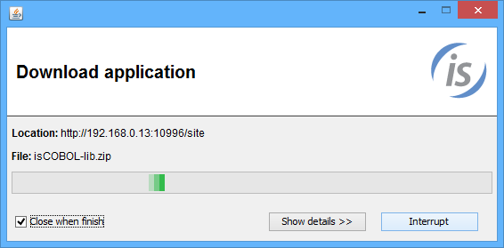

## isUPDATER, software updates for all COBOL applications

Updated software versions and program updates are vital steps in staying secure online, as security patches are often included in updates, as well as solutions for other vulnerabilities and bugs. The goal of this new product, is to assist you to keep all COBOL applications, native modules and isCOBOL libraries up to date.

The isUPDATER software:

- Provides an easy, one-click activation of applications
- Guarantees that you are always running the latest version of the application
- Eliminates complicated installation or upgrade procedures

Based on HTTP communication protocol it can be used on conjunction with any HTTP server live IIS or Apache. In order to simplify the use of this new feature, isCOBOL Server provides very basic HTTP services to make the adoption of this new feature out-of-the box.

With the server configuration file, it is possible to define which packages that must be keep up to date. It is also possible to define a client-side POSTUPDATE procedure for each package to be updated. This allows the developer to specify specific tasks to be executed on the client where packages are updated, after updating procedures.

On server side we need to have a property file named swupdater.properties where define packages and versions:

```cobol
swupdater.version.iscobol=100
swupdater.zipfile.iscobol=isCOBOL2016.zip
swupdater.version.application=100
swupdater.zipfile.application=customer_application.zip
```

to be located with all packages for updating process on a directory of a HTTP server like Apache Http, Microsoft IIS or isCOBOL Server with HTTP service tuned on.

On the client site we need to have a property file, named for example isupdater.properties, where defines mainly the address of HTTP server where locate updates and packages to be updated:

```cobol
swupdater.site=http://192.168.0.13:10996/site
swupdater.version.iscobol=90
swupdater.directory.iscobol=c:/isCOBOL2016R1
swupdater.version.application=90
swupdater.directory.application=C:/Application
swupdater.mainclass=MAIN_APPLICATION
```

With the above basic configuration we can run the isUPDATER command on client site to start the updating process from a command prompt typing:

```cobol
iscupdater -c isupdater.properties
```

This command will launch the updating process as ruled on server and client configuration file. As depicted in the picture below, the command will show a dialog where will be possible to see all actions of updating procedure.



After updating the packages, as defined with swupdater.mainclass property, will be executed the main program of COBOL application named MAIN_APPLICATION.

Another use of the updater facility could be to run isCOBOL thin client afterwards to accommodate the updating of jar files on the client side. This configuration will remove the task to update the jar files on the client side when the version of the isCOBOL Server doesn’t match the version of isCOBOL thin client.

The following property file allows running the thin client after client’s updating:

```cobol
swupdater.site=http://192.168.0.13:10996/site
swupdater.version.iscobol=90
swupdater.directory.iscobol=c:/isCOBOL2016R1
swupdater.version.application=90
swupdater.directory.application=C:/Application
swupdater.mainclass=com.iscobol.gui.client.Client MAIN_APPLICATION
```
