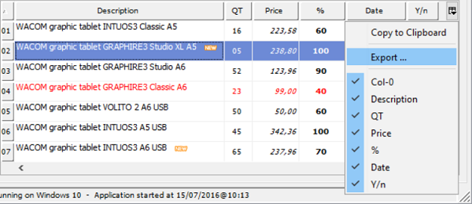
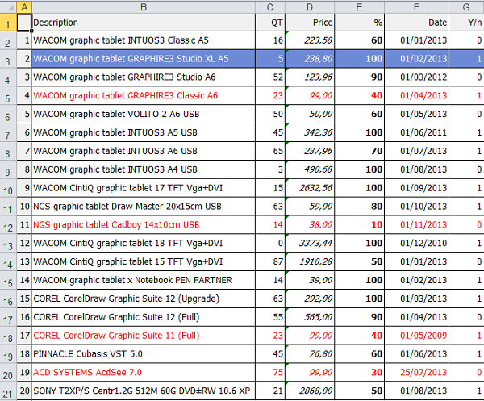
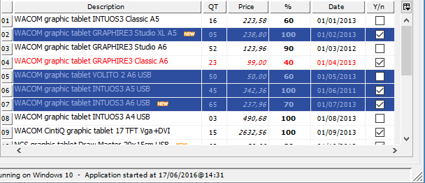
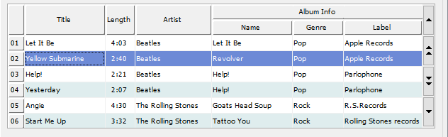
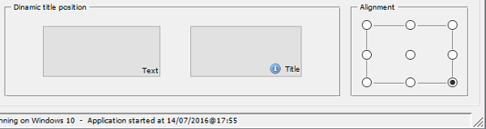

## New User Interface Features

The Grid control has been greatly enhanced with new features, and push buttons have been upgraded as well.

### Grid control

Grid content can now be copied to the clipboard and exported in Microsoft Excel XLS and XLSX formats. Those features can be added automatically or controlled by code.

The HEADING-MENU-POPUP property has new values defined in the isgui.def, or automatically generated by the Screen Painter, to allow adding the Copy and Export popup menu items.

Using COBOL code, the new ACTION property value ACTION-EXPORT will trigger the grid data export feature. Exported data file name and format can be customized using the EXPORT-FILE-NAME and EXPORT-FILE-FORMAT properties.

Using the ACTION-COPY value of the ACTION property will copy the grid contents to the clipboard.

The figure below shows how the user can access the new grid export feature. This can be achieved by properly setting the HEADING-MENU-POPUP property of the grid, as shown below, no coding needed!

```cobol
05 my-grid grid
   heading-menu-popup 63
   export-file-name w-path-filename
   export-file-format "xlsx"
```



The content of exported data into Excel will look like this:



Multiple selection modes are now supported in the grid control, to allow users to more conveniently select rows or columns.

New properties in the GRID control:

- SELECTION-MODE to specify the selection type
- CELL-SELECTED-COLOR to set the selected cell color, expressed as COBOL value
- CELL-SELECTED-BACKGROUND-COLOR to set the selected cell background color, in RGB format
- CELL-SELECTED-FOREGROUND-COLOR to set the selected cell foreground color, in RGB format
- COLUMN-SELECTED-COLOR to set the selected column color, expressed as COBOL value
- COLUMN-SELECTED-BACKGROUND-COLOR to set the selected column background color, in RGB format
- COLUMN-SELECTED-FOREGROUND-COLOR to set the selected column foreground color, in RGB format
- ROW-SELECTED-COLOR to set the selected row color, expressed as COBOL value
- ROW-SELECTED-BACKGROUND-COLOR to set the selected row background color, in RGB format
- ROW-SELECTED-FOREGROUND-COLOR to set the selected row foreground color, in RGB format
- CELLS-SELECTED to retrieve the selected cells list
- COLUMNS-SELECTED to retrieve the selected columns list
- ROWS-SELECTED to retrieve the selected rows list

With the code shown below multiple row selections can be easily added in the grid:

```cobol
05 my-grid grid
   selection-mode 12
   row-selected-foreground-color rgb x#9CB0E3
   row-selected-background-color rgb x#2D4D9F 
      ...
```



To provide better looking and easier to read grids, when multiple header rows are used, heading cells can now span horizontally or vertically

- CELL-ROWS-SPAN spans a header cell vertically on multiple rows
- CELL-COLUMNS-SPAN spans a header cell horizontally on multiple columns

In the figure below, the SPAN CELLS feature is used to vertically span the first 4 columns and to horizontally span the Album Info cell, using the following code:

```cobol
05 my-grid grid
            column-headings
            num-col-headings 2
            ...
 
modify my-grid(1, 1) cell-rows-span 2
modify my-grid(1, 2) cell-rows-span 2
modify my-grid(1, 3) cell-rows-span 2
modify my-grid(1, 4) cell-rows-span 2
modify my-grid(1, 5) cell-columns-span 3
```



### Push buttons

Alignment styles LEFT, RIGHT, TOP, BOTTOM, CENTER are now supported in push-buttons and can be set dynamically.


