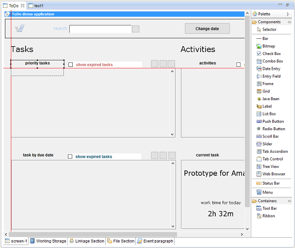

## isCOBOL IDE Enhancements

The isCOBOL Evolve 2016 R2’s IDE includes the new feature “Snap to Guides”, which improves productivity by simplifying the alignment of components when designing a screen or report.

