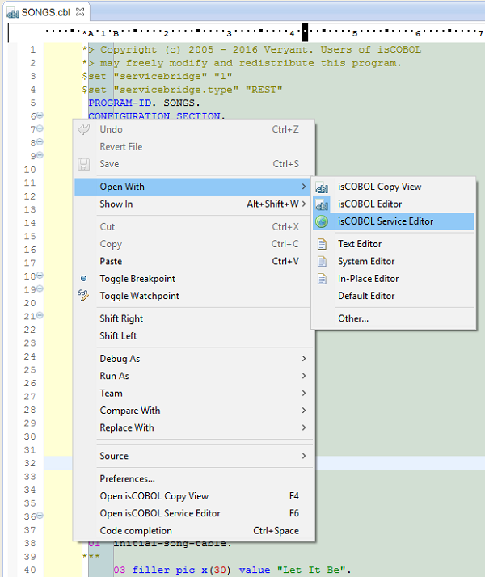
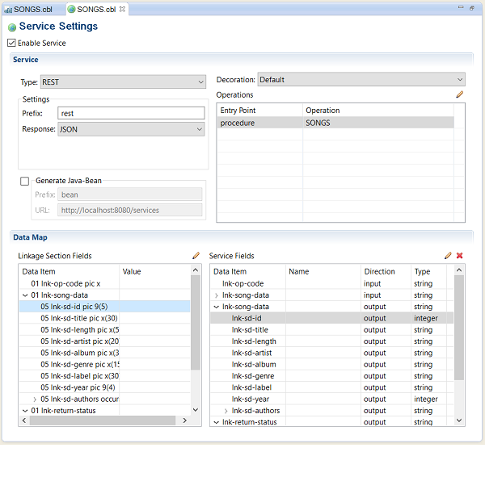

## isCOBOL Service Bridge facility

To allow other software to communicate with an isCOBOL program, isCOBOL 2016R2 now provides easy server-side SOAP and REST Web Services development using the isCOBOL Server Bridge feature, available in the EIS framework. With Server Bridge, every time the isCOBOL Compiler compiles a legacy COBOL program with Linkage Section, a bridge class that allows the program to be used as a Web Service is automatically generated.

This feature is enabled by setting the property iscobol.compiler.servicebridge to true, and can be customized through the Service Bridge configuration described as follows:

```cobol
iscobol.compiler.servicebridge=true
iscobol.compiler.servicebridge.type=SOAP|REST
iscobol.compiler.servicebridge.package=...
iscobol.compiler.servicebridge.rest.prefix=...
iscobol.compiler.servicebridge.rest.response=JSON|XML
iscobol.compiler.servicebridge.soap.prefix=...
iscobol.compiler.servicebridge.soap.url=...
iscobol.compiler.servicebridge.soap.style=RPC|Document
iscobol.compiler.servicebridge.soap.namespace=...
```

To generate a REST web service with JSON responses, for example, the following configuration should be used when compiling:

```cobol
iscobol.compiler.servicebridge=true
iscobol.compiler.servicebridge.type=REST
iscobol.compiler.servicebridge.rest.response=JSON
```

In addition, the generation of the Service Bridge class can be customized using $ELK directives that need to be set before each data item in Linkage section. For example, using the code sample below, the web service will have an input/output parameter called code, an input parameter called *name* and an output parameter called *description*.

When the web service is called, the corresponding linkage data items (*p1*, *p2* and *p3*) will be assigned the corresponding values.

```cobol
Linkage Section.
01 params.
$ELK NAME=code
03 p1 pic 9(9).
$ELK INPUT, NAME=name
03 p2 pic x(20).
$ELK OUTPUT, NAME=description
03 p3 pic x(100).
```

isCOBOL IDE users can use the isCOBOL Service Editor to automatically and graphically generate the needed configuration and directives. Using this editor, developers can map the Linkage Section data items to the Web Service parameters, as well as configure other Web Service specific parameters. As soon as changes are saved, the configuration and original source code is updated with the proper compiler directives. In the isCOBOL Editor you can access the new isCOBOL Service Editor, and graphically customize the Web Service generation.




